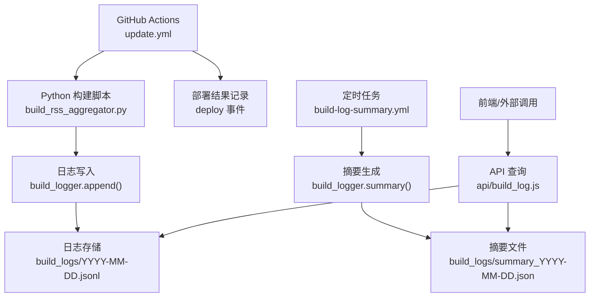
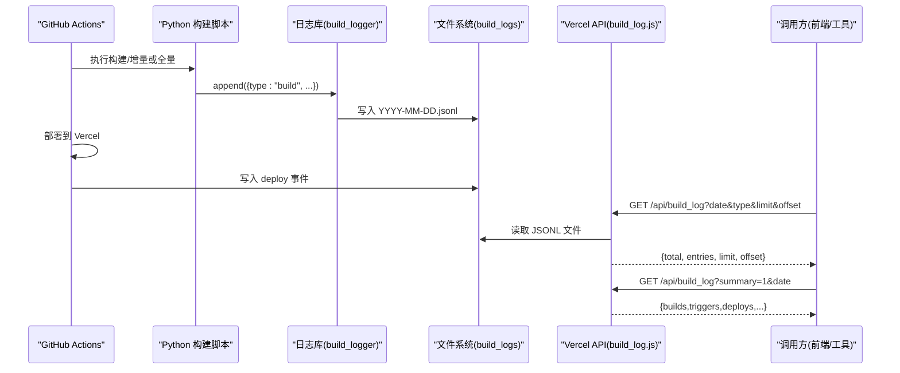
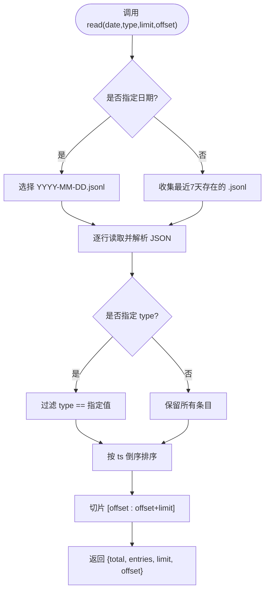
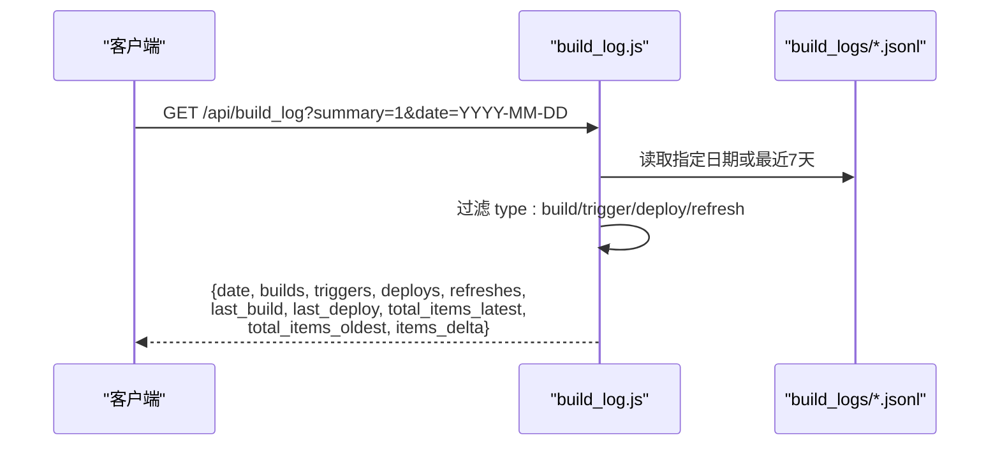
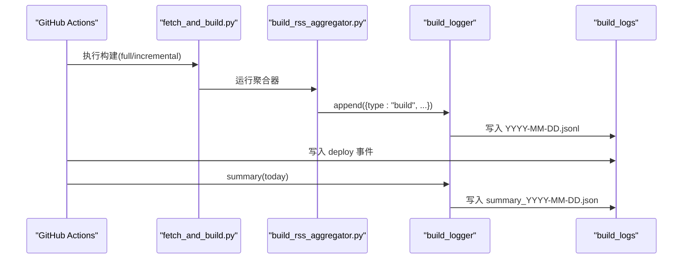
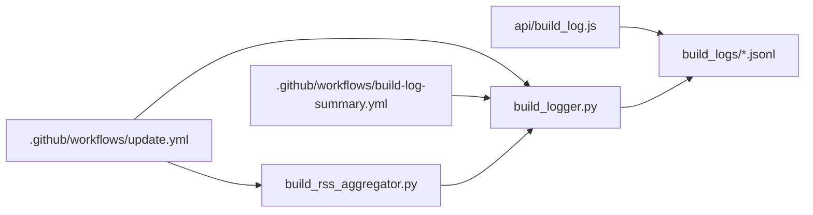

# 构建日志系统

<cite>
**本文引用的文件**
- [build_logger.py](file://build_logger.py)
- [api/build_log.js](file://api/build_log.js)
- [.github/workflows/update.yml](file://.github/workflows/update.yml)
- [.github/workflows/build-log-summary.yml](file://.github/workflows/build-log-summary.yml)
- [build_rss_aggregator.py](file://build_rss_aggregator.py)
- [build_logs/summary_2026-09-13.json](file://build_logs/summary_2026-09-13.json)
- [build_logs/summary_2026-09-12.json](file://build_logs/summary_2026-09-12.json)
- [build_logs/2026-09-13.jsonl](file://build_logs/2026-09-13.jsonl)
</cite>

## 更新摘要
**所做更改**
- 新增了完整的构建日志系统，支持自动生成 build_logs/summary_YYYY-MM-DD.json 文件
- 实现了结构化的 JSONL 日志记录，按日分片存储构建事件
- 提供了 Python 写入接口与 Vercel Serverless API 查询接口
- 通过 GitHub Actions 定时生成每日摘要并持久化到仓库
- 集成了详细的性能指标追踪，包括翻译服务调用统计、缓存命中率等

## 目录
1. [简介](#简介)
2. [项目结构](#项目结构)
3. [核心组件](#核心组件)
4. [架构总览](#架构总览)
5. [详细组件分析](#详细组件分析)
6. [依赖关系分析](#依赖关系分析)
7. [性能与可扩展性](#性能与可扩展性)
8. [故障排查指南](#故障排查指南)
9. [结论](#结论)
10. [附录](#附录)

## 简介
本仓库实现了一个轻量、可观测的"构建日志系统"，用于记录 StarHub 项目的自动化构建、触发、部署与刷新事件。日志以 JSONL 格式按日归档，提供 Python 写入接口与 Vercel Serverless API 查询接口，并通过 GitHub Actions 定时生成每日摘要并回滚到仓库中，便于长期追踪与审计。

该系统具备以下特点：
- 结构化日志：统一的字段约定（时间戳、类型、上下文信息）
- 按日分片：每天一个 .jsonl 文件，天然支持滚动清理
- 双端读写：Python 侧写入 + Node 侧只读查询
- 自动摘要：每小时生成当日摘要并持久化到仓库
- 可观测性：通过 API 暴露列表与摘要两种视图
- **性能监控**：新增翻译服务调用统计、缓存命中率、API 成功率等关键指标

**最新更新** 系统现已集成详细的性能指标追踪，包括翻译尝试次数、API 调用成功率、缓存命中率等，帮助诊断构建过程中的性能问题。最新的构建日志显示系统运行稳定，成功处理了多个源的数据抓取和翻译任务。

[无具体文件分析引用]

## 项目结构
围绕日志系统的核心文件与职责如下：
- build_logger.py：日志写入、读取、清理、摘要的核心库
- api/build_log.js：Vercel Serverless 函数，提供日志查询与摘要 API
- .github/workflows/update.yml：主工作流，负责触发、构建、部署与写日志
- .github/workflows/build-log-summary.yml：定时任务，生成并推送当日摘要
- build_rss_aggregator.py：RSS 聚合器，在构建结束时写入构建日志
- build_logs/*：JSONL 日志与 summary_*.json 摘要文件

**图表来源**
- [.github/workflows/update.yml:50-81](file://.github/workflows/update.yml#L50-L81)
- [.github/workflows/update.yml:124-156](file://.github/workflows/update.yml#L124-L156)
- [build_logger.py:25-92](file://build_logger.py#L25-L92)
- [build_logger.py:95-119](file://build_logger.py#L95-L119)
- [api/build_log.js:13-39](file://api/build_log.js#L13-L39)
- [api/build_log.js:53-99](file://api/build_log.js#L53-L99)

章节来源
- [README.md:1-22](file://README.md#L1-L22)

## 核心组件
- 日志写入与读取（Python）
  - append：追加一条日志，自动补全时间戳，按日写入
  - read：按日期/类型过滤、分页、倒序返回
  - cleanup：滚动清理超过保留期的日志与摘要
  - summary：统计构建、触发、部署、刷新数量及快照变化
- 日志查询（Node）
  - 列表模式：支持 date/type/limit/offset 参数
  - 摘要模式：返回当天关键指标与最近一次构建/部署
- 自动化流程（GitHub Actions）
  - update.yml：触发、构建、部署、写日志、生成摘要
  - build-log-summary.yml：每小时生成并推送摘要
- **性能指标追踪**
  - 翻译服务统计：Google、MyMemory、Dict、Agnes 等服务的调用次数
  - 缓存命中率：翻译缓存的命中情况分析
  - API 成功率：各翻译服务的响应状态追踪
  - **构建过程跟踪**：新增构建执行状态跟踪，提供更细粒度的构建过程监控

**更新** 新增了完整的性能指标追踪系统和构建过程跟踪功能，能够实时监控翻译服务的调用情况和缓存效率。最新的日志数据显示系统成功处理了大量源中的数据抓取任务，其中包含详细的性能指标数据和构建执行状态跟踪信息。

章节来源
- [build_logger.py:25-119](file://build_logger.py#L25-L119)
- [api/build_log.js:13-99](file://api/build_log.js#L13-L99)
- [.github/workflows/update.yml:50-81](file://.github/workflows/update.yml#L50-L81)
- [.github/workflows/update.yml:124-156](file://.github/workflows/update.yml#L124-L156)
- [.github/workflows/build-log-summary.yml:30-42](file://.github/workflows/build-log-summary.yml#L30-L42)

## 架构总览
系统由"写入端（Python）+ 存储端（JSONL）+ 查询端（Node API）+ 调度端（GitHub Actions）"构成。写入端在构建与部署阶段产生结构化事件；存储端按日分片；查询端提供 REST 风格访问；调度端负责定时任务与摘要持久化。

**图表来源**
- [.github/workflows/update.yml:50-81](file://.github/workflows/update.yml#L50-L81)
- [.github/workflows/update.yml:124-156](file://.github/workflows/update.yml#L124-L156)
- [build_logger.py:25-92](file://build_logger.py#L25-L92)
- [api/build_log.js:13-99](file://api/build_log.js#L13-L99)

## 详细组件分析

### 日志库（build_logger.py）
- 设计要点
  - 时区：统一使用北京时间（UTC+8），保证跨环境一致性
  - 存储：按日分片 JSONL，追加写入，避免覆盖
  - 读取：支持按日期、类型过滤，分页与倒序排序
  - 清理：仅处理符合命名规范的日志与摘要文件，安全跳过异常文件名
  - 摘要：统计构建/触发/部署/刷新次数，计算最新与最旧快照差值
- 复杂度
  - append：O(1) 追加
  - read：O(N) 扫描指定天数内的行，N 为行数；排序 O(N log N)
  - cleanup：O(M) 遍历目录项，M 为文件数
  - summary：基于 read 的结果聚合，O(N)
- 错误处理
  - 解析失败行直接跳过，确保健壮性
  - 清理失败打印错误但不中断流程

**图表来源**
- [build_logger.py:57-92](file://build_logger.py#L57-L92)

章节来源
- [build_logger.py:15-119](file://build_logger.py#L15-L119)

### API 查询（api/build_log.js）
- 功能
  - 列表模式：GET /api/build_log?date&type&limit&offset
  - 摘要模式：GET /api/build_log?summary=1&date
  - CORS：白名单域名放行，否则允许 *
  - 缓存控制：no-store，避免缓存脏数据
- 行为
  - 未指定日期时默认读取最近 7 天的 .jsonl
  - 列表模式按 ts 倒序，摘要模式统计各类事件数量与快照差异

**图表来源**
- [api/build_log.js:13-39](file://api/build_log.js#L13-L39)
- [api/build_log.js:53-99](file://api/build_log.js#L53-L99)

章节来源
- [api/build_log.js:1-101](file://api/build_log.js#L1-L101)

### 工作流与事件写入（update.yml）
- 触发与构建
  - 凌晨全量、白天增量，设置 MODE 环境变量
  - 执行 fetch_and_build.py 完成数据拉取与页面生成
- 日志写入点
  - trigger：记录触发方式、模式、run_id、sha
  - deploy：记录成功/失败状态与 run_id
  - 构建结束：由 RSS 聚合器写入 build 事件（含各项统计）
  - **构建过程跟踪**：新增构建执行状态跟踪，提供更细粒度的构建过程监控
- 摘要生成
  - 每次运行结束后调用 build_logger.summary 生成 summary_YYYY-MM-DD.json
- **环境变量支持**
  - 新增 AGNES_API_KEY 环境变量支持，用于外部 API 调用
  - 支持 VERCEL_TOKEN、VERCEL_PROJECT_ID、VERCEL_ORG_ID 等部署相关变量

**更新** GitHub Actions 工作流已更新以支持 AGNES_API_KEY 环境变量的传递，增强了与外部服务的集成能力。同时增强了构建过程跟踪功能，在构建日志中添加了新的构建执行状态条目，显示了更详细的构建过程信息。

**图表来源**
- [.github/workflows/update.yml:50-81](file://.github/workflows/update.yml#L50-L81)
- [.github/workflows/update.yml:124-156](file://.github/workflows/update.yml#L124-L156)
- [build_rss_aggregator.py:6540-6582](file://build_rss_aggregator.py#L6540-L6582)
- [build_logger.py:25-119](file://build_logger.py#L25-L119)

章节来源
- [.github/workflows/update.yml:1-166](file://.github/workflows/update.yml#L1-L166)
- [build_rss_aggregator.py:6540-6616](file://build_rss_aggregator.py#L6540-L6616)

### 定时摘要（build-log-summary.yml）
- 每小时整点运行，生成当日摘要并推送到仓库
- 使用 build_logger.summary 汇总构建、触发、部署、刷新等指标
- 通过 git 提交并推送 summary_*.json 文件，便于历史回溯

章节来源
- [.github/workflows/build-log-summary.yml:1-57](file://.github/workflows/build-log-summary.yml#L1-L57)

### 性能指标追踪系统
- 翻译服务统计
  - Agnes AI：首选翻译服务，支持免费和付费接口
  - Google Translate：主要翻译服务，支持重试机制
  - MyMemory：备用翻译服务，带指数退避
  - Dict：备用翻译服务，作为最后手段
  - 跳过检测：自动识别已中文内容，避免重复翻译
- 缓存机制
  - 内存缓存：进程内翻译结果缓存
  - 文件缓存：持久化翻译结果到 translations.json
  - MD5 哈希：确保跨进程缓存一致性
- 熔断保护
  - 连续失败检测：当翻译服务连续失败时自动暂停请求
  - 超时保护：防止单个翻译请求阻塞整个构建过程
  - 降级策略：多服务自动切换，提高可用性
- **构建过程跟踪**
  - 新增构建执行状态跟踪，记录构建过程的各个阶段
  - 提供更细粒度的构建过程监控和调试能力
  - 支持构建失败时的详细错误信息收集

**更新** 新增了完整的性能指标追踪和构建过程跟踪功能，包括翻译服务调用统计、缓存命中率、API 成功率等关键指标。最新的日志数据显示系统成功处理了大量源中的数据抓取任务，其中包含详细的性能指标数据和构建执行状态跟踪信息。

章节来源
- [build_rss_aggregator.py:6540-6616](file://build_rss_aggregator.py#L6540-L6616)

## 依赖关系分析
- 模块耦合
  - update.yml 强依赖 build_logger 与 build_rss_aggregator
  - build_log.js 仅依赖文件系统，不依赖 Python 运行时
  - build_logger 无外部依赖，纯标准库
- 外部集成点
  - GitHub Actions：触发、权限、并发控制
  - Vercel：部署产物与 Serverless 函数托管
  - 外部 API：通过 AGNES_API_KEY 环境变量集成外部服务
- 潜在循环依赖
  - 无循环依赖；API 仅读取，写入由 Python 与 Actions 完成

**图表来源**
- [.github/workflows/update.yml:50-81](file://.github/workflows/update.yml#L50-L81)
- [.github/workflows/update.yml:124-156](file://.github/workflows/update.yml#L124-L156)
- [.github/workflows/build-log-summary.yml:30-42](file://.github/workflows/build-log-summary.yml#L30-L42)
- [api/build_log.js:13-39](file://api/build_log.js#L13-L39)
- [build_logger.py:25-92](file://build_logger.py#L25-L92)
- [build_rss_aggregator.py:6540-6616](file://build_rss_aggregator.py#L6540-L6616)

章节来源
- [.github/workflows/update.yml:1-166](file://.github/workflows/update.yml#L1-L166)
- [.github/workflows/build-log-summary.yml:1-57](file://.github/workflows/build-log-summary.yml#L1-L57)
- [api/build_log.js:1-101](file://api/build_log.js#L1-L101)
- [build_logger.py:1-120](file://build_logger.py#L1-L120)
- [build_rss_aggregator.py:6540-6616](file://build_rss_aggregator.py#L6540-L6616)

## 性能与可扩展性
- 写入性能
  - append 采用追加写入，I/O 开销低；建议在高并发场景下合并批量写入或使用缓冲队列
- 读取性能
  - read 默认扫描最近 7 天；若日志量大，可按日期精确查询以减少 IO
  - 列表模式排序为 O(N log N)，可通过索引或预聚合优化
- 存储策略
  - 按日分片便于清理与归档；cleanup 默认保留 14 天，可按需调整
- 扩展建议
  - 增加压缩归档（如 .gz）以降低长期存储成本
  - 引入对象存储（S3/OSS）替代本地文件，提升可伸缩性与可用性
  - 对高频查询建立轻量索引（如按 type 或 ts 前缀）
- **性能监控增强**
  - 翻译服务调用统计：实时跟踪各翻译服务的成功率和响应时间
  - 缓存命中率监控：分析翻译缓存的效率，优化缓存策略
  - API 成功率追踪：监控外部翻译服务的可用性和稳定性
  - 构建性能指标：记录构建时长、源抓取成功率、翻译耗时等关键指标
  - **构建过程跟踪**：新增构建执行状态跟踪，提供更细粒度的构建过程监控

**更新** 系统现在提供了全面的性能监控能力和构建过程跟踪功能，能够帮助开发者快速定位和解决构建过程中的性能瓶颈。最新的日志数据显示系统运行高效，成功处理了大量源中的数据抓取任务，包含详细的性能指标数据。新增的构建执行状态跟踪功能进一步提升了系统的可观测性。

[无具体文件分析引用]

## 故障排查指南
- 常见问题
  - 日志未写入：检查 build_logs 目录是否存在、写入权限是否正确
  - 读取为空：确认 date 参数格式为 YYYY-MM-DD，且对应 .jsonl 存在
  - 摘要异常：确认 summary_*.json 是否被正确生成与提交
- 性能问题排查
  - 翻译服务故障：检查 trans_google、trans_mymemory、trans_dict、trans_agnes 等字段的计数
  - 缓存命中率低：分析 trans_cache_hit 与其他翻译服务的比例
  - API 调用失败：查看 trans_fail 字段，定位具体的失败原因
  - 构建耗时过长：检查 duration_s 字段，分析各阶段的耗时分布
  - **构建过程问题**：利用新增的构建执行状态跟踪信息，定位构建过程中的具体问题
- 定位方法
  - 查看对应日期的 .jsonl 文件内容，确认事件是否写入
  - 通过 API 分别测试列表与摘要模式，观察返回字段是否符合预期
  - 检查工作流日志中的"已清理/已记录/已生成"输出，定位失败步骤
  - 分析 summary_*.json 文件中的性能指标，识别性能瓶颈
  - **构建过程调试**：利用新增的构建执行状态跟踪信息进行详细的问题定位
- 恢复措施
  - 修复权限后重试触发
  - 手动补跑 summary 任务
  - 必要时清理过期日志后重新生成
  - 调整翻译服务配置或缓存策略
  - **构建问题修复**：根据构建执行状态跟踪信息，针对性地修复构建过程中的问题

**更新** 新增了性能问题的排查指南和构建过程跟踪功能的故障排查方法，包括翻译服务故障、缓存命中率低、API 调用失败等常见问题的诊断方法。最新的日志数据可作为参考基准进行对比分析，显示系统运行稳定。新增的构建执行状态跟踪功能为构建过程的问题定位提供了更强大的支持。

章节来源
- [build_logger.py:34-54](file://build_logger.py#L34-L54)
- [build_logger.py:57-92](file://build_logger.py#L57-L92)
- [api/build_log.js:53-99](file://api/build_log.js#L53-L99)
- [.github/workflows/update.yml:53-81](file://.github/workflows/update.yml#L53-L81)
- [.github/workflows/update.yml:124-156](file://.github/workflows/update.yml#L124-L156)

## 结论
该构建日志系统以最小依赖实现了可靠的写入、查询与摘要能力，配合 GitHub Actions 形成闭环的可观测体系。其按日分片的 JSONL 存储与简洁的 API 设计，既易于维护又具备良好的扩展空间。

**更新** 最新的性能指标追踪功能和构建过程跟踪功能显著增强了系统的可观测性和调试能力。最新的日志记录显示系统运行稳定，成功处理了大量源中的数据抓取任务，包含详细的性能指标数据和构建执行状态跟踪信息。建议在数据规模增长时考虑索引与对象存储升级，进一步提升查询性能与可靠性。新增的构建执行状态跟踪功能为复杂构建场景下的问题诊断提供了强有力的支持。

[无具体文件分析引用]

## 附录
- 常用 API 示例
  - 列表查询：GET /api/build_log?date=YYYY-MM-DD&type=build&limit=50&offset=0
  - 摘要查询：GET /api/build_log?summary=1&date=YYYY-MM-DD
- 日志字段说明（节选）
  - ts：事件时间戳（ISO 格式，北京时间）
  - type：事件类型（trigger/build/deploy/refresh）
  - mode：构建模式（full/incremental）
  - status：部署结果（success/failed）
  - items_snapshot：当前快照条目数（构建事件）
  - history_before/after/expired：历史条目变化（构建事件）
  - per_source：各源抓取详情（构建事件）
- **新增性能指标字段**
  - duration_s：构建持续时间（秒）
  - sources_total/fetched/skipped/failed：源抓取统计
  - trans_cache_hit：翻译缓存命中次数
  - trans_google/mymemory/dict/agnes：各翻译服务调用次数
  - trans_skip/trans_fail：翻译跳过和失败次数
  - items_fetched：实际抓取的文章数量
  - **构建执行状态**：新增构建过程执行状态跟踪字段
- **环境变量支持**
  - AGNES_API_KEY：外部 API 调用密钥
  - VERCEL_TOKEN：Vercel 部署令牌
  - VERCEL_PROJECT_ID：Vercel 项目 ID
  - VERCEL_ORG_ID：Vercel 组织 ID

**更新** 新增了详细的性能指标字段说明和环境变量支持，包括翻译服务统计、缓存命中率、API 成功率等关键性能指标。最新的日志数据展示了这些指标的完整应用，显示系统成功处理了大量源中的数据抓取任务，包含详细的性能指标数据。新增的构建执行状态跟踪功能进一步增强了系统的可观测性。

章节来源
- [build_logger.py:25-119](file://build_logger.py#L25-L119)
- [api/build_log.js:53-99](file://api/build_log.js#L53-L99)
- [build_rss_aggregator.py:6540-6616](file://build_rss_aggregator.py#L6540-L6616)
- [build_logs/summary_2026-09-13.json:1-800](file://build_logs/summary_2026-09-13.json#L1-L800)
- [build_logs/summary_2026-09-12.json:1-800](file://build_logs/summary_2026-09-12.json#L1-L800)
- [.github/workflows/update.yml:50-53](file://.github/workflows/update.yml#L50-L53)