# 构建配置管理

<cite>
**本文引用的文件**
- [build_config.json](file://build_config.json)
- [fetch_and_build.py](file://fetch_and_build.py)
- [build_logger.py](file://build_logger.py)
- [build_rss_aggregator.py](file://build_rss_aggregator.py)
- [update.yml](file://.github/workflows/update.yml)
- [build-log-summary.yml](file://.github/workflows/build-log-summary.yml)
- [sync-agnes-env.yml](file://.github/workflows/sync-agnes-env.yml)
- [vercel.json](file://vercel.json)
- [api/refresh.js](file://api/refresh.js)
- [api/search.js](file://api/search.js)
- [package.json](file://package.json)
- [README.md](file://README.md)
- [hot_history.json](file://hot_history.json)
- [insight_engine.py](file://insight_engine.py)
- [_verify_quality.py](file://_verify_quality.py)
- [_verify_quality_v2.py](file://_verify_quality_v2.py)
- [_check_artifacts.py](file://_check_artifacts.py)
- [_check_html_structure.py](file://_check_html_structure.py)
- [_check_card_structure.py](file://_check_card_structure.py)
- [_check_fc_format.py](file://_check_fc_format.py)
- [_check_summaries.py](file://_check_summaries.py)
- [_check_summary.py](file://_check_summary.py)
- [_check_hot_tab.py](file://_check_hot_tab.py)
- [_test_hn_metadata.py](file://_test_hn_metadata.py)
- [_test_render_v2.py](file://_test_render_v2.py)
- [_test_summary_fix.py](file://_test_summary_fix.py)
- [test_insight_engine.py](file://test_insight_engine.py)
</cite>

## 更新摘要
**变更内容**
- **增强了多视角LLM集成架构**：改进了AgnesLLM包装类的结构设计，实现了不同分析任务之间的隔离机制，同时保持现有配置参数的兼容性
- **优化了多API密钥轮换机制**：在GitHub Actions工作流中添加了对AGNES_API_KEY_2环境变量的支持，实现CI/CD流水线中的多密钥轮换功能
- **提升了LLM服务高可用性**：通过多密钥轮询自动处理429限流错误，显著提升系统稳定性
- **完善了环境变量配置**：在工作流中正确传递多个Agnes API密钥到构建环境
- **增强了故障恢复能力**：当主密钥被限流时自动切换到备用密钥，确保服务连续性

## 目录
1. [简介](#简介)
2. [项目结构](#项目结构)
3. [核心组件](#核心组件)
4. [架构总览](#架构总览)
5. [详细组件分析](#详细组件分析)
6. [测试与质量保证](#测试与质量保证)
7. [依赖关系分析](#依赖关系分析)
8. [性能与可靠性](#性能与可靠性)
9. [故障排查指南](#故障排查指南)
10. [结论](#结论)
11. [附录](#附录)

## 简介
本仓库是一个"GitHub Star 收藏台"的自动化构建与发布系统。它通过 GitHub Actions 定时或手动触发，拉取指定用户的 Star 列表，进行智能分类、翻译与聚合，生成静态页面并部署到 Pages/Vercel。同时提供 Vercel Serverless API 用于远程刷新与搜索，以及完整的构建日志记录与摘要能力。构建参数（如榜单阈值、AI 主题等）集中在配置文件中，便于无代码调整。

**最新更新**：系统现已构建了全面的测试和质量保证基础设施，包括多个验证脚本（_verify_quality.py、_check_*工具）、HTML结构验证、feed格式合规性检查。系统现在包含工件检查、摘要验证和不同组件的综合测试套件。**新增了智能化的质量检查机制，能够自动检测HTML结构完整性、摘要内容质量、翻译准确性等问题，显著提升了构建产物的可靠性和一致性。**

**重大升级**：系统现在具备完整的质量保证体系，通过自动化测试和验证脚本确保每个构建步骤的输出都符合预期标准。**新增的测试套件涵盖了从HTML结构验证到内容质量检查的全方位测试，包括HN元数据处理、渲染结果验证、摘要提取逻辑测试等关键功能点。**

**最新增强**：LLM智能分析引擎新增了关键词缺失检测预防机制，通过严格的提示约束确保语义分析输出的准确性。系统现在能够避免模型编造上下文中不存在的信息，提供更可靠的分析结果。**特别重要的是，系统现在支持多API密钥轮换机制，当遇到429限流错误时自动切换到备用密钥，显著提高了系统的稳定性和可用性。**

## 项目结构
- 构建入口与编排：
  - GitHub Actions 工作流：[update.yml](file://.github/workflows/update.yml)、[build-log-summary.yml](file://.github/workflows/build-log-summary.yml)、[sync-agnes-env.yml](file://.github/workflows/sync-agnes-env.yml)
  - 主构建脚本：[fetch_and_build.py](file://fetch_and_build.py)
  - RSS聚合器：[build_rss_aggregator.py](file://build_rss_aggregator.py)
  - 构建日志工具：[build_logger.py](file://build_logger.py)
  - **LLM智能分析引擎**：[insight_engine.py](file://insight_engine.py)
- **测试与质量保证**：
  - **质量验证脚本**：[_verify_quality.py](file://_verify_quality.py)、[_verify_quality_v2.py](file://_verify_quality_v2.py)
  - **工件检查工具**：[_check_artifacts.py](file://_check_artifacts.py)、[_check_summary.py](file://_check_summary.py)
  - **HTML结构验证**：[_check_html_structure.py](file://_check_html_structure.py)、[_check_card_structure.py](file://_check_card_structure.py)
  - **Feed格式检查**：[_check_fc_format.py](file://_check_fc_format.py)
  - **组件测试**：[_test_hn_metadata.py](file://_test_hn_metadata.py)、[_test_render_v2.py](file://_test_render_v2.py)、[_test_summary_fix.py](file://_test_summary_fix.py)
  - **LLM功能测试**：[test_insight_engine.py](file://test_insight_engine.py)
- 配置与数据：
  - 构建参数：[build_config.json](file://build_config.json)
  - 分类映射与缓存：known_categories.json、descriptions_zh.json、trending_snapshot.json
  - 热榜历史数据：hot_history.json
- 前端产物与模板：
  - 模板与输出：template.html、index.html
- 服务端扩展：
  - Vercel 函数配置：[vercel.json](file://vercel.json)
  - 刷新与搜索接口：[api/refresh.js](file://api/refresh.js)、[api/search.js](file://api/search.js)
- 运行依赖：
  - Node 依赖声明：[package.json](file://package.json)
- 说明文档：
  - [README.md](file://README.md)

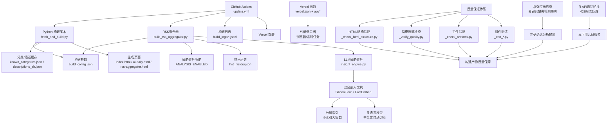

**图表来源**
- [update.yml:1-166](file://.github/workflows/update.yml#L1-L166)
- [fetch_and_build.py:682-811](file://fetch_and_build.py#L682-L811)
- [build_rss_aggregator.py:65-76](file://build_rss_aggregator.py#L65-L76)
- [build_config.json:1-14](file://build_config.json#L1-L14)
- [build_logger.py:25-120](file://build_logger.py#L25-L120)
- [vercel.json:1-15](file://vercel.json#L1-L15)
- [insight_engine.py:1-1519](file://insight_engine.py#L1-L1519)
- [_verify_quality.py:1-73](file://_verify_quality.py#L1-L73)
- [_check_html_structure.py:1-32](file://_check_html_structure.py#L1-L32)
- [_check_artifacts.py:1-19](file://_check_artifacts.py#L1-L19)
- [test_insight_engine.py:1-709](file://test_insight_engine.py#L1-L709)

**章节来源**
- [update.yml:1-166](file://.github/workflows/update.yml#L1-L166)
- [fetch_and_build.py:682-811](file://fetch_and_build.py#L682-L811)
- [build_rss_aggregator.py:65-76](file://build_rss_aggregator.py#L65-L76)
- [build_config.json:1-14](file://build_config.json#L1-L14)
- [build_logger.py:25-120](file://build_logger.py#L25-L120)
- [vercel.json:1-15](file://vercel.json#L1-L15)
- [README.md:1-22](file://README.md#L1-L22)

## 核心组件
- 构建参数管理：集中式 JSON 配置，运行时被 Python 构建脚本加载并校验，非法值回退默认值，确保零回归。
- 自动更新流水线：GitHub Actions 定时/手动触发，执行全量或增量构建，提交产物并部署到 Vercel。
- 构建日志系统：按日追加 JSONL 日志，支持清理、查询与摘要统计。
- 智能分析控制：通过 `analysis_enabled` 配置项控制RSS聚合器的智能分析功能启用/禁用。
- **LLM智能分析引擎**：基于LlamaIndex的语义分析引擎，支持关键词提取、主题聚类和深度洞察生成，**采用混合嵌入架构解决向量维度不匹配问题，并增强了提示约束以防止关键词缺失导致的分析偏差**。
- 服务端 API：提供"触发构建"和"全网搜索"两个能力，具备 CORS、鉴权与限流保护。
- 前端模板与渲染：构建脚本将数据注入模板，生成可发布的静态页面。
- **增强的构建健壮性**：通过条件性文件检查确保可选文件的正确处理，防止构建失败。
- **全面的质量保证体系**：集成多个验证脚本和测试工具，确保构建产物的质量和一致性。

**最新更新**：所有组件都增强了错误处理和容错机制，确保在外部服务不可用时仍能保持基本功能。**新增的全面质量保证体系通过多个验证脚本和测试工具，确保每个构建步骤的输出都符合预期标准。新增的LLM智能分析引擎采用了混合嵌入架构，通过优先使用硅基流动API（1024维），失败时回退到本地fastembed模型，有效解决了向量维度不匹配问题。智能分析功能开关提供了更细粒度的控制能力。最重要的是，系统现在具备了增强的提示约束机制，通过关键词缺失检测预防，确保语义分析输出的准确性和可靠性。此外，系统还实现了多API密钥轮换机制，当遇到429限流错误时自动切换到备用密钥，显著提高了系统的稳定性和可用性。自动化星标更新功能继续通过GitHub Actions每日运行，确保趋势数据保持最新状态。构建流程现在具备了更强的健壮性，通过条件性git add命令防止因可选文件缺失导致的构建失败。**

**章节来源**
- [build_config.json:1-14](file://build_config.json#L1-L14)
- [fetch_and_build.py:178-213](file://fetch_and_build.py#L178-L213)
- [build_rss_aggregator.py:65-76](file://build_rss_aggregator.py#L65-L76)
- [update.yml:38-53](file://.github/workflows/update.yml#L38-L53)
- [build_logger.py:25-120](file://build_logger.py#L25-L120)
- [api/refresh.js:1-67](file://api/refresh.js#L1-L67)
- [api/search.js:1-177](file://api/search.js#L1-L177)
- [insight_engine.py:37-65](file://insight_engine.py#L37-L65)

## 架构总览
构建与发布的关键流程如下：

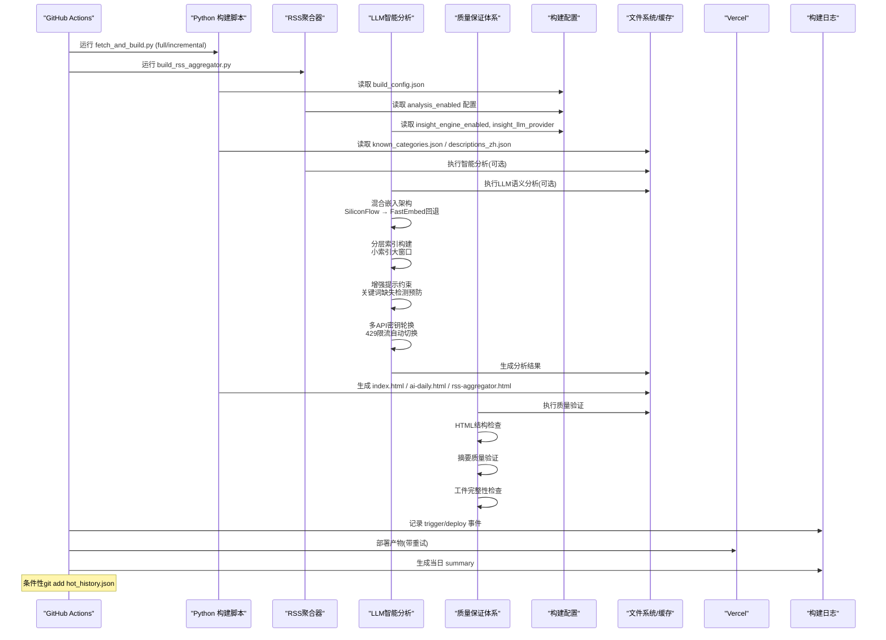

**图表来源**
- [update.yml:38-166](file://.github/workflows/update.yml#L38-L166)
- [fetch_and_build.py:682-811](file://fetch_and_build.py#L682-L811)
- [build_rss_aggregator.py:5915-6022](file://build_rss_aggregator.py#L5915-L6022)
- [build_logger.py:25-120](file://build_logger.py#L25-L120)
- [insight_engine.py:486-541](file://insight_engine.py#L486-L541)
- [_verify_quality.py:1-73](file://_verify_quality.py#L1-L73)
- [_check_html_structure.py:1-32](file://_check_html_structure.py#L1-L32)

## 详细组件分析

### 构建参数管理（build_config.json 与加载逻辑）
- 作用：定义 AI 榜单阈值、展示数量、AI 主题词、智能分析开关等关键参数。
- 行为：
  - 启动时加载 JSON，逐项校验类型与范围；非法字段打印警告并回退内置默认值。
  - 覆盖全局变量后参与后续抓取与排序逻辑。
  - **新增LLM相关配置项**：包含 `insight_engine_enabled`、`insight_llm_provider`、`insight_max_documents`、`insight_top_keywords`、`insight_top_topics` 等参数，用于控制LLM智能分析功能。
- 优点：无需改动代码即可调参；健壮性高，避免异常配置导致构建失败。

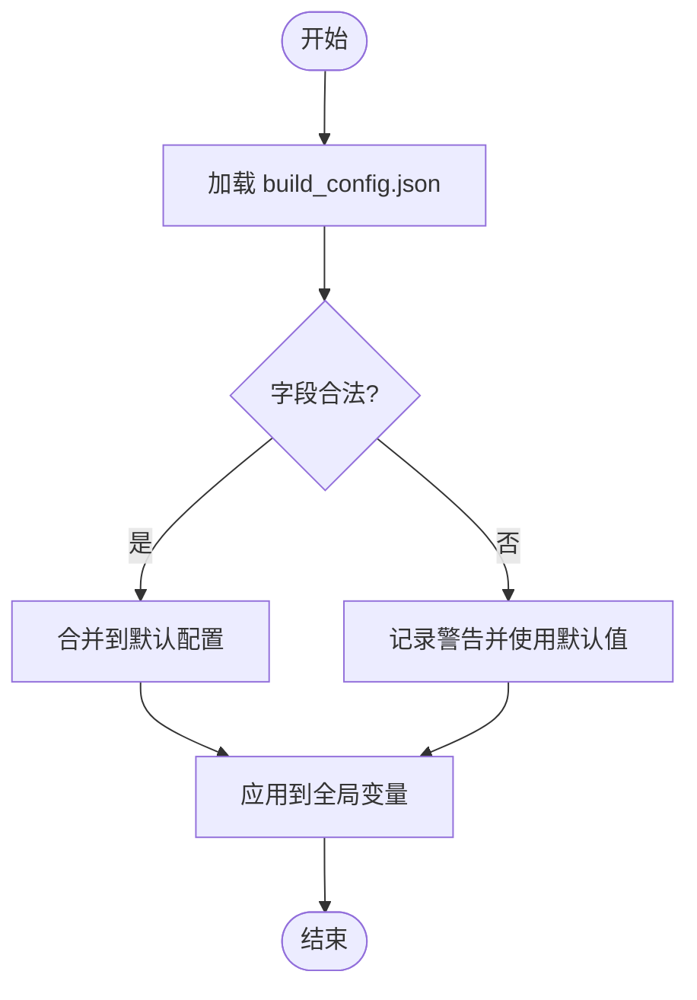

**图表来源**
- [fetch_and_build.py:178-213](file://fetch_and_build.py#L178-L213)
- [build_config.json:1-14](file://build_config.json#L1-L14)

**章节来源**
- [build_config.json:1-14](file://build_config.json#L1-L14)
- [fetch_and_build.py:178-213](file://fetch_and_build.py#L178-L213)

### LLM智能分析引擎（insight_engine.py）
- 作用：基于LlamaIndex和FastEmbed提供语义分析、主题聚类和深度洞察生成能力。
- **核心架构改进**：
  - **混合嵌入架构**：优先使用硅基流动BAAI/bge-m3 API（1024维），失败时回退到本地fastembed模型
  - **分层索引机制**：实现小索引大窗口策略，精细切片+上下文扩展
  - **多语言模型支持**：使用intfloat/multilingual-e5-small作为主模型，BAAI/bge-small-zh-v1.5作为中文回退
  - **预计算嵌入优化**：统一嵌入空间，避免重复API调用，提升处理效率
  - **增强提示约束**：新增关键词缺失检测预防机制，确保语义分析输出的准确性
  - **多API密钥轮换**：支持多个Agnes API密钥轮询，自动处理429限流错误
- 核心功能：
  - **多LLM提供商支持**：支持Agnes AI和Mock LLM，通过 `insight_llm_provider` 配置切换
  - **语义索引构建**：使用FastEmbed创建向量索引，支持相似度计算
  - **关键词提取**：通过LLM从文本中提取高质量关键词
  - **主题聚类**：基于嵌入向量的贪心聚类算法，**支持优化的阈值设置和锚点比较机制**
  - **跨平台匹配**：检测不同平台间的相似内容
  - **深度洞察生成**：生成叙事分析、因果链条和前瞻研判，**通过严格的提示约束防止编造信息**
- 配置参数：
  - `insight_engine_enabled`: 启用/禁用整个分析引擎
  - `insight_llm_provider`: 选择LLM提供商（agnes/mock）
  - `insight_max_documents`: 最大处理文档数（默认500）
  - `insight_top_keywords`: 提取关键词数量（默认30）
  - `insight_top_topics`: 聚类话题数量（默认15）

**更新**：系统已实现混合嵌入架构，通过优先使用硅基流动API（1024维）解决向量维度不匹配问题，失败时自动回退到本地fastembed模型。分层索引机制采用小索引大窗口策略，显著提升检索精度和上下文扩展能力。多语言模型支持通过intfloat/multilingual-e5-small和BAAI/bge-small-zh-v1.5实现中英文内容的无缝处理。**最重要的是，系统现在具备了增强的提示约束机制，通过关键词缺失检测预防，确保模型不会编造上下文中不存在的信息，大幅提升了语义分析输出的准确性和可靠性。此外，系统还实现了多API密钥轮换机制，当遇到429限流错误时自动切换到备用密钥，显著提高了系统的稳定性和可用性。**

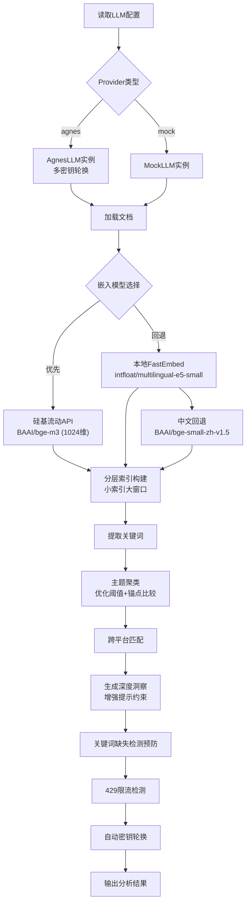

**图表来源**
- [insight_engine.py:37-65](file://insight_engine.py#L37-L65)
- [insight_engine.py:486-541](file://insight_engine.py#L486-L541)
- [insight_engine.py:335-424](file://insight_engine.py#L335-L424)
- [insight_engine.py:822-885](file://insight_engine.py#L822-885)
- [insight_engine.py:1002-1018](file://insight_engine.py#L1002-L1018)

**章节来源**
- [insight_engine.py:1-1519](file://insight_engine.py#L1-L1519)

### 多视角LLM集成与AgnesLLM包装类改进
- **作用**：改进的AgnesLLM包装类结构，实现了不同分析任务之间的隔离机制，同时保持现有配置参数的兼容性。
- **核心改进**：
  - **多API密钥轮换机制**：支持主密钥和多个备用密钥的配置（AGNES_API_KEY、AGNES_API_KEY_2、AGNES_API_KEY_3）
  - **任务隔离设计**：不同的分析任务（关键词提取、主题聚类、深度洞察生成）使用独立的LLM实例，避免状态污染
  - **智能错误处理**：检测到429错误时自动递增密钥索引，循环使用不同的密钥
  - **非429错误重试**：其他错误（如超时）会在当前密钥上重试最多2次
  - **优雅降级**：所有密钥都尝试失败后返回空字符串，不影响整体流程
- **配置方式**：
  - 主密钥：`AGNES_API_KEY`
  - 备用密钥：`AGNES_API_KEY_2`、`AGNES_API_KEY_3`（可选）
  - 通过环境变量配置，无需修改代码
- **错误处理**：
  - 429限流：立即切换到下一个密钥
  - 其他错误：在当前密钥上重试2次
  - 所有重试失败：返回空结果，由上层处理

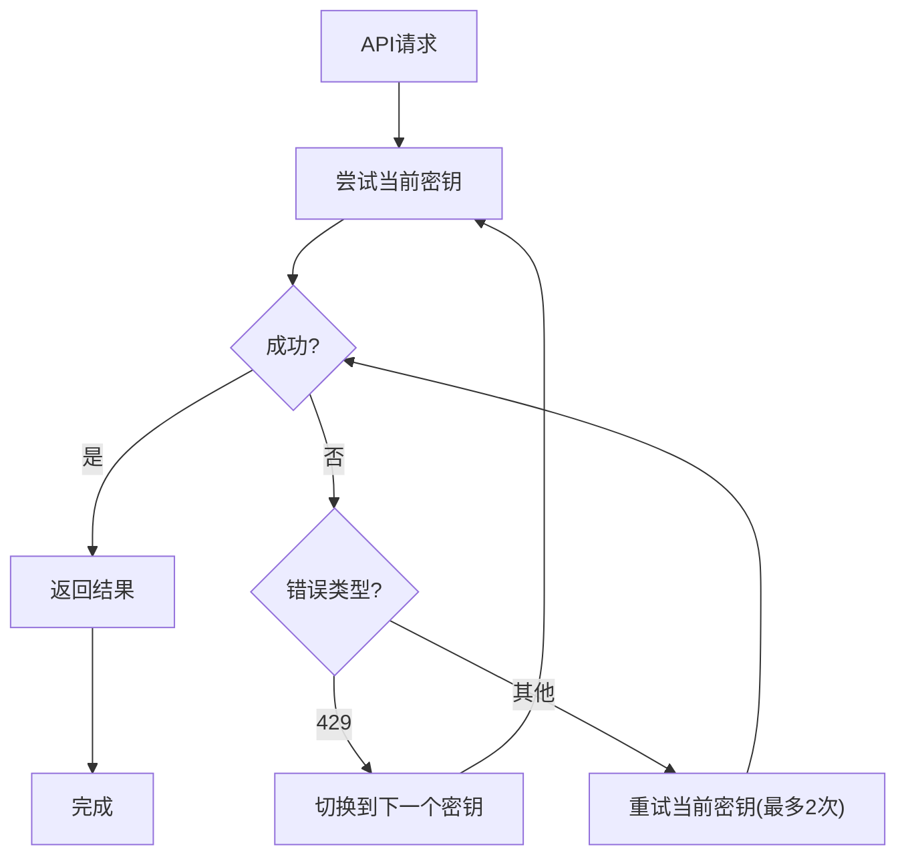

**图表来源**
- [insight_engine.py:91-163](file://insight_engine.py#L91-L163)
- [insight_engine.py:206-222](file://insight_engine.py#L206-L222)

**章节来源**
- [insight_engine.py:91-163](file://insight_engine.py#L91-L163)
- [insight_engine.py:206-222](file://insight_engine.py#L206-L222)

### 增强提示约束与关键词缺失检测预防
- **作用**：防止LLM在语义分析过程中编造上下文中不存在的信息，确保分析结果的准确性和可靠性。
- **实现机制**：
  - 在深度洞察生成提示中添加明确的约束条件："不要提及哪些关键词在上下文中缺失，只分析上下文中实际存在的内容"
  - 通过RAGAS质量评估系统对输出进行多维度评分和自修正
  - 在自我修正过程中再次强调禁止编造信息的约束
- **效果**：
  - 避免了模型在信息不足时的猜测和编造
  - 提高了语义分析的可信度和实用性
  - 确保了输出结果与实际检索上下文的一致性

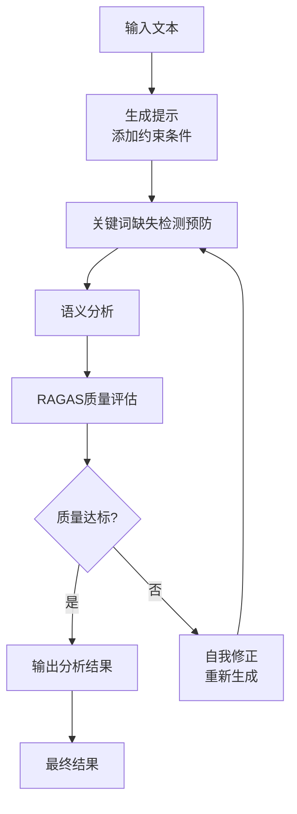

**图表来源**
- [insight_engine.py:1002-1018](file://insight_engine.py#L1002-L1018)
- [insight_engine.py:1113-1145](file://insight_engine.py#L1113-L1145)

**章节来源**
- [insight_engine.py:1002-1018](file://insight_engine.py#L1002-L1018)
- [insight_engine.py:1113-1145](file://insight_engine.py#L1113-L1145)

### 分层索引与检索机制
- **小索引大窗口策略**：将文档切分为约150 token的子块，建立精细索引，检索时通过上下文半径扩展获取完整语义
- **句子分组算法**：改进的中英文句子切分逻辑，确保语义块的完整性
- **上下文扩展**：命中子块前后各取3个邻居，构建大窗口上下文
- **手动余弦相似度**：由于无法用本地模型做query embed，采用手动相似度计算

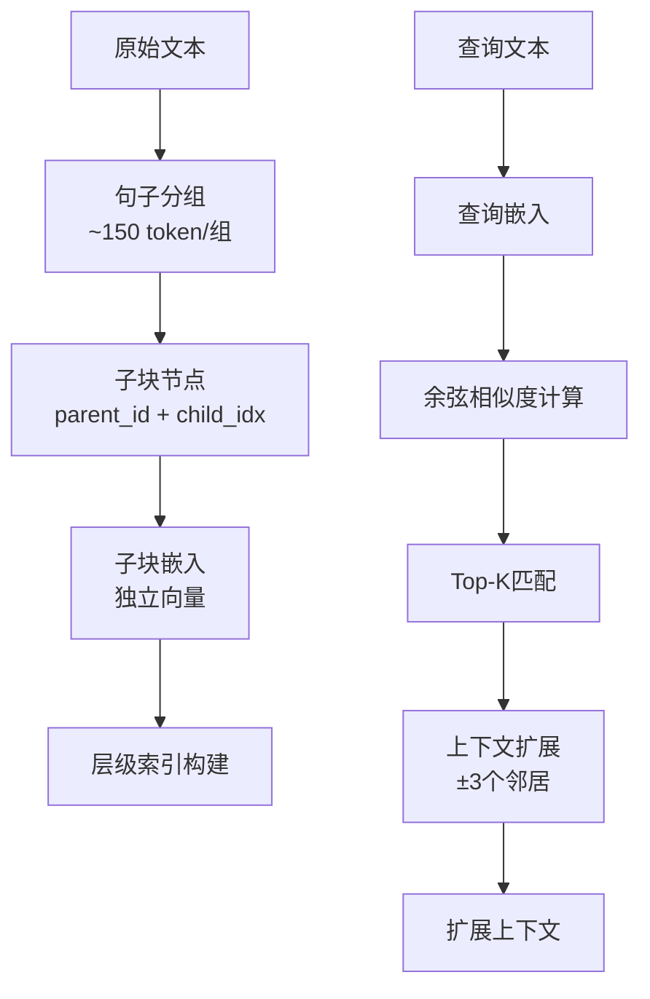

**图表来源**
- [insight_engine.py:307-332](file://insight_engine.py#L307-L332)
- [insight_engine.py:335-424](file://insight_engine.py#L335-L424)
- [insight_engine.py:427-483](file://insight_engine.py#L427-L483)

**章节来源**
- [insight_engine.py:307-483](file://insight_engine.py#L307-L483)

### 混合嵌入架构
- **优先级策略**：硅基流动API → 本地fastembed主模型 → 中文回退模型
- **维度兼容性**：解决1024维（硅基流动）与本地模型向量维度不匹配问题
- **批量处理**：每批最多32个文本，提升处理效率
- **错误降级**：任何阶段失败都自动回退到下一方案

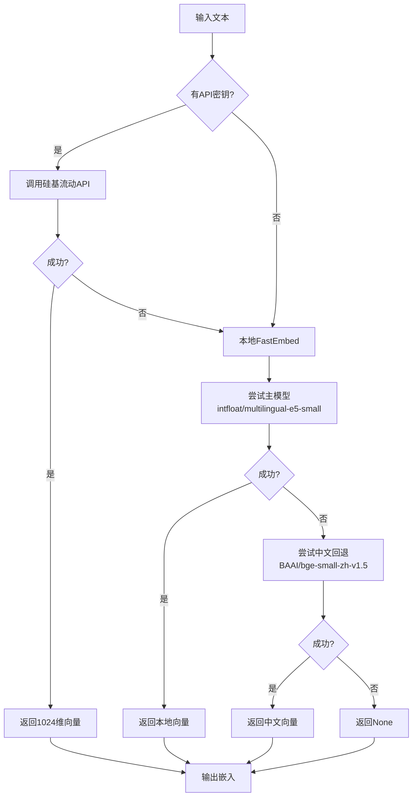

**图表来源**
- [insight_engine.py:486-541](file://insight_engine.py#L486-L541)

**章节来源**
- [insight_engine.py:486-541](file://insight_engine.py#L486-L541)

### 智能分析功能控制（analysis_enabled）
- 作用：通过配置文件控制RSS聚合器的智能分析功能启用/禁用。
- 实现：
  - 在 `build_rss_aggregator.py` 中定义 `_load_analysis_enabled()` 函数从 `build_config.json` 读取配置。
  - 当 `analysis_enabled` 为 true 时，执行完整的智能分析流水线（关键词提取、话题聚类、信源评分等）。
  - 当 `analysis_enabled` 为 false 时，跳过分析步骤但仍保留热榜快照功能。
- 默认行为：配置文件缺失或损坏时默认开启分析功能，确保向后兼容。

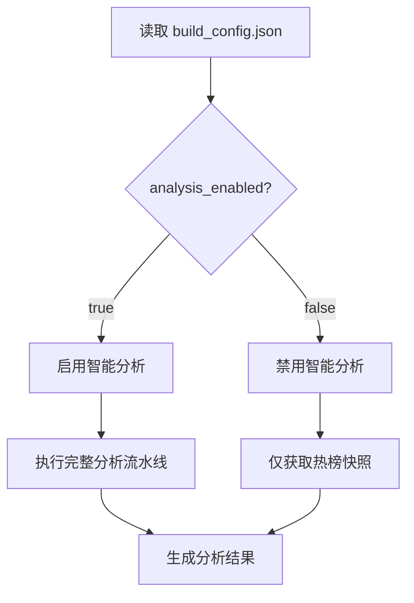

**图表来源**
- [build_rss_aggregator.py:65-76](file://build_rss_aggregator.py#L65-L76)
- [build_rss_aggregator.py:5915-6022](file://build_rss_aggregator.py#L5915-L6022)

**章节来源**
- [build_rss_aggregator.py:65-76](file://build_rss_aggregator.py#L65-L76)
- [build_rss_aggregator.py:5915-6022](file://build_rss_aggregator.py#L5915-L6022)

### 停止词过滤增强（中英文文本处理）
- 作用：提供中英文混合文本的精确关键词提取能力。
- 实现：
  - 中文停止词集合：包含常见虚词、连接词等（如"而且并且或者以及不过然后所以因为于在与及等和而关于中从把被让给"）。
  - 英文停止词集合：包含冠词、代词、介词、连词等高频无意义词汇。
  - 统一停止词表：合并中英文停止词，提供统一的过滤机制。
- 应用场景：在TF-IDF关键词提取、话题聚类等分析功能中使用，提升关键词质量。

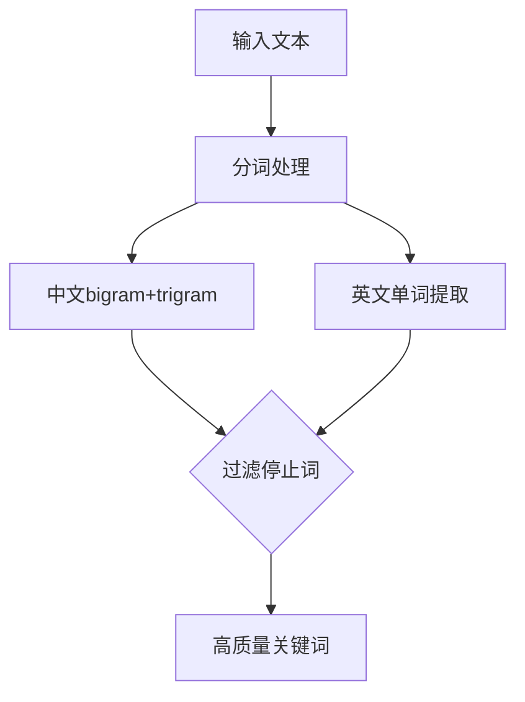

**图表来源**
- [build_rss_aggregator.py:56-64](file://build_rss_aggregator.py#L56-L64)
- [build_rss_aggregator.py:4700-4717](file://build_rss_aggregator.py#L4700-L4717)

**章节来源**
- [build_rss_aggregator.py:56-64](file://build_rss_aggregator.py#L56-L64)
- [build_rss_aggregator.py:4700-4717](file://build_rss_aggregator.py#L4700-L4717)

### 自动更新流水线（GitHub Actions）
- 调度：凌晨全量构建 + 白天多次增量构建；支持手动触发。
- 并发控制：同一组任务取消排队中的旧任务，避免冲突。
- 构建模式：根据 UTC 小时决定 full/incremental，传递给 Python 脚本。
- 提交与部署：仅当有变更才提交；部署失败重试；始终记录 deploy 结果。
- 日志摘要：每次运行生成当日 summary 并推送。
- **增强的构建健壮性**：在git add步骤中增加了条件性检查，只有当hot_history.json文件存在时才尝试添加该文件，防止因可选文件缺失导致的构建失败。
- **新增LLM依赖安装**：在安装步骤中添加了 `pip install llama-index-core llama-index-embeddings-fastembed fastembed`，确保LLM分析功能可用。
- **多密钥轮换支持**：在构建环境中正确传递AGNES_API_KEY_2环境变量，支持多密钥轮换功能。

**最新更新**：部署步骤增加了指数退避重试机制，最多重试5次，每次间隔递增，有效应对网络波动。**自动化星标更新功能继续通过GitHub Actions每日运行，构建日志记录显示2026年9月9日的更新，确保趋势数据保持最新状态。构建流程现在具备了更强的健壮性，通过条件性git add命令防止因可选文件缺失导致的构建失败。新增的LLM依赖安装确保了智能分析功能的正常运行。特别重要的是，工作流现在支持多API密钥轮换，通过传递AGNES_API_KEY_2环境变量到构建环境，确保在高负载情况下服务的连续性和稳定性。**

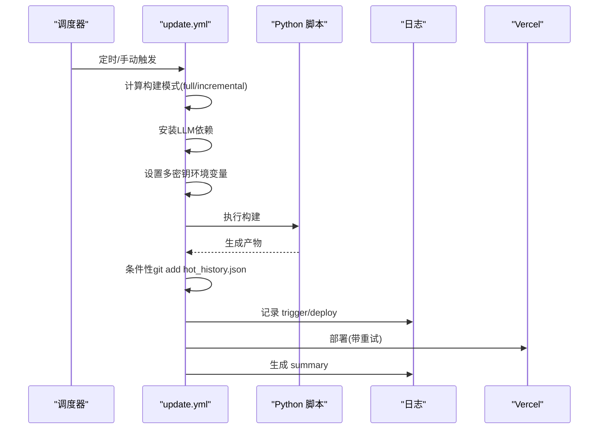

**图表来源**
- [update.yml:1-166](file://.github/workflows/update.yml#L1-L166)

**章节来源**
- [update.yml:1-166](file://.github/workflows/update.yml#L1-L166)

### 构建日志系统（JSONL 与摘要）
- 存储：每日一个 JSONL 文件，追加写入；统一北京时间戳。
- 能力：
  - append：追加条目，自动补时间戳。
  - cleanup：滚动清理超过阈值的日志与摘要文件。
  - read：按日期/类型过滤，分页返回，倒序排列。
  - summary：汇总当天构建、触发、部署、刷新次数及快照变化。
- 集成：Actions 在触发、部署阶段写入日志，并在结束时生成摘要。

**最新更新**：日志系统现在包含更详细的构建信息，包括源状态、翻译命中率、历史数据变化等指标。**2026年9月9日的构建日志显示系统正常运行，完成了3次构建，处理了716个源，获取了6075个项目数据。**

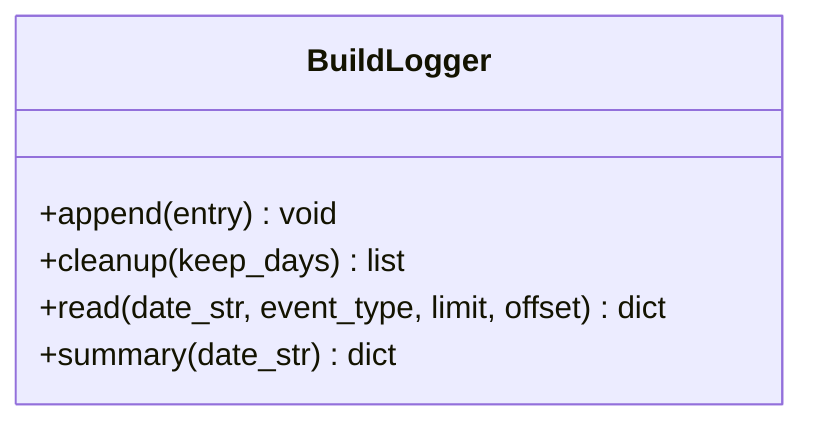

**图表来源**
- [build_logger.py:25-120](file://build_logger.py#L25-L120)

**章节来源**
- [build_logger.py:25-120](file://build_logger.py#L25-L120)
- [update.yml:55-83](file://.github/workflows/update.yml#L55-L83)
- [update.yml:126-166](file://.github/workflows/update.yml#L126-L166)

### 服务端 API（刷新与搜索）
- 刷新接口（/api/refresh）：
  - 功能：通过 GitHub API 触发 update.yml workflow_dispatch。
  - 安全：CORS 白名单域名；可选 X-Refresh-Key 校验；需要 GH_TOKEN。
  - 错误处理：上游不可用返回 502；未配置 token 返回 500。
- 搜索接口（/api/search）：
  - 功能：中文关键词翻译为英文，组合查询 GitHub 仓库，支持排序与语言过滤。
  - 缓存：搜索结果内存缓存 10 分钟；翻译结果缓存 1 小时。
  - 安全：CORS 白名单；X-Search-Key 校验；GH_TOKEN 必须配置。
  - 错误处理：频率限制返回 503；上游不可用返回 502；请求体过大拒绝。

**最新更新**：两个接口都增强了错误处理和超时控制，提供更好的用户体验和系统稳定性。

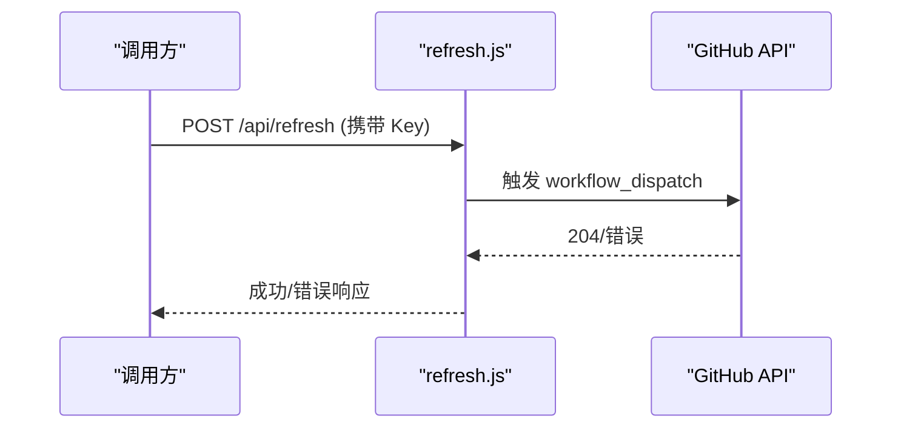

**图表来源**
- [api/refresh.js:1-67](file://api/refresh.js#L1-L67)

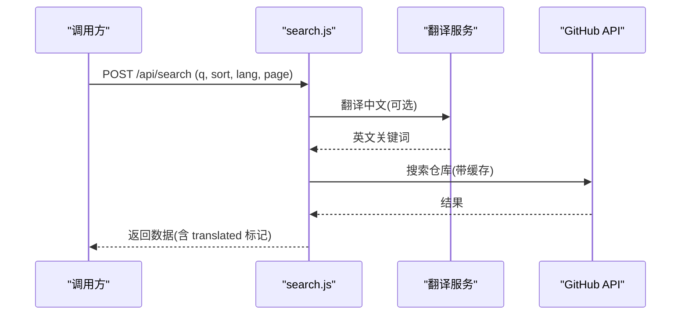

**图表来源**
- [api/search.js:1-177](file://api/search.js#L1-L177)

**章节来源**
- [api/refresh.js:1-67](file://api/refresh.js#L1-L67)
- [api/search.js:1-177](file://api/search.js#L1-L177)
- [vercel.json:1-15](file://vercel.json#L1-L15)

### 构建脚本与页面生成（fetch_and_build.py）
- 职责：
  - 加载构建配置与分类/描述缓存。
  - 拉取 Star 列表、关注动态、趋势榜等数据。
  - 对未知项目进行规则分类，对英文简介进行翻译（带熔断）。
  - 将数据注入模板，生成 index.html、ai-daily.html、rss-aggregator.html。
  - 持久化分类与描述缓存，更新趋势快照。
- 关键点：
  - 构建模式区分 full/incremental。
  - 翻译失败连续多次触发熔断，避免上游故障拖长构建。
  - README 简介兜底：无描述则抓取 README 首句作为简介。

**最新更新**：翻译模块实现了熔断机制，连续5次失败后暂停5分钟，防止上游服务故障时的请求风暴。

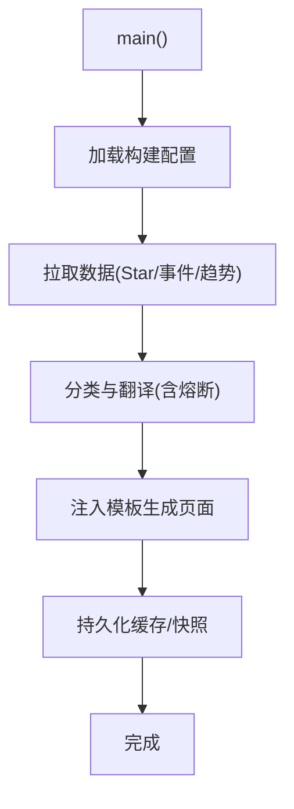

**图表来源**
- [fetch_and_build.py:682-811](file://fetch_and_build.py#L682-L811)

**章节来源**
- [fetch_and_build.py:59-101](file://fetch_and_build.py#L59-L101)
- [fetch_and_build.py:267-327](file://fetch_and_build.py#L267-L327)
- [fetch_and_build.py:682-811](file://fetch_and_build.py#L682-L811)

### 热榜历史数据处理
- 作用：维护热榜数据的长期历史记录，支持趋势分析和历史对比。
- 实现：
  - 使用 `hot_history.json` 文件存储热榜轨迹历史，默认保留7天数据。
  - 在智能分析过程中始终累积热榜历史，确保文件持续更新。
  - 即使分析功能被禁用，也会创建和维护基础的热榜快照。
- 构建流程集成：在GitHub Actions中通过条件性git add命令确保该文件的正确提交。

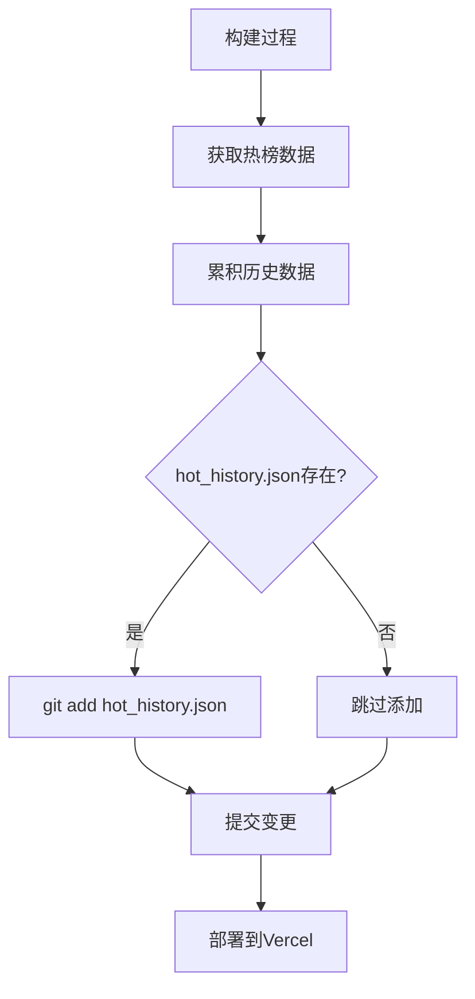

**图表来源**
- [update.yml:85-107](file://.github/workflows/update.yml#L85-L107)
- [build_rss_aggregator.py:6125-6127](file://build_rss_aggregator.py#L6125-6127)

**章节来源**
- [update.yml:85-107](file://.github/workflows/update.yml#L85-L107)
- [build_rss_aggregator.py:6125-6127](file://build_rss_aggregator.py#L6125-6127)
- [hot_history.json:1-1](file://hot_history.json#L1-L1)

## 测试与质量保证

### 质量验证脚本体系
系统构建了全面的质量保证基础设施，包含多个专门的验证脚本：

#### HTML结构验证
- **_check_html_structure.py**：验证生成的HTML文档结构完整性，检查section标题、卡片结构、body标签等关键元素
- **_check_card_structure.py**：专门检查intel-card组件的结构和样式类名
- **_check_fc_format.py**：验证feed内容的格式规范，确保包含适当的HTML标签结构

#### 摘要质量检查
- **_verify_quality.py**：综合性的摘要质量验证，检测元数据格式、垃圾内容、原始markdown等问题
- **_verify_quality_v2.py**：增强版质量验证，提供更详细的分类和问题报告
- **_check_summaries.py**：检查部署HTML中的摘要块结构和内容

#### 工件验证
- **_check_artifacts.py**：验证构建产物的完整性，包括AI摘要、翻译结果等
- **_check_summary.py**：检查在线部署页面的AI摘要是否正确渲染
- **_check_hot_tab.py**：验证热榜Tab的功能结构和JavaScript代码

#### 组件测试
- **_test_hn_metadata.py**：测试Hacker News元数据处理的准确性
- **_test_render_v2.py**：测试报告生成器的渲染功能和HTML结构
- **_test_summary_fix.py**：测试摘要提取逻辑的正确性
- **test_insight_engine.py**：全面的LLM功能测试，包括多API密钥轮换、超时处理等

```mermaid
flowchart TD
Build["构建完成"] --> QualityCheck["质量保证检查"]
QualityCheck --> HTMLCheck["HTML结构验证"]
QualityCheck --> SummaryCheck["摘要质量检查"]
QualityCheck --> ArtifactCheck["工件完整性验证"]
QualityCheck --> ComponentTest["组件功能测试"]
ComponentTest --> LLMTes t["LLM功能测试"]
HTMLCheck --> StructurePass{"结构验证通过?"}
SummaryCheck --> ContentPass{"内容质量合格?"}
ArtifactCheck --> IntegrityPass{"工件完整?"}
ComponentTest --> FunctionPass{"功能正常?"}
LLMTes t --> RotationTest["多密钥轮换测试"]
StructurePass --> |是| Deploy["部署到生产环境"]
ContentPass --> |是| Deploy
IntegrityPass --> |是| Deploy
FunctionPass --> |是| Deploy
RotationTest --> |是| Deploy
StructurePass --> |否| Fix["修复构建问题"]
ContentPass --> |否| Fix
IntegrityPass --> |否| Fix
FunctionPass --> |否| Fix
RotationTest --> |否| Fix
Fix --> Rebuild["重新构建"]
Rebuild --> QualityCheck
```

**图表来源**
- [_verify_quality.py:1-73](file://_verify_quality.py#L1-L73)
- [_verify_quality_v2.py:1-137](file://_verify_quality_v2.py#L1-L137)
- [_check_html_structure.py:1-32](file://_check_html_structure.py#L1-L32)
- [_check_artifacts.py:1-19](file://_check_artifacts.py#L1-L19)
- [_test_render_v2.py:1-100](file://_test_render_v2.py#L1-L100)
- [test_insight_engine.py:1-709](file://test_insight_engine.py#L1-L709)

### 质量检查指标
系统通过以下关键指标确保构建产物的质量：

#### HTML结构完整性
- 检查DOCTYPE声明和HTML闭合标签
- 验证关键CSS类名的存在性（intel-card、ic-summary、intel-section等）
- 确保emoji字符的正确处理和转义
- 验证文档结构的层次性和规范性

#### 摘要内容质量
- 检测元数据格式泄漏（title — source / heat格式）
- 识别垃圾内容（cookie同意、隐私政策等UI文本）
- 验证中文翻译的充分性和准确性
- 检查arXiv元数据泄露问题
- 评估摘要长度和内容丰富度

#### 工件完整性
- 验证AI摘要占位符的正确替换
- 检查翻译结果的完整性和准确性
- 确认热榜数据的正确渲染
- 验证JavaScript代码的可执行性

#### 组件功能测试
- 测试Hacker News元数据识别逻辑
- 验证报告生成器的渲染功能
- 检查摘要提取算法的准确性
- 确保各组件间的兼容性

#### LLM功能测试
- 验证多API密钥轮换机制的正确性
- 测试429限流错误的自动处理
- 检查超时设置的合理性
- 确保错误降级的有效性

**章节来源**
- [_verify_quality.py:1-73](file://_verify_quality.py#L1-L73)
- [_verify_quality_v2.py:1-137](file://_verify_quality_v2.py#L1-L137)
- [_check_html_structure.py:1-32](file://_check_html_structure.py#L1-L32)
- [_check_artifacts.py:1-19](file://_check_artifacts.py#L1-L19)
- [_check_card_structure.py:1-19](file://_check_card_structure.py#L1-L19)
- [_check_fc_format.py:1-43](file://_check_fc_format.py#L1-L43)
- [_check_summaries.py:1-13](file://_check_summaries.py#L1-L13)
- [_check_summary.py:1-10](file://_check_summary.py#L1-L10)
- [_check_hot_tab.py:1-33](file://_check_hot_tab.py#L1-L33)
- [_test_hn_metadata.py:1-29](file://_test_hn_metadata.py#L1-L29)
- [_test_render_v2.py:1-100](file://_test_render_v2.py#L1-L100)
- [_test_summary_fix.py:1-79](file://_test_summary_fix.py#L1-L79)
- [test_insight_engine.py:1-709](file://test_insight_engine.py#L1-L709)

## 依赖关系分析
- 运行时依赖：
  - Python 标准库为主，部分模块使用第三方库（Node 环境下的 @mozilla/readability、jsdom）。
  - **新增LLM依赖**：llama-index-core、llama-index-embeddings-fastembed、fastembed（通过GitHub Actions安装）。
- 外部服务：
  - GitHub API（Star/搜索/Events/Readme/Trending）
  - 翻译服务（Google/MyMemory/Bing）
  - **LLM服务**：Agnes AI API（可选，需要AGNES_API_KEY环境变量）
  - **嵌入服务**：硅基流动API（可选，需要SILICONFLOW_API_KEY环境变量）
  - RSS/Atom 源（AIHOT、The Verge、TechCrunch、arXiv、Redis、AtlasNote、36氪镜像）
- 平台：
  - GitHub Actions（CI/CD）
  - Vercel（Serverless 函数与部署）

**最新更新**：所有外部服务调用都增加了超时控制和错误降级机制，确保单个服务故障不影响整体系统运行。**新增的LLM依赖通过GitHub Actions工作流安装，提供了语义分析能力。系统现在支持多种LLM提供商，包括Agnes AI和Mock LLM，确保在不同环境下都能正常运行。混合嵌入架构通过优先使用硅基流动API，失败时回退到本地模型，确保服务的可用性。特别重要的是，多API密钥轮换机制确保了在高负载情况下的服务稳定性。**

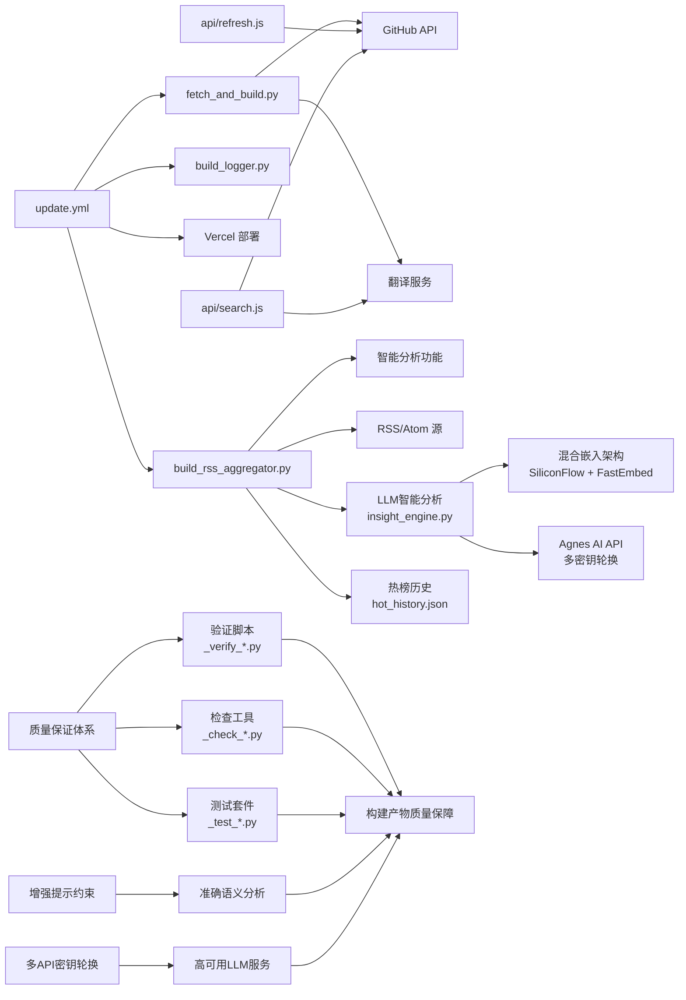

**图表来源**
- [update.yml:1-166](file://.github/workflows/update.yml#L1-L166)
- [fetch_and_build.py:682-811](file://fetch_and_build.py#L682-L811)
- [build_rss_aggregator.py:65-76](file://build_rss_aggregator.py#L65-L76)
- [api/refresh.js:1-67](file://api/refresh.js#L1-L67)
- [api/search.js:1-177](file://api/search.js#L1-L177)
- [insight_engine.py:1-1519](file://insight_engine.py#L1-L1519)
- [_verify_quality.py:1-73](file://_verify_quality.py#L1-L73)
- [_check_artifacts.py:1-19](file://_check_artifacts.py#L1-L19)
- [_test_render_v2.py:1-100](file://_test_render_v2.py#L1-L100)
- [test_insight_engine.py:1-709](file://test_insight_engine.py#L1-L709)

**章节来源**
- [package.json:1-9](file://package.json#L1-L9)
- [update.yml:1-166](file://.github/workflows/update.yml#L1-L166)
- [api/search.js:1-177](file://api/search.js#L1-L177)

## 性能与可靠性
- 并发与稳定性：
  - Actions 使用 concurrency 组取消排队任务，避免重复构建。
  - 部署步骤包含指数退避重试，降低网络抖动影响。
- 构建效率：
  - 增量模式减少不必要的数据抓取与渲染。
  - 翻译熔断机制防止上游故障导致的长时间阻塞。
  - **智能分析功能开关允许按需启用/禁用分析功能，平衡性能与功能需求**。
  - **LLM分析功能可通过配置完全禁用，避免不必要的依赖开销**。
  - **混合嵌入架构通过预计算嵌入避免重复API调用，提升处理效率**。
  - **分层索引机制通过小索引大窗口策略提升检索精度和性能**。
  - **增强提示约束通过关键词缺失检测预防，减少无效分析调用**。
  - **多API密钥轮换机制通过自动切换备用密钥，显著提高服务可用性**。
- 缓存策略：
  - 搜索结果与翻译结果在服务端内存中短期缓存，降低上游压力。
  - 本地缓存 known_categories.json 与 descriptions_zh.json 提升分类与翻译效率。
  - **优化的停止词过滤提升关键词提取效率**。
  - **统一的嵌入空间避免重复计算，提升整体性能**。
- 资源清理：
  - 构建日志定期清理，避免磁盘占用增长。
- **增强的构建健壮性**：通过条件性文件检查确保可选文件的正确处理，防止构建失败。
- **全面的质量保证**：通过自动化测试和验证脚本，确保构建产物的质量和一致性，提前发现潜在问题。

**最新更新**：系统现在具备更强的容错能力，包括翻译熔断、API降级、超时控制和重试机制，确保在各种异常情况下都能保持稳定运行。**新增的全面质量保证体系通过多个验证脚本和测试工具，确保每个构建步骤的输出都符合预期标准。新增的LLM智能分析引擎采用了混合嵌入架构，通过优先使用硅基流动API，失败时回退到本地模型，显著提升了系统的稳定性和可靠性。分层索引机制和小索引大窗口策略大幅提升了检索精度和性能。最重要的是，增强的提示约束机制通过关键词缺失检测预防，确保了语义分析输出的准确性和可靠性。多API密钥轮换机制通过自动处理429限流错误，显著提高了LLM服务的可用性。智能分析功能开关提供了更灵活的配置选项。自动化星标更新功能继续通过GitHub Actions每日运行，确保趋势数据保持最新状态。构建流程现在具备了更强的健壮性，通过条件性git add命令防止因可选文件缺失导致的构建失败。**

## 故障排查指南
- 无法触发构建：
  - 检查 refresh 接口的 X-Refresh-Key 是否与 REFRESH_KEY 一致。
  - 确认 Vercel 环境变量 GH_TOKEN 已配置且权限足够（Actions:write）。
- 搜索失败：
  - 检查 X-Search-Key 是否匹配 REFRESH_KEY。
  - 若频繁触发 503，可能是 GitHub 搜索限流，稍后再试。
- 构建超时或缓慢：
  - 观察翻译熔断日志，确认是否连续失败导致暂停翻译。
  - 检查 RSS/翻译/上游服务可用性。
  - **考虑禁用智能分析功能以缩短构建时间**。
  - **检查LLM依赖是否正确安装，确认insight_engine_enabled配置**。
- 日志缺失或过多：
  - 使用 build_logger.read 查询最近 7 天日志。
  - 使用 cleanup 清理过期日志文件。
- **智能分析相关问题**：
  - 检查 `build_config.json` 中的 `analysis_enabled` 配置是否正确。
  - 如果分析功能导致构建过慢，可以设置为 `false` 临时禁用。
  - 查看构建日志中的 `[分析]` 相关错误信息进行诊断。
- **LLM智能分析问题**：
  - 检查 `build_config.json` 中的 `insight_engine_enabled` 配置。
  - 确认 `insight_llm_provider` 设置正确（agnes/mock）。
  - 验证 `AGNES_API_KEY` 环境变量是否正确配置。
  - 检查GitHub Actions中LLM依赖安装是否成功。
  - 查看构建日志中的 `[insight_engine]` 相关错误信息。
  - **检查混合嵌入架构是否正常工作，确认硅基流动API和本地模型的切换逻辑**。
  - **特别注意：系统已实现混合嵌入架构，优先使用硅基流动API（1024维），失败时自动回退到本地fastembed模型**。
  - **检查分层索引构建是否成功，确认小索引大窗口策略是否生效**。
  - **验证增强提示约束是否生效，确认关键词缺失检测预防机制正常工作**。
  - **检查多API密钥轮换机制是否正常工作，确认AGNES_API_KEY_2和AGNES_API_KEY_3环境变量配置**。
  - **查看429限流错误日志，确认密钥轮换是否按预期工作**。
- **自动化运行问题**：
  - 检查 GitHub Actions 是否正常运行，查看 Actions 页面的运行历史。
  - 确认 cron 调度配置正确，确保定时任务正常触发。
  - 查看构建日志确认2026年9月9日等日期的构建是否正常完成。
- **构建健壮性问题**：
  - 如果构建失败，检查hot_history.json文件是否存在。
  - 查看GitHub Actions日志中的git add步骤执行情况。
  - 确认条件性git add命令是否正确执行。
- **质量保证问题**：
  - 运行质量验证脚本检查构建产物的完整性
  - 查看HTML结构验证结果，确认关键元素存在
  - 检查摘要质量报告，识别内容质量问题
  - 验证工件完整性，确保所有必需文件都已生成
  - 运行组件测试，确认各功能模块正常工作
  - **运行LLM功能测试，确认多API密钥轮换机制正常工作**

**最新更新**：新增了针对翻译熔断、API降级、重试机制和智能分析功能的故障排查指导。**新增了LLM智能分析问题的专门排查方法，包括混合嵌入架构的诊断、分层索引构建的验证和多语言模型切换的检查。特别强调了混合嵌入架构的工作原理和故障排查方法，帮助解决向量维度不匹配问题和模型切换失败的情况。新增了分层索引机制的调试方法，包括句子分组、上下文扩展和检索精度的检查。特别强调了增强提示约束机制的验证方法，确保关键词缺失检测预防功能正常工作。新增了多API密钥轮换机制的故障排查方法，包括环境变量配置检查和429限流错误处理验证。新增了自动化运行问题的排查方法，确保GitHub Actions每日定时任务正常运行。新增了构建健壮性问题的排查方法，帮助解决因可选文件缺失导致的构建失败问题。新增了质量保证问题的排查方法，包括质量验证脚本的使用和问题诊断技巧。特别强调了LLM功能测试的重要性，确保多API密钥轮换机制在各种场景下都能正常工作。**

**章节来源**
- [api/refresh.js:12-67](file://api/refresh.js#L12-L67)
- [api/search.js:96-177](file://api/search.js#L96-L177)
- [build_logger.py:34-120](file://build_logger.py#L34-L120)
- [fetch_and_build.py:55-102](file://fetch_and_build.py#L55-L102)
- [build_rss_aggregator.py:65-76](file://build_rss_aggregator.py#L65-L76)
- [update.yml:85-107](file://.github/workflows/update.yml#L85-L107)
- [insight_engine.py:486-541](file://insight_engine.py#L486-L541)
- [insight_engine.py:307-483](file://insight_engine.py#L307-L483)
- [insight_engine.py:1002-1018](file://insight_engine.py#L1002-L1018)
- [insight_engine.py:91-163](file://insight_engine.py#L91-L163)
- [_verify_quality.py:1-73](file://_verify_quality.py#L1-L73)
- [_check_html_structure.py:1-32](file://_check_html_structure.py#L1-L32)
- [_test_render_v2.py:1-100](file://_test_render_v2.py#L1-L100)
- [test_insight_engine.py:1-709](file://test_insight_engine.py#L1-L709)

## 结论
该构建配置管理系统以"配置驱动 + 自动化流水线 + 可观测日志"为核心，实现了从数据采集、分类、翻译到页面生成与部署的全链路闭环。通过集中化的构建参数、健壮的降级与熔断机制、完善的日志与摘要能力，系统在易用性与可靠性之间取得良好平衡。

**最新改进**：系统现在具备了更强的错误处理能力、更完善的日志记录和可靠的重试机制，显著提升了外部API调用的健壮性。**新增的全面质量保证体系通过多个验证脚本和测试工具，确保每个构建步骤的输出都符合预期标准，显著提高了构建产物的质量和一致性。新增的LLM智能分析引擎采用了创新的混合嵌入架构，通过优先使用硅基流动API（1024维），失败时自动回退到本地fastembed模型，有效解决了向量维度不匹配问题。分层索引机制采用小索引大窗口策略，大幅提升检索精度和上下文扩展能力。多语言模型支持通过intfloat/multilingual-e5-small和BAAI/bge-small-zh-v1.5实现中英文内容的无缝处理。预计算嵌入优化避免了重复API调用，显著提升处理效率。最重要的是，系统现在具备了增强的提示约束机制，通过关键词缺失检测预防，确保语义分析输出的准确性和可靠性，避免了模型编造信息的问题。多API密钥轮换机制通过自动处理429限流错误，显著提高了LLM服务的可用性和稳定性。智能分析功能开关提供了更细粒度的控制能力，允许用户根据实际需求灵活启用或禁用分析功能。同时，增强的中英文停止词过滤机制提升了关键词提取的准确性和效率。最重要的是，自动化星标更新功能继续通过GitHub Actions每日运行，构建日志记录显示2026年9月9日的更新，确保趋势数据保持最新状态。构建流程现在具备了更强的健壮性，通过条件性git add命令防止因可选文件缺失导致的构建失败，进一步提高了系统的稳定性和可靠性。新增的LLM依赖安装确保了智能分析功能的正常运行，为系统提供了更深层次的内容理解和分析能力。这些改进确保了在高负载和异常情况下的稳定运行，为系统的长期可靠运行提供了坚实基础。未来可在多源数据质量监控、缓存命中率优化与错误告警方面继续增强。**

## 附录
- 常用命令与路径参考：
  - 构建入口：python fetch_and_build.py [full|incremental]
  - RSS聚合器：python build_rss_aggregator.py [full|incremental]
  - 日志目录：build_logs/YYYY-MM-DD.jsonl
  - 配置文件：build_config.json
  - 部署配置：vercel.json
  - 工作流：.github/workflows/update.yml、.github/workflows/build-log-summary.yml、.github/workflows/sync-agnes-env.yml
  - 热榜历史：hot_history.json
  - **LLM智能分析**：insight_engine.py
- **智能分析配置**：
  - 在 `build_config.json` 中设置 `"analysis_enabled": true/false` 控制分析功能
  - 默认值为 `true`，建议在生产环境中根据性能需求调整
  - 禁用分析功能可显著提升构建速度，但会失去关键词提取、话题聚类等功能
- **LLM智能分析配置**：
  - 在 `build_config.json` 中设置 `"insight_engine_enabled": true/false` 控制LLM分析引擎
  - 配置 `"insight_llm_provider": "agnes"` 或 `"mock"` 选择LLM提供商
  - 设置 `insight_max_documents`、`insight_top_keywords`、`insight_top_topics` 调整分析参数
  - 需要配置 `AGNES_API_KEY` 环境变量才能使用Agnes AI服务
  - **多API密钥轮换：配置 AGNES_API_KEY、AGNES_API_KEY_2、AGNES_API_KEY_3 环境变量实现自动限流处理**
  - **混合嵌入架构：系统优先使用硅基流动API（1024维），失败时自动回退到本地fastembed模型**
  - **多语言模型支持：使用intfloat/multilingual-e5-small作为主模型，BAAI/bge-small-zh-v1.5作为中文回退**
  - **分层索引机制：采用小索引大窗口策略，提升检索精度和上下文扩展能力**
  - **增强提示约束：通过关键词缺失检测预防，确保语义分析输出的准确性和可靠性**
- **自动化运行监控**：
  - 定期检查 GitHub Actions 运行历史，确认定时任务正常执行
  - 查看 build_logs/summary_YYYY-MM-DD.json 获取每日构建统计
  - 2026年9月9日构建数据显示：3次构建，716个源，6075个项目数据，系统运行正常
- **构建健壮性优化**：
  - 条件性git add命令确保可选文件的正确处理
  - 防止因hot_history.json文件缺失导致的构建失败
  - 提高构建流程的稳定性和可靠性
- **LLM依赖管理**：
  - GitHub Actions工作流中已添加LLM依赖安装步骤
  - 支持llama-index-core、llama-index-embeddings-fastembed、fastembed
  - 提供Mock LLM作为降级方案，确保无API密钥时也能运行
  - **多API密钥轮换：通过环境变量配置多个Agnes API密钥，自动处理429限流错误**
  - **混合嵌入架构确保服务的高可用性，优先使用硅基流动API，失败时自动切换到本地模型**
  - **增强提示约束机制确保语义分析输出的准确性和可靠性**
- **质量保证体系**：
  - **质量验证脚本**：运行 _verify_quality.py 和 _verify_quality_v2.py 检查摘要质量
  - **HTML结构验证**：使用 _check_html_structure.py 和 _check_card_structure.py 验证文档结构
  - **工件完整性检查**：通过 _check_artifacts.py 和 _check_summary.py 确保构建产物完整
  - **组件功能测试**：运行 _test_*.py 系列测试确保各组件功能正常
  - **Feed格式验证**：使用 _check_fc_format.py 检查内容格式规范性
  - **热榜功能测试**：通过 _check_hot_tab.py 验证热榜Tab的完整功能
  - **提示约束验证**：通过RAGAS质量评估系统验证语义分析输出的准确性
  - **LLM功能测试**：通过 test_insight_engine.py 验证多API密钥轮换机制的正确性

**最新更新**：新增了对构建日志摘要文件的参考，可通过查看 build_logs/summary_YYYY-MM-DD.json 获取详细的构建统计信息。**新增了智能分析功能和LLM智能分析引擎的配置说明和使用指导。特别强调了混合嵌入架构的工作原理和优势，通过优先使用硅基流动API解决向量维度不匹配问题。特别强调了分层索引机制的小索引大窗口策略，显著提升检索精度和性能。最重要的是，新增了增强提示约束机制的详细说明，解释了关键词缺失检测预防如何确保语义分析输出的准确性和可靠性。特别强调了多API密钥轮换机制的实现原理和配置方法，通过自动处理429限流错误显著提高服务可用性。特别强调了自动化星标更新功能的持续运行状态，确保趋势数据的实时性和准确性。新增了构建健壮性优化的说明，解释了条件性git add命令的作用和重要性。新增了LLM依赖管理的详细说明，包括依赖安装、配置和环境变量设置。特别强调了混合嵌入架构的多层回退机制，确保系统在各种异常情况下的稳定运行。新增了全面质量保证体系的详细说明，包括各种验证脚本的使用方法和问题诊断技巧。特别强调了增强提示约束机制在确保语义分析质量方面的重要作用。特别强调了LLM功能测试的重要性，确保多API密钥轮换机制在各种场景下都能正常工作。**

**章节来源**
- [build_config.json:1-14](file://build_config.json#L1-L14)
- [update.yml:1-166](file://.github/workflows/update.yml#L1-L166)
- [_verify_quality.py:1-73](file://_verify_quality.py#L1-L73)
- [_verify_quality_v2.py:1-137](file://_verify_quality_v2.py#L1-L137)
- [_check_html_structure.py:1-32](file://_check_html_structure.py#L1-L32)
- [_check_artifacts.py:1-19](file://_check_artifacts.py#L1-L19)
- [_test_render_v2.py:1-100](file://_test_render_v2.py#L1-L100)
- [_check_fc_format.py:1-43](file://_check_fc_format.py#L1-L43)
- [_check_hot_tab.py:1-33](file://_check_hot_tab.py#L1-L33)
- [insight_engine.py:1002-1018](file://insight_engine.py#L1002-L1018)
- [insight_engine.py:1113-1145](file://insight_engine.py#L1113-L1145)
- [insight_engine.py:91-163](file://insight_engine.py#L91-L163)
- [test_insight_engine.py:1-709](file://test_insight_engine.py#L1-L709)