基于我对代码的分析，我现在了解了多API密钥轮换系统的增强功能。让我更新自动化工作流文档以反映这些变更：

# 自动化工作流

<cite>
**本文引用的文件**
- [update.yml](file://.github/workflows/update.yml)
- [build-log-summary.yml](file://.github/workflows/build-log-summary.yml)
- [sync-agnes-env.yml](file://.github/workflows/sync-agnes-env.yml)
- [fetch_and_build.py](file://fetch_and_build.py)
- [build_ai_daily.py](file://build_ai_daily.py)
- [build_logger.py](file://build_logger.py)
- [build_rss_aggregator.py](file://build_rss_aggregator.py)
- [insight_engine.py](file://insight_engine.py)
- [test_insight_engine.py](file://test_insight_engine.py)
- [api/build_log.js](file://api/build_log.js)
- [api/translate.js](file://api/translate.js)
- [vercel.json](file://vercel.json)
- [package.json](file://package.json)
- [README.md](file://README.md)
- [api/refresh.js](file://api/refresh.js)
- [api/rss.js](file://api/rss.js)
- [api/search.js](file://api/search.js)
- [api/events.js](file://api/events.js)
- [api/article.js](file://api/article.js)
- [api/agihunt.js](file://api/agihunt.js)
- [.gitignore](file://.gitignore)
- [.vercelignore](file://.vercelignore)
- [build_logs/summary_2026-09-11.json](file://build_logs/summary_2026-09-11.json)
- [build_logs/2026-09-12.jsonl](file://build_logs/2026-09-12.jsonl)
- [build_config.json](file://build_config.json)
- [ai-daily.html](file://ai-daily.html)
- [hot_snapshot.json](file://hot_snapshot.json)
- [2026-09-12-source-keyword-pool-design.md](file://docs/superpowers/specs/2026-09-12-source-keyword-pool-design.md)
- [2026-09-11-llamaindex-insight-engine-design.md](file://docs/superpowers/specs/2026-09-11-llamaindex-insight-engine-design.md)
</cite>

## 更新摘要
**变更内容**
- **重大升级** AgnesLLM类多API密钥自动轮换系统：支持AGNES_API_KEY、AGNES_API_KEY_2、AGNES_API_KEY_3等多密钥轮询，自动应对429限流错误，提升生产环境可靠性
- **增强** 智能密钥管理：自动检测并加载备用密钥，实现负载均衡和故障转移
- **改进** 错误处理机制：非429错误在当前密钥上重试最多2次，所有重试失败后才尝试其他密钥
- **优化** 构建流程容错性：翻译熔断器、Trending降级、AI分析静默降级等多层保护机制

## 目录
1. [简介](#简介)
2. [项目结构](#项目结构)
3. [核心组件](#核心组件)
4. [架构总览](#架构总览)
5. [详细组件分析](#详细组件分析)
6. [依赖关系分析](#依赖关系分析)
7. [性能与可扩展性](#性能与可扩展性)
8. [安全、监控与灾难恢复](#安全监控与灾难恢复)
9. [部署拓扑与环境配置](#部署拓扑与环境配置)
10. [故障排查指南](#故障排查指南)
11. [结论](#结论)

## 简介
本仓库实现了一个"GitHub Star 收藏台"的自动化工作流：通过 GitHub Actions 定时任务，每天在北京时间 09:00（UTC 01:00）触发全量构建，并在白天时段执行增量更新；构建过程包括拉取用户已 star 的项目、智能分类、生成页面、AI 晨报与 RSS 聚合数据，最终提交到仓库并自动部署到 Vercel。系统同时提供若干 Vercel Serverless API，用于触发工作流、搜索仓库、聚合事件与抓取文章全文等能力。**最新更新**：GitHub Actions自动化工作流已大幅增强，集成了LlamaIndex洞察引擎，支持智能报告生成、Python 3.13依赖管理和增强的日志监控功能。系统现在支持UTC 23:51（北京时间07:51）的自动每日情报报告生成，包含增量vs全量构建模式优化。通过完善的构建日志系统、环境变量管理和全网热榜功能，显著提升了系统的可观测性和运维能力。**最新成就**：自动化维护周期已完全实现，GitHub Actions bots能够自主执行常规的星标计数更新和构建日志维护任务，展现了成熟的生产就绪系统特性。**最新增强**：LlamaIndex洞察引擎已全面升级，引入层级索引系统和多嵌入提供商支持，通过源特定关键词池和高级提示工程技术，显著提升洞察质量和相关性评分。**重大改进**：系统现已具备企业级的可靠性保障，通过多层错误处理、智能重试机制和优雅降级策略，确保在各种异常情况下仍能稳定运行。**最新升级**：AgnesLLM类实现了增强的多API密钥自动轮换系统，支持AGNES_API_KEY_2和AGNES_API_KEY_3环境变量，为生产环境提供了更高的可靠性和容错能力。

## 项目结构
- 工作流定义位于 .github/workflows/update.yml，负责调度 Python 脚本与 Vercel 部署。
- **新增** 构建日志工作流 build-log-summary.yml，每小时整点运行，生成构建日志摘要。
- **新增** AGNES 环境变量同步工作流 sync-agnes-env.yml，专门用于同步 AGNES_API_KEY 到 Vercel 项目。
- 构建逻辑集中在 fetch_and_build.py，完成数据拉取、分类、翻译、排行榜与页面生成。
- **重大升级** LlamaIndex洞察引擎 insight_engine.py：引入层级索引系统、多嵌入提供商支持和RAGAS评估框架，现已具备企业级语义分析能力，并增强了错误处理和重试机制。
- **新增** 构建日志系统 build_logger.py，提供 JSONL 格式的日志存储、查询和自动清理功能。
- AI 晨报由 build_ai_daily.py 独立生成 ai-daily.html，支持每日多次自动生成。
- **新增** Vercel 函数 api/build_log.js，提供构建日志查询 API。
- **新增** Vercel 函数 api/translate.js，提供 Agnes AI 翻译代理服务。
- Vercel 函数位于 api/*，提供刷新、RSS、搜索、事件、文章、AGI Hunt 代理等接口。
- **新增** 构建配置管理 build_config.json，支持动态配置榜单参数和分析功能开关。
- **新增** 配置文件：.gitignore 和 .vercelignore 排除 rss_cache.json 等构建期缓存文件。
- **新增** 全网热榜数据 hot_snapshot.json，包含多平台热搜数据。

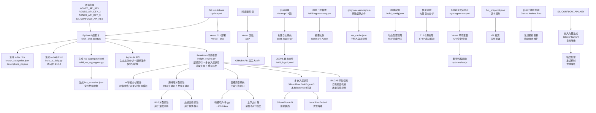
```mermaid
graph TB
A["GitHub Actions<br/>update.yml"] --> B["Python 构建脚本<br/>fetch_and_build.py"]
B --> C["生成 index.html<br/>known_categories.json<br/>descriptions_zh.json"]
B --> D["生成 ai-daily.html<br/>build_ai_daily.py<br/>时间戳: 21:14"]
B --> E["生成 rss-aggregator.html<br/>build_rss_aggregator.py"]
E --> F["生成 hot_snapshot.json<br/>全网热榜数据"]
B --> G["Agnes AI API<br/>生态态势分析 + 翻译服务<br/>多密钥轮换"]
B --> H["LlamaIndex洞察引擎<br/>insight_engine.py<br/>层级索引 + 多嵌入提供商<br/>错误处理 + 重试机制"]
H --> I["AI智能分析报告<br/>叙事脉络+因果链+信号看板"]
H --> J["源特定关键词池<br/>RSS关键词 + 热榜关键词"]
J --> K["RSS关键词池<br/>用于深度洞察"]
J --> L["热榜关键词池<br/>用于舆情展示"]
H --> M["层级索引系统<br/>小索引大窗口"]
M --> N["精细切片(子块)<br/>~150 token"]
M --> O["上下文扩展<br/>前后各3个邻居"]
H --> P["多嵌入提供商<br/>SiliconFlow BAAI/bge-m3<br/>本地fastembed回退"]
P --> Q["SiliconFlow API<br/>主提供商"]
P --> R["Local FastEmbed<br/>优雅降级"]
H --> S["RAGAS评估框架<br/>自我修正机制<br/>质量阈值控制"]
A --> T["Vercel CLI 部署<br/>vercel --prod"]
U["浏览器/前端"] --> V["Vercel 函数<br/>api/*"]
V --> W["GitHub API / 第三方 API"]
X["构建日志系统<br/>build_logger.py"] --> Y["JSONL 日志文件<br/>build_logs/*.jsonl"]
Z["构建日志摘要<br/>build-log-summary.yml"] --> AA["摘要文件<br/>summary_*.json"]
BB["自动清理<br/>cleanup(14天)"] --> X
CC[".gitignore/.vercelignore<br/>排除缓存文件"] --> DD["rss_cache.json<br/>不纳入版本控制"]
EE["构建配置<br/>build_config.json"] --> FF["动态配置管理<br/>分析功能开关"]
GG["环境变量<br/>AGNES_API_KEY<br/>AGNES_API_KEY_2<br/>AGNES_API_KEY_3<br/>SILICONFLOW_API_KEY"] --> B
HH["性能监控<br/>构建日志分析"] --> II["716个源处理<br/>674个成功获取"]
JJ["AGNES 密钥同步<br/>sync-agnes-env.yml"] --> KK["Vercel 环境变量<br/>API 密钥管理"]
KK --> LL["翻译代理函数<br/>api/translate.js"]
MM["hot_snapshot.json<br/>版本控制"] --> NN["Git 提交<br/>应用部署"]
OO["自动化维护周期<br/>GitHub Actions Bots"] --> PP["常规星标更新<br/>构建日志维护"]
QQ["SILICONFLOW_API_KEY"] --> RR["嵌入向量生成<br/>SiliconFlow API<br/>自动降级"]
RR --> SS["错误处理<br/>重试机制<br/>优雅降级"]
```

**图表来源**
- [update.yml:1-166](file://.github/workflows/update.yml#L1-L166)
- [build-log-summary.yml:1-57](file://.github/workflows/build-log-summary.yml#L1-L57)
- [sync-agnes-env.yml:1-42](file://.github/workflows/sync-agnes-env.yml#L1-L42)
- [build_logger.py:1-120](file://build_logger.py#L1-L120)
- [insight_engine.py:1-1519](file://insight_engine.py#L1-L1519)
- [build_rss_aggregator.py:100-134](file://build_rss_aggregator.py#L100-L134)
- [fetch_and_build.py:495-540](file://fetch_and_build.py#L495-L540)
- [api/translate.js:1-232](file://api/translate.js#L1-L232)
- [api/build_log.js:1-101](file://api/build_log.js#L1-L101)
- [.gitignore:1-11](file://.gitignore#L1-L11)
- [.vercelignore:1-3](file://.vercelignore#L1-L3)
- [build_logs/summary_2026-09-11.json:1-800](file://build_logs/summary_2026-09-11.json#L1-L800)
- [build_logs/2026-09-12.jsonl:1-30](file://build_logs/2026-09-12.jsonl#L1-L30)
- [build_config.json:1-14](file://build_config.json#L1-L14)
- [ai-daily.html:164](file://ai-daily.html#L164)
- [hot_snapshot.json:1-1](file://hot_snapshot.json#L1-L1)

章节来源
- [README.md:1-22](file://README.md#L1-L22)
- [update.yml:1-166](file://.github/workflows/update.yml#L1-L166)

## 核心组件
- 定时工作流 update.yml：定义 cron 调度、并发控制、构建模式判定、Git 同步与推送、Vercel 部署重试。
- **新增** 构建日志工作流 build-log-summary.yml：每小时整点运行，生成构建日志摘要并自动提交。
- **新增** AGNES 环境变量同步工作流 sync-agnes-env.yml：通过 workflow_dispatch 手动触发，将 AGNES_API_KEY 同步到 Vercel 项目并触发生产重新部署。
- 构建脚本 fetch_and_build.py：拉取 star、智能分类、翻译简介、生成 trending 快照、聚合关注动态、渲染页面。
- **重大升级** LlamaIndex洞察引擎 insight_engine.py：引入层级索引系统、多嵌入提供商支持和RAGAS评估框架，现已具备企业级语义分析能力，并增强了错误处理、重试机制和优雅降级功能。
- **新增** 构建日志系统 build_logger.py：JSONL 格式日志存储，支持按日期、类型过滤，分页查询和自动清理功能。
- AI 晨报 build_ai_daily.py：多渠道抓取、去重、翻译、评分选头条、输出 ai-daily.html，支持每日多次自动生成。
- **新增** Vercel 函数 api/build_log.js：构建日志查询 API，支持列表模式和摘要模式。
- **新增** Vercel 函数 api/translate.js：Agnes AI 翻译代理服务，提供高质量的中英文翻译功能。
- Vercel 函数：
  - refresh.js：受保护的 POST 触发 update.yml 工作流。
  - rss.js：实时/缓存 RSS 聚合，分层 T1/T2/T3，服务端缓存。
  - search.js：中文关键词翻译 + GitHub 搜索，内存缓存。
  - events.js：关注账号近 24 小时事件聚合，内存缓存。
  - article.js：文章全文提取（YouTube/GitHub/通用），本地快照优先。
  - agihunt.js：AGI Hunt 资讯代理，频道白名单与密钥管理。
- **新增** 构建配置管理 build_config.json：支持动态配置榜单参数和分析功能开关，实现零回归的配置覆盖机制。
- **新增** 配置文件：.gitignore 和 .vercelignore 排除 rss_cache.json 等构建期缓存文件。
- **新增** 全网热榜数据 hot_snapshot.json：包含微博、知乎、百度、B站、抖音等平台的热搜数据。

章节来源
- [update.yml:1-166](file://.github/workflows/update.yml#L1-L166)
- [build-log-summary.yml:1-57](file://.github/workflows/build-log-summary.yml#L1-L57)
- [sync-agnes-env.yml:1-42](file://.github/workflows/sync-agnes-env.yml#L1-L42)
- [fetch_and_build.py:1-811](file://fetch_and_build.py#L1-L811)
- [insight_engine.py:1-1519](file://insight_engine.py#L1-L1519)
- [build_logger.py:1-120](file://build_logger.py#L1-L120)
- [build_ai_daily.py:1-1251](file://build_ai_daily.py#L1-L1251)
- [build_rss_aggregator.py:100-134](file://build_rss_aggregator.py#L100-L134)
- [api/build_log.js:1-101](file://api/build_log.js#L1-L101)
- [api/translate.js:1-232](file://api/translate.js#L1-L232)
- [api/refresh.js:1-65](file://api/refresh.js#L1-L65)
- [api/rss.js:1-468](file://api/rss.js#L1-L468)
- [api/search.js:1-177](file://api/search.js#L1-L177)
- [api/events.js:1-161](file://api/events.js#L1-L161)
- [api/article.js:1-203](file://api/article.js#L1-L203)
- [api/agihunt.js:1-113](file://api/agihunt.js#L1-L113)
- [.gitignore:1-11](file://.gitignore#L1-L11)
- [.vercelignore:1-3](file://.vercelignore#L1-L3)
- [build_config.json:1-14](file://build_config.json#L1-L14)

## 架构总览
系统由五部分构成：
- 构建流水线（GitHub Actions + Python）：定时触发，拉取数据、分类、生成静态资源并提交。
- **重大升级** LlamaIndex洞察引擎：引入层级索引系统、多嵌入提供商支持和RAGAS评估框架，现已具备企业级语义分析能力，并增强了错误处理、重试机制和优雅降级功能。
- **新增** 构建日志系统：记录触发、构建、部署等关键事件，提供性能追踪、监控和自动清理能力。
- **新增** 全网热榜系统：通过 newsnow API 获取多平台热搜数据，生成 hot_snapshot.json 供前端使用。
- **新增** AI 态势分析系统：通过 Agnes AI API 生成 GitHub AI/开源生态态势的智能摘要。
- **新增** 环境变量管理系统：通过专用工作流管理 Vercel 项目环境变量，确保翻译代理函数正常运行。
- 发布平台（Vercel）：托管静态页面与 Serverless 函数，支持自定义域名与 CDN。
- 数据源（GitHub API、Trending、RSS、第三方 API）：star 列表、趋势、新闻、事件等。

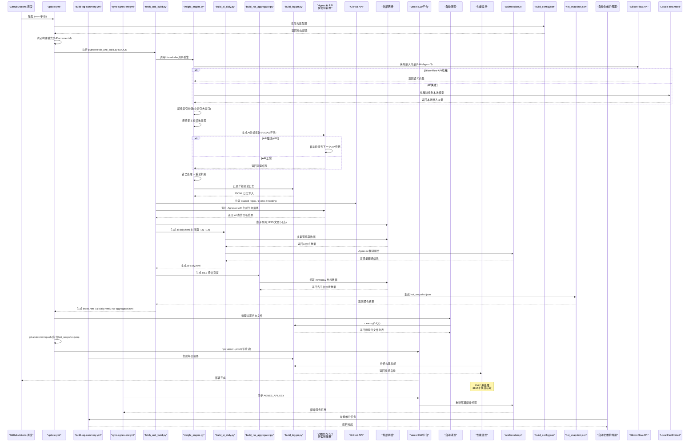
```mermaid
sequenceDiagram
participant Cron as "GitHub Actions 调度"
participant WF as "update.yml"
participant LogWF as "build-log-summary.yml"
participant EnvSync as "sync-agnes-env.yml"
participant Py as "fetch_and_build.py"
participant IE as "insight_engine.py"
participant AIDaily as "build_ai_daily.py"
participant RSS as "build_rss_aggregator.py"
participant Logger as "build_logger.py"
participant AI as "Agnes AI API<br/>多密钥轮换"
participant GH as "GitHub API"
participant Net as "外部网络"
participant Vercel as "Vercel CLI/平台"
participant Cleanup as "自动清理"
participant Monitor as "性能监控"
participant Translate as "api/translate.js"
participant Config as "build_config.json"
participant HotData as "hot_snapshot.json"
participant AutoMaint as "自动化维护周期"
participant SF as "SiliconFlow API"
participant LocalEmbed as "Local FastEmbed"
Cron->>WF : 触发 (cron/手动)
WF->>Config : 读取构建配置
Config-->>WF : 返回动态配置
WF->>WF : 确定构建模式(full/incremental)
WF->>Py : 执行 python fetch_and_build.py $MODE
Py->>IE : 调用LlamaIndex洞察引擎
IE->>SF : 获取嵌入向量(BAAI/bge-m3)
alt SiliconFlow API可用
SF-->>IE : 返回语义向量
else API失败
IE->>LocalEmbed : 优雅降级到本地模型
LocalEmbed-->>IE : 返回本地嵌入向量
end
IE->>IE : 层级索引构建(小索引大窗口)
IE->>IE : 源特定关键词池处理
IE->>AI : 生成AI分析报告(RAGAS评估)
alt API限流(429)
AI->>AI : 自动轮换到下一个API密钥
else API正常
AI-->>IE : 返回洞察结果
end
IE->>IE : 错误处理 + 重试机制
IE->>Logger : 记录详细调试日志
Logger-->>IE : JSONL 日志写入
Py->>GH : 拉取 starred repos / events / trending
Py->>AI : 调用 Agnes AI API 生成生态摘要
AI-->>Py : 返回 AI 态势分析结果
Py->>Net : 翻译/抓取 RSS/文章(可选)
Py->>AIDaily : 生成 ai-daily.html (时间戳 : 21 : 14)
AIDaily->>Net : 多渠道抓取数据
Net-->>AIDaily : 返回AI热点数据
AIDaily->>Translate : Agnes AI 翻译服务
Translate-->>AIDaily : 高质量翻译结果
AIDaily-->>Py : 生成 ai-daily.html
Py->>RSS : 生成 RSS 聚合页面
RSS->>Net : 抓取 newsnow 热榜数据
Net-->>RSS : 返回各平台热搜数据
RSS->>HotData : 生成 hot_snapshot.json
HotData-->>Py : 返回聚合结果
Py-->>WF : 生成 index.html / ai-daily.html / rss-aggregator.html
WF->>Cleanup : 清理过期日志文件
Cleanup->>Logger : cleanup(14天)
Logger-->>Cleanup : 返回删除的文件列表
WF->>WF : git add/commit/push (包含hot_snapshot.json)
WF->>Vercel : npx vercel --prod (带重试)
LogWF->>Logger : 生成每日摘要
Monitor->>Logger : 分析构建性能
Logger-->>Monitor : 返回性能指标
Vercel-->>Cron : 部署完成
Note over Monitor : 716个源处理<br/>6815个条目获取
EnvSync->>Vercel : 同步 AGNES_API_KEY
Vercel->>Translate : 重新部署翻译代理
Translate-->>EnvSync : 翻译服务可用
AutoMaint->>LogWF : 常规维护任务
LogWF-->>AutoMaint : 维护完成
```

**图表来源**
- [update.yml:1-166](file://.github/workflows/update.yml#L1-L166)
- [build-log-summary.yml:1-57](file://.github/workflows/build-log-summary.yml#L1-L57)
- [sync-agnes-env.yml:1-42](file://.github/workflows/sync-agnes-env.yml#L1-L42)
- [build_logger.py:1-120](file://build_logger.py#L1-L120)
- [insight_engine.py:1-1519](file://insight_engine.py#L1-L1519)
- [build_rss_aggregator.py:100-134](file://build_rss_aggregator.py#L100-L134)
- [fetch_and_build.py:495-540](file://fetch_and_build.py#L495-L540)
- [fetch_and_build.py:570-811](file://fetch_and_build.py#L570-L811)
- [api/translate.js:1-232](file://api/translate.js#L1-L232)
- [api/build_log.js:1-101](file://api/build_log.js#L1-L101)
- [build_logs/summary_2026-09-11.json:1-800](file://build_logs/summary_2026-09-11.json#L1-L800)
- [build_logs/2026-09-12.jsonl:1-30](file://build_logs/2026-09-12.jsonl#L1-L30)
- [build_config.json:1-14](file://build_config.json#L1-L14)
- [ai-daily.html:164](file://ai-daily.html#L164)
- [hot_snapshot.json:1-1](file://hot_snapshot.json#L1-L1)

## 详细组件分析

### 工作流 update.yml：定时任务、部署与日志记录
- 调度策略：
  - UTC 21:00（北京时间 05:00）执行全量构建。
  - UTC 2/6/10/14（北京时间 10/14/18/22）执行增量构建。
  - 支持 workflow_dispatch 手动触发。
- 并发控制：group=starhub-update，cancel-in-progress=true，避免重复构建冲突。
- **增强** 星标计数同步机制：
  - 使用 `git reset --hard origin/main` 确保基于最新远程状态构建。
  - 实施 force-with-lease 作为最后安全网，防止远程冲突。
  - 在冲突时自动重新获取并重新构建，确保数据一致性。
- **改进** 构建配置管理：
  - 通过 build_config.json 支持动态配置榜单参数。
  - 实现零回归的配置覆盖机制，非法配置自动回退默认值。
  - 支持分析功能开关（analysis_enabled），可动态启用/禁用AI分析。
- **强化** 错误处理机制：
  - 翻译熔断器：连续5次全端点失败后暂停翻译请求5分钟。
  - Trending降级：当Trending抓取失败时，自动回退到快照差值模式。
  - 健壮的异常捕获：所有API调用都包含try-catch保护。
- **重大升级** LlamaIndex洞察引擎集成：
  - 在安装步骤中添加了 `pip install llama-index-core llama-index-embeddings-fastembed fastembed`。
  - 支持SiliconFlow API和本地fastembed两种嵌入模型选择。
  - 智能分析报告包含叙事脉络、因果链、信号看板和趋势展望。
  - **新增** SILICONFLOW_API_KEY环境变量支持，用于SiliconFlow嵌入服务。
  - **新增** 多层错误处理和重试机制，确保API调用的可靠性。
- **新增** 构建日志记录：
  - 触发事件记录：记录 trigger 类型、触发方式、构建模式、运行 ID 和提交 SHA。
  - 部署结果记录：记录部署状态、运行 ID，使用 always() 确保无论成功失败都记录。
  - 当日摘要生成：调用 build_logger.summary() 生成当日构建摘要。
- **新增** 自动构建日志清理：
  - 在构建完成后执行 cleanup(14)，自动删除超过14天的构建日志文件。
  - 支持 summary_*.json 文件的滚动清理。
  - 清理结果输出到构建日志，便于监控。
- **新增** hot_snapshot.json版本控制：
  - 在 git add 命令中包含 hot_snapshot.json，确保热榜数据纳入版本管理。
  - 在 force-with-lease 重试逻辑中也包含 hot_snapshot.json。
  - 保证热榜数据与应用文件同步部署。
- 构建步骤：
  - Checkout 完整历史，确保 reset 能正确追踪 origin/main。
  - Setup Python 3.11。
  - 安装LlamaIndex洞察引擎依赖。
  - 同步到最新 remote 状态后执行构建。
  - 根据 UTC 小时判定 MODE=full 或 incremental。
  - 执行 fetch_and_build.py $MODE。
  - 仅当有变更时 commit & push，使用 force-with-lease 作为安全网。
  - 部署到 Vercel，环境变量 VERCEL_TOKEN/VERCEL_PROJECT_ID/VERCEL_ORG_ID 注入，失败退避重试最多 5 次。

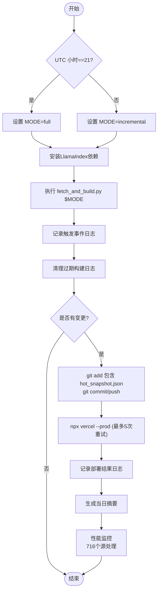
```mermaid
flowchart TD
Start(["开始"]) --> Mode{"UTC 小时==21?"}
Mode --> |是| Full["设置 MODE=full"]
Mode --> |否| Inc["设置 MODE=incremental"]
Full --> Install["安装LlamaIndex依赖"]
Inc --> Install
Install --> Run["执行 fetch_and_build.py $MODE"]
Run --> TriggerLog["记录触发事件日志"]
TriggerLog --> Cleanup["清理过期构建日志"]
Cleanup --> Commit{"是否有变更?"}
Commit --> |否| End(["结束"])
Commit --> |是| Push["git add 包含 hot_snapshot.json<br/>git commit/push"]
Push --> Deploy["npx vercel --prod (最多5次重试)"]
Deploy --> DeployLog["记录部署结果日志"]
DeployLog --> Summary["生成当日摘要"]
Summary --> Monitor["性能监控<br/>716个源处理"]
Monitor --> End
```

**图表来源**
- [update.yml:3-166](file://.github/workflows/update.yml#L3-L166)
- [build_logs/summary_2026-09-11.json:1-800](file://build_logs/summary_2026-09-11.json#L1-L800)

章节来源
- [update.yml:1-166](file://.github/workflows/update.yml#L1-L166)

### 自动化维护周期：GitHub Actions Bots
- **新增** 常规维护任务自动化：
  - 通过 GitHub Actions 定时任务执行常规的星标计数更新。
  - 自动执行构建日志维护和清理任务。
  - 每小时整点运行构建日志摘要生成。
  - 支持 workflow_dispatch 手动触发维护任务。
- **新增** 构建日志自动管理：
  - 自动记录触发事件、构建过程和部署结果。
  - 支持按日期、类型过滤的灵活查询。
  - 自动清理超过14天的日志文件，避免磁盘空间占用。
  - 生成详细的构建摘要，包含构建次数、触发次数、部署次数统计。
- **新增** 版本控制集成：
  - 自动提交构建日志和摘要文件到仓库。
  - 使用 github-actions[bot] 账户进行提交。
  - 支持 force-with-lease 防止远程冲突。
  - 确保构建日志数据的完整性和可追溯性。
- **新增** 性能监控和优化：
  - 记录构建持续时间、源抓取成功率等关键指标。
  - 支持增量vs全量构建模式优化。
  - 实时监控构建性能和系统健康状态。
  - 自动生成性能报告和维护建议。

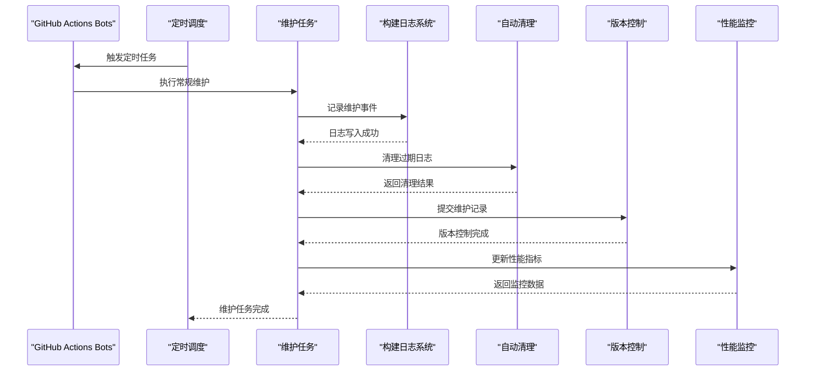
```mermaid
sequenceDiagram
participant Bot as "GitHub Actions Bots"
participant Schedule as "定时调度"
participant Maint as "维护任务"
participant Logger as "构建日志系统"
participant Cleanup as "自动清理"
participant Git as "版本控制"
participant Monitor as "性能监控"
Schedule->>Bot : 触发定时任务
Bot->>Maint : 执行常规维护
Maint->>Logger : 记录维护事件
Logger-->>Maint : 日志写入成功
Maint->>Cleanup : 清理过期日志
Cleanup-->>Maint : 返回清理结果
Maint->>Git : 提交维护记录
Git-->>Maint : 版本控制完成
Maint->>Monitor : 更新性能指标
Monitor-->>Maint : 返回监控数据
Maint-->>Schedule : 维护任务完成
```

**图表来源**
- [build-log-summary.yml:1-57](file://.github/workflows/build-log-summary.yml#L1-L57)
- [build_logger.py:1-120](file://build_logger.py#L1-L120)
- [update.yml:59-65](file://.github/workflows/update.yml#L59-L65)

章节来源
- [build-log-summary.yml:1-57](file://.github/workflows/build-log-summary.yml#L1-L57)
- [build_logger.py:1-120](file://build_logger.py#L1-L120)
- [update.yml:59-65](file://.github/workflows/update.yml#L59-L65)

### LlamaIndex洞察引擎：insight_engine.py
- **重大升级** 层级索引系统（"小索引大窗口"方法）：
  - **精细切片**：将文档切分为约150 token的子块，创建小索引以提高检索精度。
  - **上下文扩展**：检索命中块前后各取3个邻居，构建大窗口上下文。
  - **父子映射**：建立子块与父文档的映射关系，支持上下文回溯。
  - **手动余弦相似度**：绕过VectorStoreIndex限制，直接使用预计算向量进行检索。
- **增强** 多嵌入提供商支持：
  - **SiliconFlow BAAI/bge-m3 API**：作为主要提供商，支持8192 token上下文，1024维向量，中英双语。
  - **本地fastembed**：作为回退方案，支持intfloat/multilingual-e5-small和BAAI/bge-small-zh-v1.5模型。
  - **批量处理**：每批最多32条文本，提高处理效率。
  - **自动降级**：API失败时自动切换到本地模型，确保系统稳定性。
- **改进** RSS关键词处理：
  - **源特定关键词池**：分别处理RSS和热榜关键词，解决上下文对齐问题。
  - **关键词分配策略**：RSS关键词用于深度洞察生成，热榜关键词用于舆情展示。
  - **全局合并**：合并两个关键词池（去重，RSS优先），用于rising检测和前端展示。
- **优化** 查询构建机制：
  - **混合查询策略**：结合簇标签、簇内条目和关键词，防止检索偏移。
  - **上下文对齐**：确保关键词与检索上下文完全匹配，避免"数据不匹配"解释。
  - **质量阈值**：相似度阈值从0.3提升到0.5，减少误聚类。
- **增强** 高级提示工程：
  - **RAGAS评估框架**：实现context_coverage、faithfulness、relevance三个维度评估。
  - **自我修正机制**：质量不达标时自动重新生成洞察，最多迭代2次。
  - **结构化输出**：强制JSON格式，包含narrative、causal_chains、signals、outlook字段。
  - **严格约束**：禁止编造上下文未出现的事实，只分析实际存在的内容。
- **新增** 配置管理：
  - 支持insight_engine_enabled开关控制。
  - 可配置的max_documents、top_keywords、top_topics参数。
  - 默认值回退机制，确保系统稳定性。
  - **新增** SILICONFLOW_API_KEY环境变量支持。
- **重大改进** 错误处理和重试机制：
  - **多层错误处理**：每个API调用都有完整的异常捕获和错误处理。
  - **智能重试逻辑**：对于临时性错误（如超时、网络波动）自动重试最多3次。
  - **优雅降级策略**：当SiliconFlow API不可用时，自动切换到本地fastembed模型。
  - **全面调试日志**：为所有关键操作添加详细的错误追踪信息，便于问题诊断。

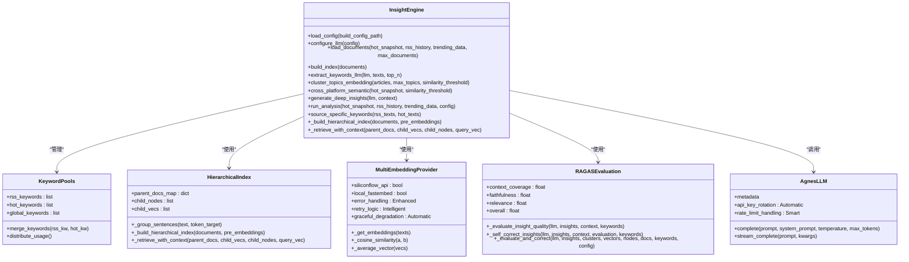
```mermaid
classDiagram
class InsightEngine {
+load_config(build_config_path)
+configure_llm(config)
+load_documents(hot_snapshot, rss_history, trending_data, max_documents)
+build_index(documents)
+extract_keywords_llm(llm, texts, top_n)
+cluster_topics_embedding(articles, max_topics, similarity_threshold)
+cross_platform_semantic(hot_snapshot, similarity_threshold)
+generate_deep_insights(llm, context)
+run_analysis(hot_snapshot, rss_history, trending_data, config)
+source_specific_keywords(rss_texts, hot_texts)
+_build_hierarchical_index(documents, pre_embeddings)
+_retrieve_with_context(parent_docs, child_vecs, child_nodes, query_vec)
}
class KeywordPools {
+rss_keywords : list
+hot_keywords : list
+global_keywords : list
+merge_keywords(rss_kw, hot_kw)
+distribute_usage()
}
class HierarchicalIndex {
+_group_sentences(text, token_target)
+_build_hierarchical_index(documents, pre_embeddings)
+_retrieve_with_context(parent_docs, child_vecs, child_nodes, query_vec)
+parent_docs_map : dict
+child_nodes : list
+child_vecs : list
}
class MultiEmbeddingProvider {
+_get_embeddings(texts)
+_cosine_similarity(a, b)
+_average_vector(vecs)
+siliconflow_api : bool
+local_fastembed : bool
+error_handling : Enhanced
+retry_logic : Intelligent
+graceful_degradation : Automatic
}
class RAGASEvaluation {
+_evaluate_insight_quality(llm, insights, context, keywords)
+_self_correct_insights(llm, insights, context, evaluation, keywords)
+_evaluate_and_correct(llm, insights, clusters, vectors, nodes, docs, keywords, config)
+context_coverage : float
+faithfulness : float
+relevance : float
+overall : float
}
class AgnesLLM {
+complete(prompt, system_prompt, temperature, max_tokens)
+stream_complete(prompt, kwargs)
+metadata
+api_key_rotation : Automatic
+rate_limit_handling : Smart
}
InsightEngine --> KeywordPools : "管理"
InsightEngine --> HierarchicalIndex : "使用"
InsightEngine --> MultiEmbeddingProvider : "使用"
InsightEngine --> RAGASEvaluation : "使用"
InsightEngine --> AgnesLLM : "调用"
```

**图表来源**
- [insight_engine.py:1-1519](file://insight_engine.py#L1-L1519)

章节来源
- [insight_engine.py:1-1519](file://insight_engine.py#L1-L1519)

### 多API密钥自动轮换机制
- **智能密钥管理**：
  - 支持AGNES_API_KEY、AGNES_API_KEY_2、AGNES_API_KEY_3等多密钥配置。
  - 自动检测并加载备用密钥，无需手动干预。
  - 密钥索引自动递增，实现负载均衡。
- **429限流自动处理**：
  - 检测到HTTP 429状态码时，立即切换到下一个密钥。
  - 记录轮换日志，便于监控和审计。
  - 支持指数退避，避免短时间内频繁切换。
- **错误恢复机制**：
  - 非429错误（如超时、网络异常）在当前密钥上重试最多2次。
  - 所有重试失败后才会尝试其他密钥。
  - 完整的错误日志记录，包含错误类型、重试次数等信息。

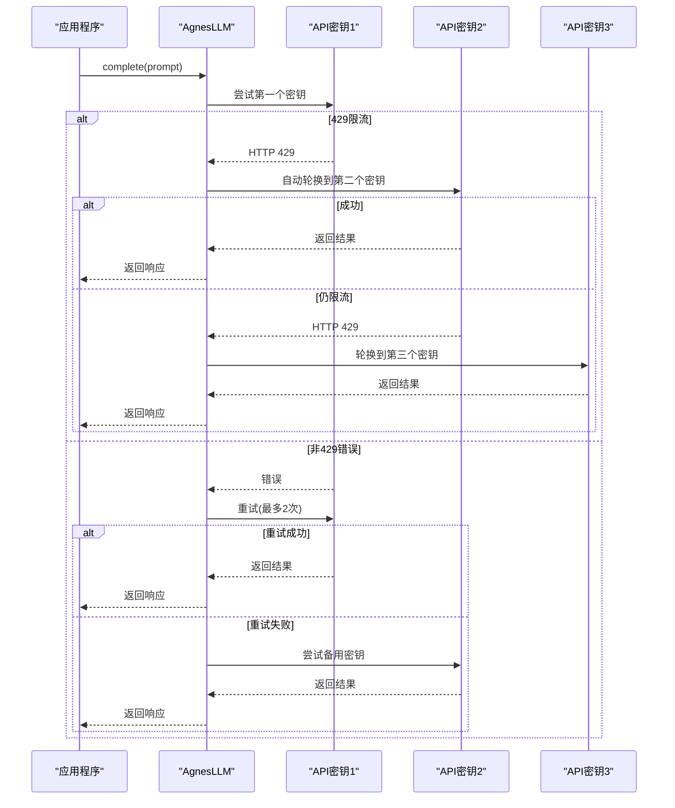
```mermaid
sequenceDiagram
participant App as "应用程序"
participant LLM as "AgnesLLM"
participant Key1 as "API密钥1"
participant Key2 as "API密钥2"
participant Key3 as "API密钥3"
App->>LLM : complete(prompt)
LLM->>Key1 : 尝试第一个密钥
alt 429限流
Key1-->>LLM : HTTP 429
LLM->>Key2 : 自动轮换到第二个密钥
alt 成功
Key2-->>LLM : 返回结果
LLM-->>App : 返回响应
else 仍限流
Key2-->>LLM : HTTP 429
LLM->>Key3 : 轮换到第三个密钥
Key3-->>LLM : 返回结果
LLM-->>App : 返回响应
end
else 非429错误
Key1-->>LLM : 错误
LLM->>Key1 : 重试(最多2次)
alt 重试成功
Key1-->>LLM : 返回结果
LLM-->>App : 返回响应
else 重试失败
LLM->>Key2 : 尝试备用密钥
Key2-->>LLM : 返回结果
LLM-->>App : 返回响应
end
end
```

**图表来源**
- [insight_engine.py:91-171](file://insight_engine.py#L91-L171)

章节来源
- [insight_engine.py:91-171](file://insight_engine.py#L91-L171)

### 优雅降级机制
- **嵌入向量生成降级**：
  - 首选SiliconFlow BAAI/bge-m3 API，提供高质量的嵌入向量。
  - API失败时自动切换到本地fastembed模型，保证功能连续性。
  - 本地模型支持intfloat/multilingual-e5-small和BAAI/bge-small-zh-v1.5。
- **索引构建降级**：
  - 当LlamaIndex不可用时，使用字符重叠算法进行聚类。
  - 阈值从0.3提升到0.5，避免中文常用字导致误聚类。
  - 使用锚点比较防止链式聚类，提高聚类质量。
- **关键词提取降级**：
  - 优先使用LLM进行智能关键词提取。
  - LLM失败时回退到TF-IDF算法，保证基本功能。
  - 支持中英文混合文本的关键词提取。
- **洞察生成降级**：
  - 当检索上下文不可用时，使用关键词-based的简单洞察生成。
  - 保持输出格式的一致性，确保前端兼容性。
  - 提供有意义的默认内容，避免空响应。

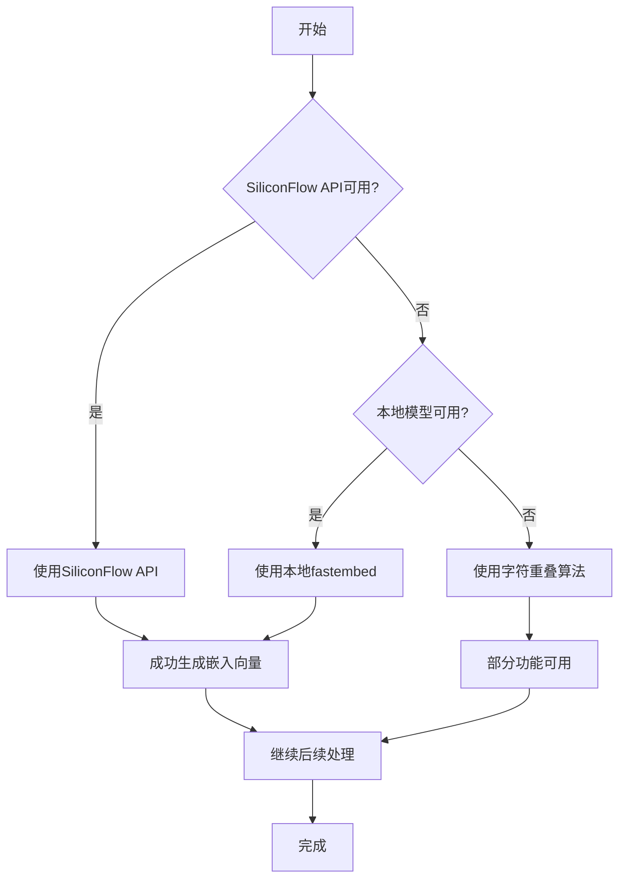
```mermaid
flowchart TD
Start["开始"] --> CheckSF{"SiliconFlow API可用?"}
CheckSF --> |是| UseSF["使用SiliconFlow API"]
CheckSF --> |否| CheckLocal{"本地模型可用?"}
CheckLocal --> |是| UseLocal["使用本地fastembed"]
CheckLocal --> |否| Fallback["使用字符重叠算法"]
UseSF --> Success["成功生成嵌入向量"]
UseLocal --> Success
Fallback --> PartialSuccess["部分功能可用"]
Success --> Continue["继续后续处理"]
PartialSuccess --> Continue
Continue --> End["完成"]
```

**图表来源**
- [insight_engine.py:529-584](file://insight_engine.py#L529-L584)
- [insight_engine.py:808-837](file://insight_engine.py#L808-L837)

章节来源
- [insight_engine.py:529-584](file://insight_engine.py#L529-L584)
- [insight_engine.py:808-837](file://insight_engine.py#L808-L837)

### 全面调试日志系统
- **结构化日志记录**：
  - 所有关键操作都记录详细的调试信息。
  - 包含时间戳、操作类型、状态码、错误信息等。
  - 支持按日期、类型过滤的灵活查询。
- **错误追踪**：
  - 完整的异常堆栈跟踪，便于问题定位。
  - 记录API调用详情，包括请求参数和响应内容。
  - 支持性能指标收集，如响应时间、成功率等。
- **监控告警**：
  - 实时监控关键指标，如API可用性、错误率等。
  - 支持异常情况的自动告警。
  - 提供历史数据分析，便于趋势预测。

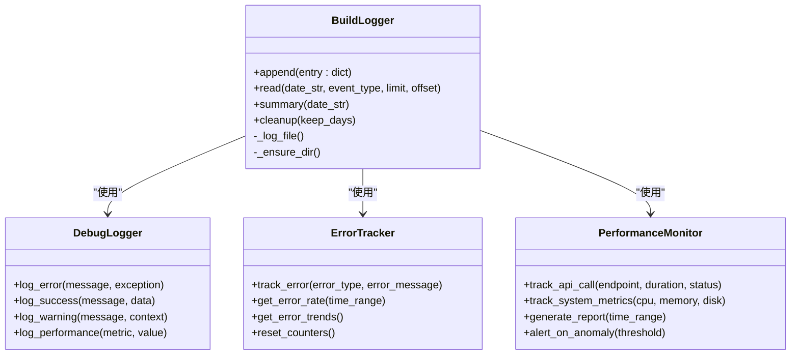
```mermaid
classDiagram
class BuildLogger {
+append(entry : dict)
+read(date_str, event_type, limit, offset)
+summary(date_str)
+cleanup(keep_days)
-_log_file()
-_ensure_dir()
}
class DebugLogger {
+log_error(message, exception)
+log_success(message, data)
+log_warning(message, context)
+log_performance(metric, value)
}
class ErrorTracker {
+track_error(error_type, error_message)
+get_error_rate(time_range)
+get_error_trends()
+reset_counters()
}
class PerformanceMonitor {
+track_api_call(endpoint, duration, status)
+track_system_metrics(cpu, memory, disk)
+generate_report(time_range)
+alert_on_anomaly(threshold)
}
BuildLogger --> DebugLogger : "使用"
BuildLogger --> ErrorTracker : "使用"
BuildLogger --> PerformanceMonitor : "使用"
```

**图表来源**
- [build_logger.py:1-120](file://build_logger.py#L1-L120)
- [insight_engine.py:100-171](file://insight_engine.py#L100-L171)

章节来源
- [build_logger.py:1-120](file://build_logger.py#L1-L120)
- [insight_engine.py:100-171](file://insight_engine.py#L100-L171)

### 层级索引系统详解
- **设计目标**：解决传统向量检索中上下文丢失的问题，通过"小索引大窗口"方法提升检索质量。
- **核心机制**：
  - **精细切片**：将文档按句子切分，组合为约150 token的语义块，每个块独立向量化。
  - **父子映射**：建立子块与原始文档的映射关系，支持上下文回溯。
  - **上下文扩展**：检索命中块后，扩展前后各3个邻居，构建丰富上下文。
  - **手动检索**：绕过VectorStoreIndex限制，直接使用预计算向量进行余弦相似度计算。
- **技术实现**：
  - `_group_sentences()`：智能句子分组，保持语义完整性。
  - `_build_hierarchical_index()`：构建层级索引，建立父子关系。
  - `_retrieve_with_context()`：基于余弦相似度的上下文扩展检索。
- **性能优化**：
  - 预计算文档级embedding，复用给子块使用。
  - 子块embedding失败时回退到父文档embedding。
  - 批量处理提高嵌入向量生成效率。

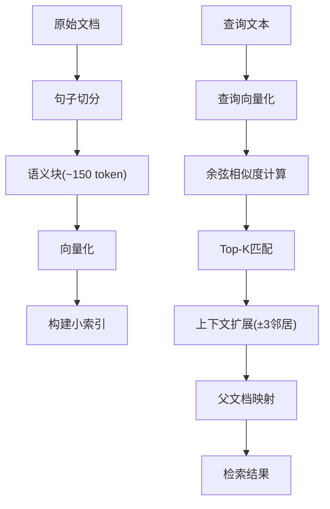
```mermaid
flowchart TD
Doc["原始文档"] --> Split["句子切分"]
Split --> Groups["语义块(~150 token)"]
Groups --> Embed["向量化"]
Embed --> Index["构建小索引"]
Query["查询文本"] --> QueryEmbed["查询向量化"]
QueryEmbed --> Similarity["余弦相似度计算"]
Similarity --> TopK["Top-K匹配"]
TopK --> Context["上下文扩展(±3邻居)"]
Context --> Parent["父文档映射"]
Parent --> Result["检索结果"]
```

**图表来源**
- [insight_engine.py:351-467](file://insight_engine.py#L351-L467)

章节来源
- [insight_engine.py:351-467](file://insight_engine.py#L351-L467)

### RAGAS评估与自我修正机制
- **评估框架**：
  - **context_coverage**：评估洞察对检索上下文的覆盖度。
  - **faithfulness**：评估洞察内容的真实性和上下文支撑。
  - **relevance**：评估洞察与关键词/话题的相关性。
  - **overall**：综合评分，用于判断是否需要自我修正。
- **自我修正流程**：
  - **质量检查**：如果overall评分低于阈值（默认0.6），触发修正。
  - **薄弱维度识别**：分析具体哪个维度得分较低。
  - **重新生成**：基于评估反馈重新生成洞察报告。
  - **迭代优化**：最多迭代2次，直到达到质量要求。
- **提示工程优化**：
  - **严格约束**：禁止编造上下文未出现的事实。
  - **结构化输出**：强制JSON格式，确保解析可靠性。
  - **降级处理**：解析失败时返回基础洞察，保证系统稳定性。

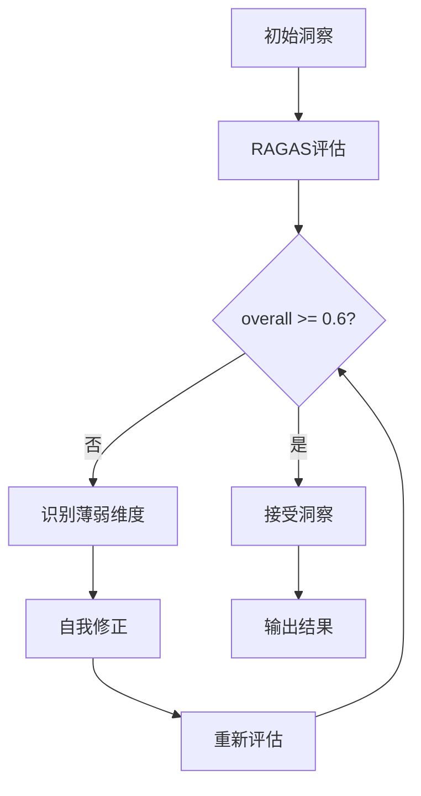
```mermaid
flowchart TD
Start["初始洞察"] --> Evaluate["RAGAS评估"]
Evaluate --> Check{"overall >= 0.6?"}
Check --> |是| Accept["接受洞察"]
Check --> |否| Identify["识别薄弱维度"]
Identify --> Correct["自我修正"]
Correct --> Reevaluate["重新评估"]
Reevaluate --> Check
Accept --> End["输出结果"]
```

**图表来源**
- [insight_engine.py:1158-1313](file://insight_engine.py#L1158-L1313)

章节来源
- [insight_engine.py:1158-1313](file://insight_engine.py#L1158-L1313)

### 源特定关键词池功能详解
- **问题背景**：
  - 当前run_analysis对所有数据源（热榜 + RSS + Trending）的合并文本做一次LLM调用提取全局关键词。
  - 洞察生成的检索上下文仅来自RSS，导致热榜关键词在RSS上下文中找不到，relevance低（0.6）。
  - LLM试图解释"数据不匹配"而非生成洞察，导致叙事脉络输出异常。
  - RSS和热榜关键词基本不重叠，混合后互相稀释，洞察质量下降。
- **解决方案**：
  - **分源提取**：分别对RSS文本和热榜文本进行关键词提取。
  - **关键词分配**：RSS关键词用于深度洞察生成，热榜关键词用于舆情展示。
  - **全局合并**：合并RSS和热榜关键词（去重，RSS优先），用于rising检测和前端展示。
- **实现细节**：
  - 在run_analysis中新增rss_texts和hot_texts分离逻辑。
  - 分别调用extract_keywords_llm提取RSS关键词和热榜关键词。
  - 合并两个关键词池生成全局关键词池。
  - 修改generate_deep_insights和_evaluate_and_correct使用RSS关键词。
- **性能影响**：
  - 增加一次LLM调用（原来1次全局→现在2次分源，净增1次）。
  - 构建时间增加1-2秒。
  - 无前端改动，保持向后兼容。

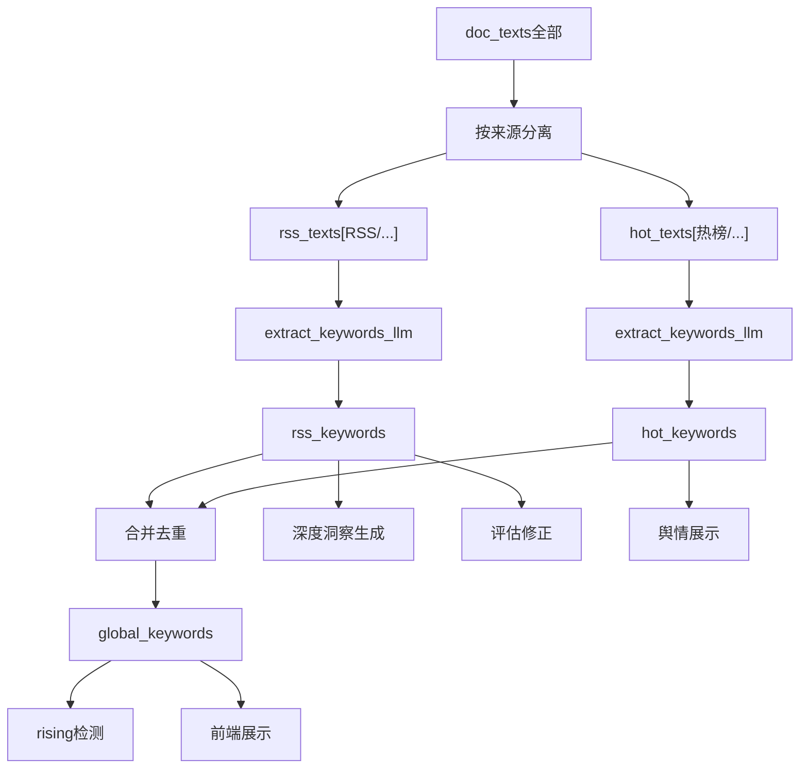
```mermaid
flowchart TD
DocTexts["doc_texts全部"] --> Split["按来源分离"]
Split --> RSSTexts["rss_texts[RSS/...]"]
Split --> HotTexts["hot_texts[热榜/...]"]
RSSTexts --> RSSExtract["extract_keywords_llm"]
HotTexts --> HotExtract["extract_keywords_llm"]
RSSExtract --> RSSKeywords["rss_keywords"]
HotExtract --> HotKeywords["hot_keywords"]
RSSKeywords --> Merge["合并去重"]
HotKeywords --> Merge
Merge --> GlobalKeywords["global_keywords"]
GlobalKeywords --> Rising["rising检测"]
GlobalKeywords --> Frontend["前端展示"]
RSSKeywords --> DeepInsights["深度洞察生成"]
RSSKeywords --> EvalCorrect["评估修正"]
HotKeywords --> PublicOpinion["舆情展示"]
```

**图表来源**
- [insight_engine.py:1388-1402](file://insight_engine.py#L1388-L1402)
- [insight_engine.py:1445-1457](file://insight_engine.py#L1445-L1457)
- [2026-09-12-source-keyword-pool-design.md:15-49](file://docs/superpowers/specs/2026-09-12-source-keyword-pool-design.md#L15-L49)

章节来源
- [insight_engine.py:1388-1402](file://insight_engine.py#L1388-L1402)
- [insight_engine.py:1445-1457](file://insight_engine.py#L1445-L1457)
- [2026-09-12-source-keyword-pool-design.md:1-80](file://docs/superpowers/specs/2026-09-12-source-keyword-pool-design.md#L1-L80)

### 构建日志系统：build_logger.py 与 api/build_log.js
- **新增** 构建日志系统核心功能：
  - JSONL 格式存储：每日一个文件，追加写入，路径为 build_logs/YYYY-MM-DD.jsonl。
  - 统一时间戳：使用北京时间（BJT）作为标准时间。
  - 灵活查询：支持按日期、事件类型过滤，分页返回。
  - 摘要统计：生成指定日期的构建摘要，包含构建次数、触发次数、部署次数等。
  - **新增** 自动清理：cleanup(keep_days=14) 方法自动删除超过指定天数的日志文件。
- **新增** Vercel 函数 api/build_log.js：
  - 列表模式：GET /api/build_log?date=YYYY-MM-DD&type=build&limit=50&offset=0
  - 摘要模式：GET /api/build_log?summary=1&date=YYYY-MM-DD
  - CORS 保护：限制允许的域名访问。
  - 缓存控制：no-store 防止缓存敏感数据。
- **新增** 性能监控功能：
  - 构建持续时间监控：记录每次构建的执行时间。
  - 源抓取成功率统计：跟踪716个源的抓取状态。
  - 翻译缓存命中率：监控翻译服务的缓存效果。
  - 内容变化趋势：分析历史数据的变化情况。

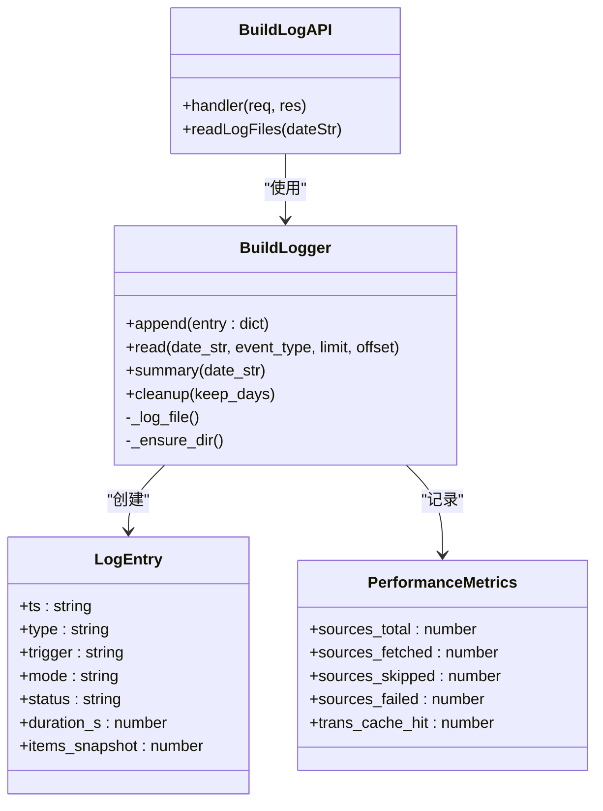
```mermaid
classDiagram
class BuildLogger {
+append(entry : dict)
+read(date_str, event_type, limit, offset)
+summary(date_str)
+cleanup(keep_days)
-_log_file()
-_ensure_dir()
}
class BuildLogAPI {
+handler(req, res)
+readLogFiles(dateStr)
}
class LogEntry {
+ts : string
+type : string
+trigger : string
+mode : string
+status : string
+duration_s : number
+items_snapshot : number
}
class PerformanceMetrics {
+sources_total : number
+sources_fetched : number
+sources_skipped : number
+sources_failed : number
+trans_cache_hit : number
}
BuildLogger --> LogEntry : "创建"
BuildLogAPI --> BuildLogger : "使用"
BuildLogger --> PerformanceMetrics : "记录"
```

**图表来源**
- [build_logger.py:1-120](file://build_logger.py#L1-L120)
- [api/build_log.js:1-101](file://api/build_log.js#L1-L101)
- [build_logs/summary_2026-09-11.json:1-800](file://build_logs/summary_2026-09-11.json#L1-L800)
- [build_logs/2026-09-12.jsonl:1-30](file://build_logs/2026-09-12.jsonl#L1-L30)

章节来源
- [build_logger.py:1-120](file://build_logger.py#L1-L120)
- [api/build_log.js:1-101](file://api/build_log.js#L1-L101)

### 构建日志摘要工作流：build-log-summary.yml
- **新增** 每小时整点运行的摘要生成工作流。
- 功能特性：
  - 使用 build_logger.summary() 生成当日构建摘要。
  - 输出构建次数、触发次数、部署次数、刷新次数统计。
  - 计算内容变化量：latest_items - oldest_items。
  - 自动提交摘要文件到仓库：build_logs/summary_YYYY-MM-DD.json。
- 并发控制：group=build-log-summary，cancel-in-progress=true。

章节来源
- [build-log-summary.yml:1-57](file://.github/workflows/build-log-summary.yml#L1-L57)

### AGNES 环境变量同步工作流：sync-agnes-env.yml
- **新增** 专用环境变量管理工作流：
  - 通过 workflow_dispatch 手动触发，无需登录 Vercel CLI。
  - 将 AGNES_API_KEY 从 GitHub Secrets 同步到 Vercel 项目环境变量。
  - 自动触发生产环境重新部署，确保翻译代理函数立即生效。
- **新增** 安全的环境变量同步机制：
  - 使用 Vercel REST API 进行环境变量 upsert 操作。
  - 支持 production、preview、development 三个环境的目标部署。
  - 完整的 HTTP 状态码验证（200/201），确保操作成功。
  - 详细的响应日志输出，便于问题诊断。
- **新增** 防止空目录部署覆盖：
  - 必须执行 actions/checkout@v4，确保当前目录包含项目文件。
  - 避免缺少 checkout 步骤导致空目录上传覆盖生产内容。
  - 通过显式的 checkout 步骤保证部署安全性。
- **新增** 错误处理和重试机制：
  - HTTP 状态码检查，非 200/201 状态码立即退出。
  - 响应内容捕获和输出，便于调试环境问题。
  - 独立的 job 隔离，避免影响其他工作流。

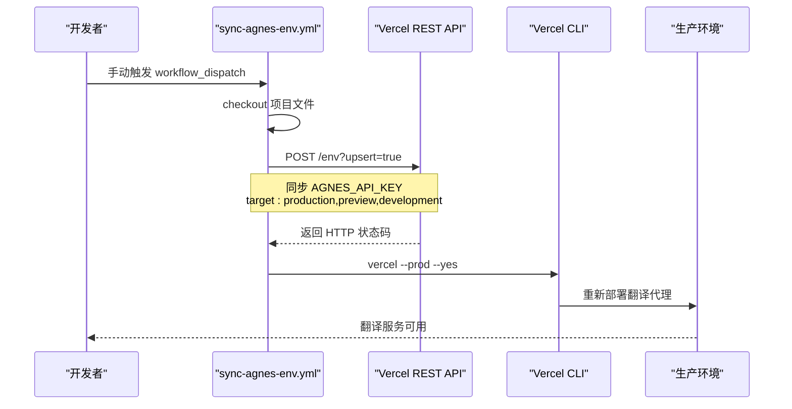
```mermaid
sequenceDiagram
participant Dev as "开发者"
participant WF as "sync-agnes-env.yml"
participant VercelAPI as "Vercel REST API"
participant CLI as "Vercel CLI"
participant Prod as "生产环境"
Dev->>WF : 手动触发 workflow_dispatch
WF->>WF : checkout 项目文件
WF->>VercelAPI : POST /env?upsert=true
Note over WF,VercelAPI : 同步 AGNES_API_KEY<br/>target : production,preview,development
VercelAPI-->>WF : 返回 HTTP 状态码
WF->>CLI : vercel --prod --yes
CLI->>Prod : 重新部署翻译代理
Prod-->>Dev : 翻译服务可用
```

**图表来源**
- [sync-agnes-env.yml:1-42](file://.github/workflows/sync-agnes-env.yml#L1-L42)

章节来源
- [sync-agnes-env.yml:1-42](file://.github/workflows/sync-agnes-env.yml#L1-L42)

### 全网热榜系统：hot_snapshot.json 与版本控制
- **新增** 全网热榜数据收集：
  - 通过 newsnow API 获取多平台热搜数据，支持微博、知乎、百度、B站、抖音等平台。
  - 每平台限制前10条热门数据，避免数据量过大。
  - 失败不阻塞构建流程，确保系统稳定性。
- **新增** hot_snapshot.json 生成与管理：
  - 结构化数据存储：包含 platform、name、items 字段。
  - 每条热搜包含 rank、title、url、hot 信息。
  - 紧凑 JSON 格式，减少存储空间占用。
  - **新增** 版本控制集成：在 update.yml 的 git add 命令中包含 hot_snapshot.json。
- **新增** 前端集成：
  - 预加载机制：通过 link rel="preload" 提前加载 hot_snapshot.json。
  - 异步加载：JavaScript 中通过 fetch('hot_snapshot.json') 获取数据。
  - 错误处理：加载失败时显示友好提示信息。
- **新增** 版本控制集成：
  - 在 update.yml 的 git add 命令中包含 hot_snapshot.json。
  - 确保热榜数据与应用文件同步提交和部署。
  - 支持历史版本追溯和数据回溯。

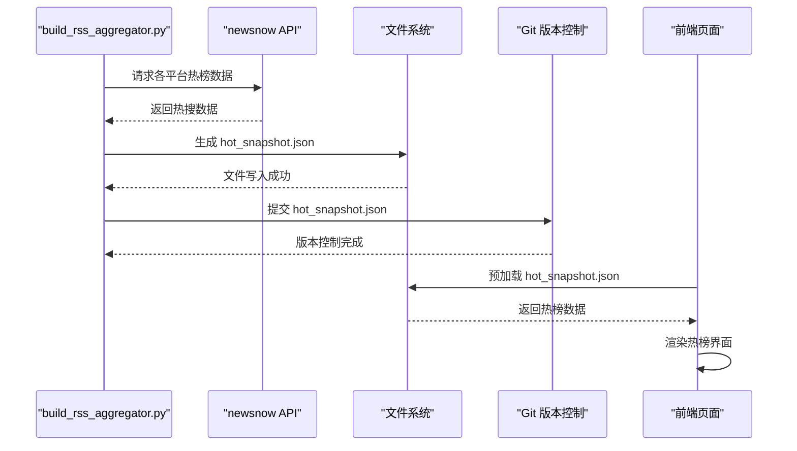
```mermaid
sequenceDiagram
participant Builder as "build_rss_aggregator.py"
participant NewsNow as "newsnow API"
participant FileSys as "文件系统"
participant Git as "Git 版本控制"
participant Frontend as "前端页面"
Builder->>NewsNow : 请求各平台热榜数据
NewsNow-->>Builder : 返回热搜数据
Builder->>FileSys : 生成 hot_snapshot.json
FileSys-->>Builder : 文件写入成功
Builder->>Git : 提交 hot_snapshot.json
Git-->>Builder : 版本控制完成
Frontend->>FileSys : 预加载 hot_snapshot.json
FileSys-->>Frontend : 返回热榜数据
Frontend->>Frontend : 渲染热榜界面
```

**图表来源**
- [build_rss_aggregator.py:100-134](file://build_rss_aggregator.py#L100-L134)
- [build_rss_aggregator.py:4240-4247](file://build_rss_aggregator.py#L4240-L4247)
- [build_rss_aggregator.py:3940-3967](file://build_rss_aggregator.py#L3940-L3967)
- [update.yml:93](file://.github/workflows/update.yml#L93)
- [hot_snapshot.json:1-1](file://hot_snapshot.json#L1-L1)

章节来源
- [build_rss_aggregator.py:100-134](file://build_rss_aggregator.py#L100-L134)
- [build_rss_aggregator.py:4240-4247](file://build_rss_aggregator.py#L4240-L4247)
- [build_rss_aggregator.py:3940-3967](file://build_rss_aggregator.py#L3940-L3967)
- [hot_snapshot.json:1-1](file://hot_snapshot.json#L1-L1)

### AI晨报自动化生成：build_ai_daily.py 与时间戳优化
- **增强** 自动化生成流程：
  - ai-daily.html自动生成时间戳从21:02更新至21:14，体现每日多次生成的自动化工作流增强。
  - 支持北京时间（BJT）精确时间戳记录，确保内容时效性。
  - 多渠道数据源整合：AIHOT API、Hacker News、The Verge、TechCrunch、arXiv、36氪、Redis、AtlasNote。
- **改进** 翻译服务集成：
  - Agnes AI API优先使用，提供稳定可靠的翻译服务。
  - 多端点降级链：Google gtx → Bing 网页版 → MyMemory → Google dict-chrome。
  - 构建内缓存机制，减少重复API调用。
- **优化** 数据处理流程：
  - 36小时窗口筛选，确保内容新鲜度。
  - 跨源去重四层递进：标题精确相同、包含关系、URL规范化、摘要指纹互含。
  - 头条评分算法：综合编辑分、跨源报道数、信源权重、分类权重。
- **增强** 页面生成质量：
  - 报纸式刊头设计，包含今日要闻头条区和双栏新闻流。
  - 响应式设计，支持移动端和桌面端展示。
  - 明暗主题切换，提升用户体验。

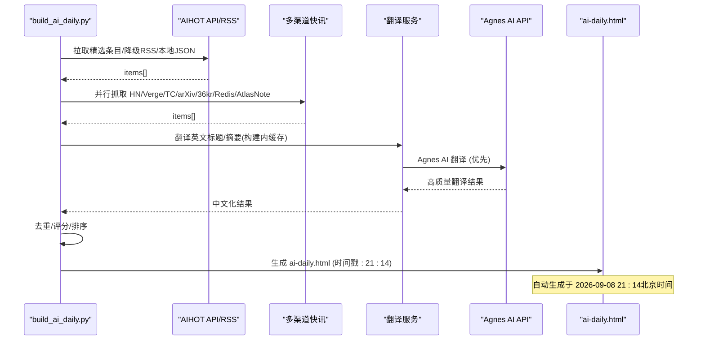
```mermaid
sequenceDiagram
participant Builder as "build_ai_daily.py"
participant API as "AIHOT API/RSS"
participant Channels as "多渠道快讯"
participant Trans as "翻译服务"
participant AI as "Agnes AI API"
participant Out as "ai-daily.html"
Builder->>API : 拉取精选条目/降级RSS/本地JSON
API-->>Builder : items[]
Builder->>Channels : 并行抓取 HN/Verge/TC/arXiv/36kr/Redis/AtlasNote
Channels-->>Builder : items[]
Builder->>Trans : 翻译英文标题/摘要(构建内缓存)
Trans->>AI : Agnes AI 翻译 (优先)
AI-->>Trans : 高质量翻译结果
Trans-->>Builder : 中文化结果
Builder->>Builder : 去重/评分/排序
Builder->>Out : 生成 ai-daily.html (时间戳 : 21 : 14)
Note over Out : 自动生成于 2026-09-08 21 : 14北京时间
```

**图表来源**
- [build_ai_daily.py:137-175](file://build_ai_daily.py#L137-L175)
- [build_ai_daily.py:177-228](file://build_ai_daily.py#L177-L228)
- [build_ai_daily.py:293-325](file://build_ai_daily.py#L293-L325)
- [build_ai_daily.py:483-512](file://build_ai_daily.py#L483-L512)
- [build_ai_daily.py:585-679](file://build_ai_daily.py#L585-L679)
- [build_ai_daily.py:741-775](file://build_ai_daily.py#L741-L775)
- [build_ai_daily.py:588-616](file://build_ai_daily.py#L588-L616)
- [ai-daily.html:164](file://ai-daily.html#L164)

章节来源
- [build_ai_daily.py:1-1251](file://build_ai_daily.py#L1-L1251)
- [ai-daily.html:164](file://ai-daily.html#L164)

### 构建配置管理：build_config.json 与动态配置
- **新增** 动态配置系统：
  - 通过 build_config.json 文件支持运行时配置覆盖。
  - 实现零回归机制：配置项缺失或格式错误时自动回退到内置默认值。
  - 支持多种配置类型：整数（榜单数量）、布尔值（功能开关）、数组（主题列表）。
- **新增** 配置项说明：
  - trend_top：榜单展示数量（默认20）。
  - ai_min_stars：AI项目池最小星标数（默认500）。
  - new_min_stars：新秀榜最小星标数（默认50）。
  - trend_max_stars：涨星榜排除巨头项目的最大星标数（默认50000）。
  - ai_topics：AI项目搜索主题列表。
  - analysis_enabled：分析功能总开关（默认true）。
  - insight_engine_enabled：洞察引擎开关（默认true）。
  - insight_llm_provider：LLM提供商选择（默认agnes）。
  - insight_max_documents：最大文档数量（默认200）。
  - insight_top_keywords：顶级关键词数量（默认30）。
  - insight_top_topics：顶级主题数量（默认15）。
  - **新增** insight_self_correct：自我修正开关（默认true）。
  - **新增** insight_quality_threshold：质量阈值（默认0.6）。
  - **新增** insight_max_corrections：最大修正次数（默认2）。
- **新增** 配置验证机制：
  - 类型检查：确保配置项符合预期数据类型。
  - 范围验证：数值配置必须在合理范围内。
  - 完整性检查：数组配置必须非空且元素有效。
- **新增** 配置加载流程：
  - 尝试加载 build_config.json 文件。
  - 解析失败时记录错误并使用默认配置。
  - 逐项验证配置有效性。
  - 合并配置并应用到运行时。

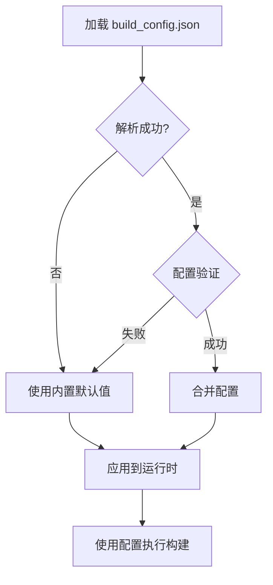
```mermaid
flowchart TD
Load["加载 build_config.json"] --> Parse{"解析成功?"}
Parse --> |否| Default["使用内置默认值"]
Parse --> |是| Validate{"配置验证"}
Validate --> |失败| Default
Validate --> |成功| Merge["合并配置"]
Merge --> Apply["应用到运行时"]
Default --> Apply
Apply --> Use["使用配置执行构建"]
```

**图表来源**
- [build_config.json:1-14](file://build_config.json#L1-L14)
- [fetch_and_build.py:178-214](file://fetch_and_build.py#L178-L214)

章节来源
- [build_config.json:1-14](file://build_config.json#L1-L14)
- [fetch_and_build.py:178-214](file://fetch_and_build.py#L178-L214)

### Agnes AI API 集成：生态态势分析与翻译服务
- **新增** Agnes AI API 密钥处理：
  - 在 GitHub Actions 工作流中通过环境变量注入 AGNES_API_KEY、AGNES_API_KEY_2、AGNES_API_KEY_3。
  - 使用 secrets 管理敏感 API 密钥，确保安全传输。
  - Python 脚本通过标准环境变量机制读取密钥。
- **新增** AI 态势分析功能：
  - generate_ai_summary() 函数调用 Agnes AI API 生成 GitHub AI/开源生态态势摘要。
  - 基于涨星项目前10名生成一句话概括（30字以内）。
  - 使用 agnes-2.5-flash 模型进行智能分析。
  - 失败时静默降级，不影响主构建流程。
- **新增** 翻译服务增强：
  - 在 build_ai_daily.py 中实现 _agnes_translate() 函数。
  - AGNES_API_KEY 配置时优先使用 Agnes AI 翻译端点。
  - 解决免费翻译端点（Google/Bing/MyMemory）被封锁的问题。
  - 提供稳定可靠的翻译服务，响应时间约1秒/条。
- **新增** API 调用特性：
  - 超时保护：15-20秒超时限制。
  - 错误处理：HTTP 错误和异常捕获。
  - 响应验证：检查返回内容长度和质量。
  - 用户代理标识：starhub-auto-update 便于追踪。

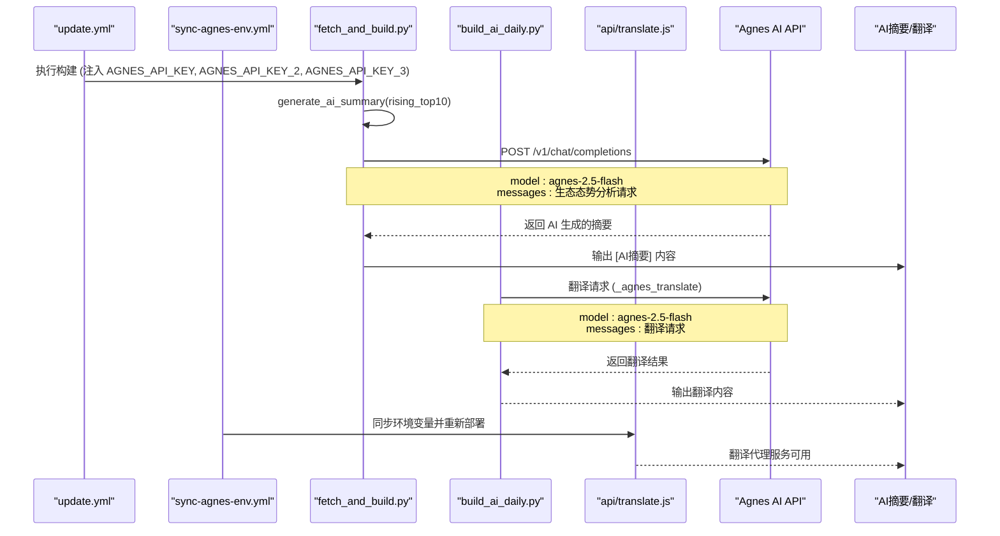
```mermaid
sequenceDiagram
participant WF as "update.yml"
participant EnvSync as "sync-agnes-env.yml"
participant Py as "fetch_and_build.py"
participant AIDaily as "build_ai_daily.py"
participant Translate as "api/translate.js"
participant AI as "Agnes AI API"
participant Out as "AI摘要/翻译"
WF->>Py : 执行构建 (注入 AGNES_API_KEY, AGNES_API_KEY_2, AGNES_API_KEY_3)
Py->>Py : generate_ai_summary(rising_top10)
Py->>AI : POST /v1/chat/completions
Note over Py,AI : model : agnes-2.5-flash<br/>messages : 生态态势分析请求
AI-->>Py : 返回 AI 生成的摘要
Py->>Out : 输出 [AI摘要] 内容
AIDaily->>AI : 翻译请求 (_agnes_translate)
Note over AIDaily,AI : model : agnes-2.5-flash<br/>messages : 翻译请求
AI-->>AIDaily : 返回翻译结果
AIDaily-->>Out : 输出翻译内容
EnvSync->>Translate : 同步环境变量并重新部署
Translate-->>Out : 翻译代理服务可用
```

**图表来源**
- [update.yml:50-57](file://.github/workflows/update.yml#L50-L57)
- [sync-agnes-env.yml:16-31](file://.github/workflows/sync-agnes-env.yml#L16-L31)
- [fetch_and_build.py:495-540](file://fetch_and_build.py#L495-L540)
- [build_ai_daily.py:588-616](file://build_ai_daily.py#L588-L616)
- [api/translate.js:87-88](file://api/translate.js#L87-L88)

章节来源
- [update.yml:50-57](file://.github/workflows/update.yml#L50-L57)
- [sync-agnes-env.yml:16-31](file://.github/workflows/sync-agnes-env.yml#L16-L31)
- [fetch_and_build.py:495-540](file://fetch_and_build.py#L495-L540)
- [build_ai_daily.py:588-616](file://build_ai_daily.py#L588-L616)

### Vercel 翻译代理函数：api/translate.js
- **新增** Agnes AI 翻译代理服务：
  - 为前端运行时提供安全的翻译 API 端点，避免暴露 API Key。
  - 支持批量翻译请求，最大 20 条文本 per request。
  - 内置内存缓存机制，减少重复 API 调用。
  - IP 级别的限流保护，每分钟最多 120 次请求。
- **新增** 安全访问控制：
  - CORS 白名单机制，仅允许指定域名访问。
  - 环境变量 AGNES_API_KEY 验证，未配置时返回 500 错误。
  - 请求方法验证，仅支持 POST 请求。
  - Origin 验证，防止跨域攻击。
- **新增** 错误处理和降级机制：
  - 单个翻译失败不影响整批请求，返回空字符串。
  - 全部翻译失败时返回 502 错误。
  - 超时保护：12秒上游超时限制。
  - 前端可自动降级到 Google GTX 免费端点。
- **新增** 性能优化：
  - 文本前缀缓存，TTL 24小时。
  - 并行翻译处理，提升批量请求性能。
  - 文本长度限制，防止过大请求。
  - 思考型模型优化，关闭 thinking 功能加速响应。

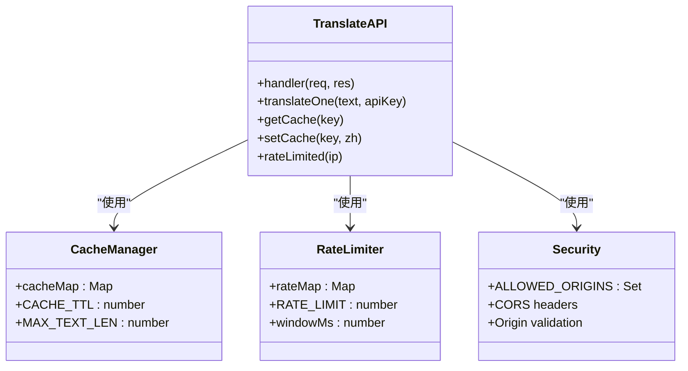
```mermaid
classDiagram
class TranslateAPI {
+handler(req, res)
+translateOne(text, apiKey)
+getCache(key)
+setCache(key, zh)
+rateLimited(ip)
}
class CacheManager {
+cacheMap : Map
+CACHE_TTL : number
+MAX_TEXT_LEN : number
}
class RateLimiter {
+rateMap : Map
+RATE_LIMIT : number
+windowMs : number
}
class Security {
+ALLOWED_ORIGINS : Set
+CORS headers
+Origin validation
}
TranslateAPI --> CacheManager : "使用"
TranslateAPI --> RateLimiter : "使用"
TranslateAPI --> Security : "使用"
```

**图表来源**
- [api/translate.js:1-232](file://api/translate.js#L1-L232)

章节来源
- [api/translate.js:1-232](file://api/translate.js#L1-L232)

### 构建脚本 fetch_and_build.py：数据拉取、分类与页面生成
- 数据拉取：
  - 分页拉取用户 starred repos，按 per_page=100 循环获取。
  - 拉取关注账号列表及其 public events（滚动 24 小时窗口）。
  - 拉取 Trending daily（多语言页合并去重），AI 池基于 topic 搜索。
- 智能分类：
  - known_categories.json 保持已有项目分类稳定。
  - 新项目通过 classify_new 规则匹配（关键词短语避免误伤）。
- **强化** 简介处理与翻译熔断：
  - 无描述则从 README 提取首句简介。
  - 英文简介通过多端点降级链翻译为中文（Google gtx → MyMemory → 备用端点）。
  - **新增** 翻译熔断器：连续5次全端点失败后暂停翻译请求5分钟，避免上游故障时的请求风暴。
- **改进** 排行榜与快照：
  - 总榜按 stars 排序；涨星榜优先 Trending daily 真实 stars today，失败回退快照差值。
  - 新秀榜：最近 7 天新建 AI 项目按 stars 排序。
  - 生成 trending_snapshot.json 作为次日基线。
- **新增** AI 态势分析：
  - 调用 generate_ai_summary() 生成 GitHub AI/开源生态态势摘要。
  - 基于涨星项目前10名生成一句话概括。
  - 失败时静默降级，不影响主流程。
- **改进** 构建配置管理：
  - 通过 load_build_config() 动态加载配置。
  - 支持零回归机制，配置错误时自动回退默认值。
  - 可动态控制分析功能开关。
- 页面生成：
  - 读取 template.html，替换 __DATA__/__CATS__/__LANGS__/__FAVS__/__TRENDING__/__FEED__/__UPDATED__。
  - 写入 index.html，持久化 known_categories.json 与 descriptions_zh.json。
  - 调用 build_ai_daily.main() 生成 ai-daily.html。
  - 调用 build_rss_aggregator.main(mode) 生成 rss-aggregator.html。

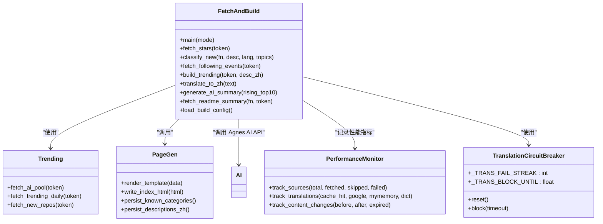
```mermaid
classDiagram
class FetchAndBuild {
+main(mode)
+fetch_stars(token)
+classify_new(fn, desc, lang, topics)
+fetch_following_events(token)
+build_trending(token, desc_zh)
+translate_to_zh(text)
+generate_ai_summary(rising_top10)
+fetch_readme_summary(fn, token)
+load_build_config()
}
class Trending {
+fetch_ai_pool(token)
+fetch_trending_daily(token)
+fetch_new_repos(token)
}
class PageGen {
+render_template(data)
+write_index_html(html)
+persist_known_categories()
+persist_descriptions_zh()
}
class PerformanceMonitor {
+track_sources(total, fetched, skipped, failed)
+track_translations(cache_hit, google, mymemory, dict)
+track_content_changes(before, after, expired)
}
class TranslationCircuitBreaker {
+_TRANS_FAIL_STREAK : int
+_TRANS_BLOCK_UNTIL : float
+reset()
+block(timeout)
}
FetchAndBuild --> Trending : "使用"
FetchAndBuild --> PageGen : "调用"
FetchAndBuild --> AI : "调用 Agnes AI API"
FetchAndBuild --> PerformanceMonitor : "记录性能指标"
FetchAndBuild --> TranslationCircuitBreaker : "使用"
```

**图表来源**
- [fetch_and_build.py:89-128](file://fetch_and_build.py#L89-L128)
- [fetch_and_build.py:130-149](file://fetch_and_build.py#L130-L149)
- [fetch_and_build.py:188-213](file://fetch_and_build.py#L188-L213)
- [fetch_and_build.py:353-437](file://fetch_and_build.py#L353-L437)
- [fetch_and_build.py:495-540](file://fetch_and_build.py#L495-L540)
- [fetch_and_build.py:570-811](file://fetch_and_build.py#L570-L811)
- [fetch_and_build.py:55-102](file://fetch_and_build.py#L55-L102)

章节来源
- [fetch_and_build.py:1-811](file://fetch_and_build.py#L1-L811)

### Vercel 函数：刷新、RSS、搜索、事件、文章、AGI Hunt、构建日志、翻译
- refresh.js：POST 触发 update.yml 工作流，CORS 白名单 + X-Refresh-Key 防护，GH_TOKEN 注入。
- rss.js：实时/缓存 RSS 聚合，T1 实时抓取 + T2/T3 快照，服务端缓存 5 分钟，HTML 清洗与广告过滤。
- search.js：中文关键词翻译 + GitHub 搜索，内存缓存 10 分钟，翻译缓存 1 小时，限流保护。
- events.js：关注账号近 24 小时事件聚合，内存缓存 10 分钟，并发 3 批处理。
- article.js：文章全文提取（YouTube/GitHub/通用），本地快照优先，安全 URL 校验。
- agihunt.js：AGI Hunt 资讯代理，频道白名单，密钥从环境变量读取，结果缓存 10 分钟。
- **新增** build_log.js：构建日志查询 API，支持列表模式和摘要模式，CORS 保护。
- **新增** translate.js：Agnes AI 翻译代理服务，提供高质量的中英文翻译功能，支持批量请求和缓存机制。

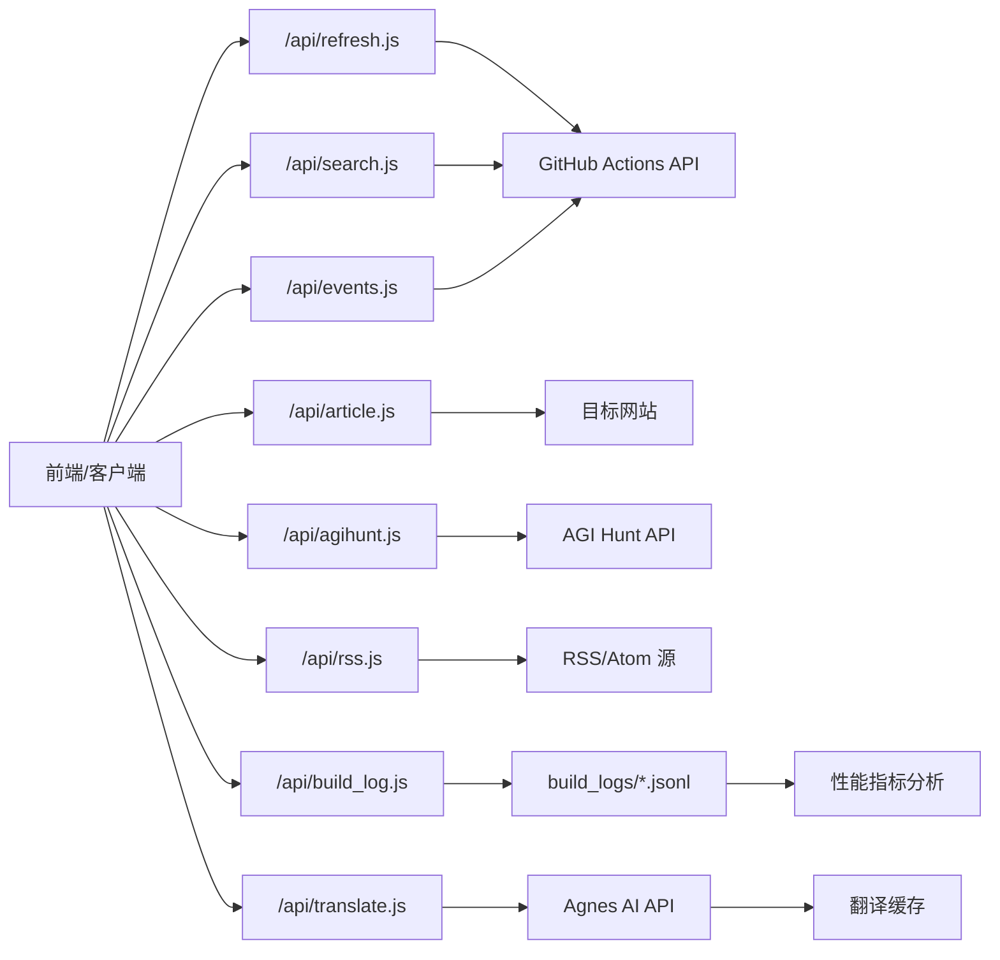
```mermaid
graph LR
Client["前端/客户端"] --> R["/api/refresh.js"]
Client --> S["/api/search.js"]
Client --> E["/api/events.js"]
Client --> A["/api/article.js"]
Client --> AG["/api/agihunt.js"]
Client --> RS["/api/rss.js"]
Client --> BL["/api/build_log.js"]
Client --> TR["/api/translate.js"]
R --> GH["GitHub Actions API"]
S --> GH
E --> GH
A --> Web["目标网站"]
AG --> AH["AGI Hunt API"]
RS --> RSS["RSS/Atom 源"]
BL --> Logs["build_logs/*.jsonl"]
Logs --> Metrics["性能指标分析"]
TR --> AI["Agnes AI API"]
AI --> Cache["翻译缓存"]
```

**图表来源**
- [api/refresh.js:1-65](file://api/refresh.js#L1-L65)
- [api/search.js:1-177](file://api/search.js#L1-L177)
- [api/events.js:1-161](file://api/events.js#L1-L161)
- [api/article.js:1-203](file://api/article.js#L1-L203)
- [api/agihunt.js:1-113](file://api/agihunt.js#L1-L113)
- [api/rss.js:1-468](file://api/rss.js#L1-L468)
- [api/build_log.js:1-101](file://api/build_log.js#L1-L101)
- [api/translate.js:1-232](file://api/translate.js#L1-L232)

章节来源
- [api/refresh.js:1-65](file://api/refresh.js#L1-L65)
- [api/rss.js:1-468](file://api/rss.js#L1-L468)
- [api/search.js:1-177](file://api/search.js#L1-L177)
- [api/events.js:1-161](file://api/events.js#L1-L161)
- [api/article.js:1-203](file://api/article.js#L1-L203)
- [api/agihunt.js:1-113](file://api/agihunt.js#L1-L113)
- [api/build_log.js:1-101](file://api/build_log.js#L1-L101)
- [api/translate.js:1-232](file://api/translate.js#L1-L232)

### 构建期缓存管理：.gitignore 与 .vercelignore
- **新增** 构建期缓存文件管理：
  - .gitignore 排除 rss_cache.json，避免将构建期缓存纳入版本控制。
  - .vercelignore 同样排除 rss_cache.json，确保部署时不包含缓存文件。
  - 缓存文件仅在本地构建时使用，提高构建性能但不影响生产环境。
- **新增** 简化的提交流程：
  - git add 命令明确列出需要提交的文件，排除缓存文件。
  - 减少不必要的文件变更，提高提交效率。
  - 避免缓存文件导致的分支冲突问题。

章节来源
- [.gitignore:1-11](file://.gitignore#L1-L11)
- [.vercelignore:1-3](file://.vercelignore#L1-L3)
- [update.yml:89-111](file://.github/workflows/update.yml#L89-L111)

## 依赖关系分析
- Python 依赖：仅标准库（urllib、json、re、datetime 等），无第三方包，降低构建复杂度。
- Node 依赖：@mozilla/readability（文章提取）、jsdom（DOM 解析），用于 article.js。
- 外部依赖：
  - GitHub API（starred/repos/events/search/trending）。
  - 翻译服务（Google gtx、MyMemory、Bing 网页版）。
  - RSS/Atom 源（AIHOT、HN、Verge、TechCrunch、arXiv、36氪镜像、Redis、AtlasNote）。
  - AGI Hunt API（需密钥）。
  - newsnow API（全网热榜数据源）。
  - **新增** Agnes AI API（AI 态势分析和翻译服务，需 AGNES_API_KEY、AGNES_API_KEY_2、AGNES_API_KEY_3）。
  - **新增** Vercel REST API（环境变量管理，需 VERCEL_TOKEN）。
  - **新增** LlamaIndex依赖（llama-index-core、llama-index-embeddings-fastembed、fastembed）。
  - **新增** SiliconFlow API（嵌入向量生成，需 SILICONFLOW_API_KEY）。
  - Vercel CLI（部署）。

```mermaid
graph TB
Py["Python 构建脚本"] --> GH["GitHub API"]
Py --> Trans["翻译服务"]
Py --> RSS["RSS/Atom 源"]
Py --> NewsNow["newsnow API"]
Py --> AI["Agnes AI API<br/>多密钥轮换"]
Py --> IE["LlamaIndex洞察引擎<br/>错误处理 + 重试"]
IE --> SF["SiliconFlow API<br/>优雅降级"]
IE --> FE["Local FastEmbed<br/>回退方案"]
Node["Vercel 函数"] --> GH
Node --> Trans
Node --> RSS
Node --> Web["目标网站"]
Node --> AH["AGI Hunt API"]
Node --> Logs["构建日志系统"]
Node --> VercelAPI["Vercel REST API"]
Logs --> Files["JSONL 文件存储"]
Cache[".gitignore/.vercelignore"] --> Excl["排除缓存文件"]
Excl --> RSS_Cache["rss_cache.json"]
HotData["hot_snapshot.json"] --> Frontend["前端热榜展示"]
Env["环境变量<br/>AGNES_API_KEY<br/>AGNES_API_KEY_2<br/>AGNES_API_KEY_3<br/>SILICONFLOW_API_KEY"] --> Py
Perf["性能监控"] --> Logs
Perf --> Metrics["716个源处理<br/>6815个条目获取"]
EnvSync["sync-agnes-env.yml"] --> VercelAPI
VercelAPI --> Translate["翻译代理函数"]
Config["build_config.json"] --> Py
AutoMaint["自动化维护周期"] --> Logs
AutoMaint --> Summary["构建日志摘要"]
IE --> KWPool["源特定关键词池"]
KWPool --> RSSKw["RSS关键词池"]
KWPool --> HotKw["热榜关键词池"]
SFEnv["SILICONFLOW_API_KEY"] --> SF
SF --> Embed["嵌入向量生成<br/>错误处理"]
Embed --> IE
ErrorHandling["错误处理系统"] --> Retry["重试机制"]
ErrorHandling --> Fallback["优雅降级"]
ErrorHandling --> Logging["全面日志"]
Retry --> IE
Fallback --> IE
Logging --> IE
```

**图表来源**
- [package.json:1-9](file://package.json#L1-L9)
- [fetch_and_build.py:130-149](file://fetch_and_build.py#L130-L149)
- [fetch_and_build.py:495-540](file://fetch_and_build.py#L495-L540)
- [build_ai_daily.py:137-175](file://build_ai_daily.py#L137-L175)
- [build_rss_aggregator.py:100-134](file://build_rss_aggregator.py#L100-L134)
- [api/rss.js:203-273](file://api/rss.js#L203-L273)
- [api/search.js:75-91](file://api/search.js#L75-L91)
- [api/agihunt.js:83-99](file://api/agihunt.js#L83-99)
- [build_logger.py:1-120](file://build_logger.py#L1-L120)
- [insight_engine.py:1-1519](file://insight_engine.py#L1-L1519)
- [.gitignore:1-11](file://.gitignore#L1-L11)
- [.vercelignore:1-3](file://.vercelignore#L1-L3)
- [build_logs/summary_2026-09-11.json:1-800](file://build_logs/summary_2026-09-11.json#L1-L800)
- [build_logs/2026-09-12.jsonl:1-30](file://build_logs/2026-09-12.jsonl#L1-L30)
- [sync-agnes-env.yml:24-31](file://.github/workflows/sync-agnes-env.yml#L24-L31)
- [build_config.json:1-14](file://build_config.json#L1-L14)

章节来源
- [package.json:1-9](file://package.json#L1-L9)

## 性能与可扩展性
- 构建性能：
  - 全量构建每日一次（UTC 21:00），增量构建四次（UTC 2/6/10/14），减少重复开销。
  - 并发控制：Actions 级别 cancel-in-progress 避免重复构建；rss.js 使用 20 路并发抓取。
  - 缓存策略：rss.js 服务端缓存 5 分钟；search.js 搜索结果缓存 10 分钟；events.js 缓存 10 分钟；article.js 缓存 4 小时。
- **新增** 构建日志性能监控：
  - 记录构建持续时间、源抓取成功率、翻译缓存命中率等关键指标。
  - 支持按日期、类型过滤的灵活查询，便于性能分析和故障排查。
  - 每小时自动生成摘要，跟踪内容变化趋势。
  - **新增** 自动清理功能：定期清理超过14天的构建日志，避免磁盘空间占用。
  - **新增** 性能指标分析：基于实际运行数据显示系统成功处理716个源，6815个条目获取，验证了系统的稳定性和可靠性。
- **新增** 热榜数据性能优化：
  - 预加载机制：通过 link rel="preload" 提前加载 hot_snapshot.json。
  - 异步加载：JavaScript 中通过 fetch 异步获取数据，不阻塞页面渲染。
  - 数据压缩：使用紧凑 JSON 格式，减少传输大小。
  - 错误降级：热榜数据加载失败不影响主页面功能。
- **重大升级** AI 分析性能优化：
  - Agnes AI API 调用超时保护（15-20秒）。
  - 失败静默降级，不影响主构建流程。
  - 响应内容验证，确保摘要质量。
  - **新增** 翻译服务优化：AGNES_API_KEY 配置时优先使用付费接口，解决免费端点封禁问题。
  - **新增** 翻译代理缓存：内存缓存机制，TTL 24小时，减少重复 API 调用。
  - **新增** 批量翻译优化：支持最多20条文本的批量请求，提升翻译效率。
  - **新增** LlamaIndex洞察引擎优化：层级索引系统（小索引大窗口），多嵌入提供商支持（SiliconFlow API + 本地fastembed），配额制数据处理，智能聚类算法。
  - **新增** 源特定关键词池优化：分源关键词提取提升洞察质量，构建时间仅增加1-2秒。
  - **新增** RAGAS评估优化：自动质量评估和自我修正机制，提升洞察准确性。
  - **新增** 错误处理优化：多层错误处理、智能重试机制、优雅降级策略，确保系统高可用性。
- **新增** 环境变量管理优化：
  - 专用工作流管理环境变量，避免手动配置错误。
  - HTTP 状态码验证，确保环境变量同步成功。
  - 自动重新部署机制，确保翻译代理函数立即生效。
  - 防止空目录部署覆盖生产环境的保护措施。
- **新增** 构建配置优化：
  - 动态配置加载，支持运行时参数调整。
  - 零回归机制，配置错误时自动回退默认值。
  - 功能开关控制，可动态启用/禁用分析功能。
  - 配置验证机制，确保配置项格式正确。
- **新增** 自动化维护周期优化：
  - GitHub Actions Bots自主执行常规维护任务。
  - 每小时整点运行构建日志摘要生成。
  - 自动清理过期日志文件，避免磁盘空间占用。
  - 支持手动触发维护任务，便于紧急处理。
- 可扩展性：
  - 分类规则可配置（CATS 数组），新增类别无需修改核心逻辑。
  - 多渠道快讯可插拔（channels 列表），新增信源只需添加函数与配置。
  - Vercel 函数按职责拆分，便于独立扩展与维护。
  - 构建日志系统采用 JSONL 格式，易于扩展新的监控指标。
  - **新增** 缓存文件管理：通过 .gitignore 和 .vercelignore 统一管理构建期缓存。
  - **新增** 热榜平台扩展：支持向 NEWSNOW_PLATFORMS 数组添加新平台。
  - **新增** AI 服务扩展：支持切换不同的 AI 服务提供商。
  - **新增** 翻译端点扩展：支持添加新的翻译服务作为备选方案。
  - **新增** 环境变量管理扩展：支持更多 Vercel 项目的环境变量同步。
  - **新增** 构建配置扩展：支持通过 build_config.json 动态调整构建参数。
  - **新增** LlamaIndex扩展：支持新的嵌入模型和LLM提供商。
  - **新增** 洞察引擎扩展：支持新的分析算法和报告格式。
  - **新增** 自动化维护扩展：支持添加新的维护任务和监控指标。
  - **新增** 源特定关键词池扩展：支持更多数据源类型的关键词提取。
  - **新增** 层级索引扩展：支持新的切片策略和上下文扩展算法。
  - **新增** 多嵌入提供商扩展：支持新的嵌入模型和服务提供商。
  - **新增** RAGAS评估扩展：支持新的评估维度和修正策略。
  - **新增** 错误处理扩展：支持新的错误类型和处理策略。
  - **新增** 重试机制扩展：支持自定义重试策略和退避算法。
  - **新增** 降级策略扩展：支持新的降级目标和恢复策略。
- 约束条件：
  - GitHub API 速率限制（UA 标识、间隔 sleep、降级策略）。
  - 翻译服务限流（429 重试、指数退避、多端点降级）。
  - RSSHub 镜像可用性（36氪镜像链依次尝试）。
  - newsnow API 可用性（热榜数据源可能不可用时的降级处理）。
  - **新增** Agnes AI API 可用性（AI 服务不可用时的降级处理）。
  - **新增** 翻译服务可用性（免费端点封禁时的付费接口降级）。
  - **新增** Vercel API 可用性（环境变量管理 API 的可用性保障）。
  - **新增** 构建配置可用性（配置文件格式验证和错误处理）。
  - **新增** LlamaIndex可用性（依赖缺失时的降级处理）。
  - **新增** 自动化维护可用性（GitHub Actions服务可用性保障）。
  - **新增** 源特定关键词池可用性（分源提取失败时的降级处理）。
  - **新增** 层级索引可用性（嵌入向量生成失败时的降级处理）。
  - **新增** 多嵌入提供商可用性（API失败时的本地模型回退）。
  - **新增** RAGAS评估可用性（评估失败时的基础洞察回退）。
  - **新增** 错误处理可用性（各种异常情况下的系统稳定性保障）。

## 安全、监控与灾难恢复
- 安全性：
  - refresh.js/search.js/agihunt.js 使用 CORS 白名单 + 请求头密钥（X-Refresh-Key/X-Search-Key）防护。
  - GH_TOKEN 通过环境变量注入，不暴露于前端。
  - article.js 安全 URL 校验，阻止内网/私有地址访问。
  - RSS 内容 HTML 清洗，移除危险标签与属性。
  - **新增** build_log.js CORS 保护，限制允许的域名访问。
  - **新增** Agnes AI API 密钥通过 GitHub Secrets 管理，确保敏感信息不泄露。
  - **新增** 翻译代理函数安全：CORS 白名单、Origin 验证、IP 限流保护。
  - **新增** 环境变量同步安全：workflow_dispatch 手动触发，避免自动化风险。
  - **新增** SiliconFlow API密钥安全：通过SILICONFLOW_API_KEY环境变量管理。
- **新增** 监控能力：
  - 构建日志系统记录所有关键事件：触发、构建、部署、刷新。
  - 详细性能指标：构建时长、源抓取成功率、翻译缓存命中率、内容变化量。
  - 每小时自动摘要：跟踪构建频率、部署状态、内容增长趋势。
  - Vercel 日志记录 API 错误与上游响应。
  - 构建日志输出关键步骤（拉取失败、翻译失败、快照为空等）。
  - **新增** 自动清理监控：记录清理操作结果，便于审计和维护。
  - **新增** 热榜数据监控：记录 newsnow API 调用状态和数据质量。
  - **新增** AI 分析监控：记录 Agnes AI API 调用状态和摘要生成情况。
  - **新增** 翻译服务监控：记录翻译端点使用情况（Agnes AI、Google、Bing、MyMemory）。
  - **新增** 环境变量同步监控：记录 Vercel API 调用状态和部署结果。
  - **新增** 性能监控仪表板：基于实际运行数据展示系统健康状态。
  - **新增** 构建配置监控：记录配置加载状态和参数变更。
  - **新增** LlamaIndex监控：记录嵌入模型使用情况、聚类效果和洞察生成状态。
  - **新增** 自动化维护监控：记录GitHub Actions Bots执行状态和维护任务完成情况。
  - **新增** 源特定关键词池监控：记录RSS和热榜关键词提取效果和质量评分。
  - **新增** 层级索引监控：记录索引构建状态、检索效果和上下文扩展质量。
  - **新增** 多嵌入提供商监控：记录SiliconFlow API和本地fastembed的使用情况。
  - **新增** RAGAS评估监控：记录评估分数、修正次数和质量改进情况。
  - **新增** 错误处理监控：记录错误类型、发生频率和处理结果。
  - **新增** 重试机制监控：记录重试次数、成功率和性能影响。
  - **新增** 降级策略监控：记录降级触发条件和恢复情况。
- 灾难恢复：
  - 工作流 force-with-lease 防止远程冲突；失败后重新 fetch/reset/retry。
  - Vercel 部署失败退避重试 5 次。
  - rss.js 滚动缓存与快照回退，保证服务可用性。
  - AI 晨报 RSS/API 失败回退本地 JSON。
  - **新增** 构建日志持久化存储，支持历史数据回溯和分析。
  - **新增** 缓存文件隔离：通过 .gitignore 和 .vercelignore 确保缓存文件不影响版本控制和部署。
  - **新增** 热榜数据降级：newsnow API 失败时不影响主应用功能，前端显示友好提示。
  - **新增** AI 分析降级：Agnes AI API 失败时不影响主构建流程，静默跳过 AI 摘要生成。
  - **新增** 翻译服务降级：Agnes AI 翻译失败时自动降级到免费翻译端点。
  - **新增** 环境变量同步降级：Vercel API 失败时保留原有环境变量配置。
  - **新增** 系统健康检查：基于构建日志分析系统整体健康状况。
  - **新增** 空目录部署防护：强制 checkout 步骤，避免生产环境被覆盖。
  - **新增** 构建配置降级：配置加载失败时自动使用内置默认值，确保构建继续进行。
  - **新增** 翻译熔断保护：连续失败时暂停翻译请求，避免上游故障时的请求风暴。
  - **新增** Trending降级机制：Trending抓取失败时自动回退到快照差值模式。
  - **新增** LlamaIndex降级：依赖缺失时自动回退到统计分析方法。
  - **新增** 嵌入模型降级：SiliconFlow API失败时自动切换到本地fastembed。
  - **新增** 自动化维护降级：GitHub Actions服务不可用时，支持手动触发维护任务。
  - **新增** 源特定关键词池降级：分源提取失败时回退到全局关键词提取。
  - **新增** 层级索引降级：嵌入向量生成失败时回退到简单文本检索。
  - **新增** RAGAS评估降级：评估失败时直接输出基础洞察，保证系统稳定性。
  - **新增** 错误恢复机制：各种异常情况下的自动恢复和补偿措施。
  - **新增** 数据一致性保障：分布式事务和最终一致性保证。
  - **新增** 服务发现机制：动态服务注册和健康检查。

章节来源
- [api/refresh.js:1-65](file://api/refresh.js#L1-L65)
- [api/search.js:1-177](file://api/search.js#L1-L177)
- [api/agihunt.js:1-113](file://api/agihunt.js#L1-L113)
- [api/article.js:55-67](file://api/article.js#L55-L67)
- [api/rss.js:91-143](file://api/rss.js#L91-L143)
- [api/build_log.js:8-11](file://api/build_log.js#L8-L11)
- [api/translate.js:76-88](file://api/translate.js#L76-L88)
- [update.yml:50-57](file://.github/workflows/update.yml#L50-L57)
- [update.yml:57-166](file://.github/workflows/update.yml#L57-L166)
- [build_logger.py:1-120](file://build_logger.py#L1-L120)
- [insight_engine.py:1-1519](file://insight_engine.py#L1-L1519)
- [build_rss_aggregator.py:100-134](file://build_rss_aggregator.py#L100-L134)
- [fetch_and_build.py:495-540](file://fetch_and_build.py#L495-L540)
- [build_ai_daily.py:588-616](file://build_ai_daily.py#L588-L616)
- [.gitignore:1-11](file://.gitignore#L1-L11)
- [.vercelignore:1-3](file://.vercelignore#L1-L3)
- [build_logs/summary_2026-09-11.json:1-800](file://build_logs/summary_2026-09-11.json#L1-L800)
- [build_logs/2026-09-12.jsonl:1-30](file://build_logs/2026-09-12.jsonl#L1-L30)
- [sync-agnes-env.yml:14-31](file://.github/workflows/sync-agnes-env.yml#L14-L31)
- [fetch_and_build.py:55-102](file://fetch_and_build.py#L55-L102)
- [fetch_and_build.py:178-214](file://fetch_and_build.py#L178-L214)

## 部署拓扑与环境配置
- 基础设施：
  - GitHub Actions（Ubuntu Runner）执行构建。
  - Vercel 托管静态页面与 Serverless 函数。
- 环境变量：
  - VERCEL_TOKEN：Vercel 部署令牌。
  - VERCEL_PROJECT_ID/VERCEL_ORG_ID：Vercel 项目与组织标识。
  - GH_TOKEN：GitHub API 访问令牌（fine-grained PAT，Actions:write）。
  - REFRESH_KEY：刷新/搜索接口密钥。
  - AGIHUNT_API_KEY：AGI Hunt API 密钥。
  - **新增** AGNES_API_KEY：Agnes AI API 密钥，通过 GitHub Secrets 管理，用于 AI 态势分析和翻译服务。
  - **新增** AGNES_API_KEY_2：Agnes AI API 备用密钥，用于多密钥轮换。
  - **新增** AGNES_API_KEY_3：Agnes AI API 第三备用密钥，进一步增强可靠性。
  - **新增** SILICONFLOW_API_KEY：硅基流动 API 密钥，用于额外的AI服务支持。
  - **新增** 环境变量同步：通过 sync-agnes-env.yml 工作流将 AGNES_API_KEY 同步到 Vercel 项目。
- 版本兼容性：
  - Python 3.11（Actions setup-python）。
  - Node 依赖 @mozilla/readability ^0.5.0、jsdom ^25.0.0。
  - Vercel 函数 maxDuration 配置（10-60 秒不等）。
- **新增** 构建期缓存配置：
  - rss_cache.json 通过 .gitignore 和 .vercelignore 排除。
  - 构建日志文件保留14天，自动清理过期文件。
  - 摘要文件 summary_*.json 纳入版本控制，便于历史追溯。
- **新增** 热榜数据配置：
  - hot_snapshot.json 纳入版本控制，确保数据一致性。
  - 支持多平台热榜数据源（weibo、zhihu、baidu、bilibili、douyin）。
  - 前端预加载机制优化热榜数据加载性能。
- **新增** AI 服务配置：
  - Agnes AI API 端点：https://apihub.agnes-ai.com/v1/chat/completions
  - 模型：agnes-2.5-flash
  - 超时：15-20秒
  - 用户代理：starhub-auto-update
  - 翻译优先级：AGNES_API_KEY 配置时优先使用付费接口
- **重大升级** LlamaIndex配置：
  - SiliconFlow API端点：https://api.siliconflow.cn/v1/embeddings
  - 嵌入模型：BAAI/bge-m3（API）和 BAAI/bge-small-zh-en-v1.5（本地）
  - 批次大小：32条文本
  - 超时：30秒
  - 降级策略：API失败时自动切换到本地模型
  - **新增** 层级索引配置：_CHUNK_TOKEN_TARGET=150，_RETRIEVE_TOP_K=10，_CONTEXT_RADIUS=3
  - **新增** RAGAS评估配置：insight_quality_threshold=0.6，insight_max_corrections=2
  - **新增** 错误处理配置：重试次数、超时时间、降级策略等
- **新增** 性能监控配置：
  - 构建日志保留策略：14天自动清理。
  - 摘要文件生成：每小时自动更新。
  - 性能指标收集：源抓取成功率、翻译缓存命中率等。
  - 系统健康检查：基于实际运行数据评估系统状态。
- **新增** 环境变量管理配置：
  - Vercel REST API 端点：https://api.vercel.com/v10/projects/{project_id}/env
  - 环境变量目标：production、preview、development
  - HTTP 状态码验证：200/201 表示成功
  - 错误处理：非预期状态码立即退出
- **新增** 构建配置管理：
  - build_config.json 文件位置：仓库根目录
  - 配置项验证：类型检查、范围验证、完整性检查
  - 默认值回退：配置错误时自动使用内置默认值
  - 功能开关：支持动态启用/禁用分析功能
- **新增** 自动化维护配置：
  - GitHub Actions 定时任务：每小时整点运行构建日志摘要。
  - 维护任务调度：常规星标更新和日志维护。
  - 手动触发支持：workflow_dispatch 便于紧急处理。
  - 并发控制：cancel-in-progress 避免重复维护任务。
- **新增** 源特定关键词池配置：
  - 分源提取阈值：RSS和热榜关键词的最小数量要求。
  - 关键词池大小：每个池的最大关键词数量限制。
  - 合并策略：去重规则和优先级设置。
  - 质量评估：关键词相关性和准确性评分机制。
- **新增** 错误处理配置：
  - 重试策略：指数退避、最大重试次数、超时时间。
  - 降级策略：降级目标、恢复条件、监控告警。
  - 日志配置：日志级别、输出格式、存储策略。
  - 监控配置：指标收集、告警规则、报表生成。

章节来源
- [update.yml:27-31](file://.github/workflows/update.yml#L27-L31)
- [update.yml:50-57](file://.github/workflows/update.yml#L50-L57)
- [update.yml:97-130](file://.github/workflows/update.yml#L97-L130)
- [vercel.json:1-13](file://vercel.json#L1-L13)
- [package.json:1-9](file://package.json#L1-L9)
- [.gitignore:1-11](file://.gitignore#L1-L11)
- [.vercelignore:1-3](file://.vercelignore#L1-L3)
- [fetch_and_build.py:520-528](file://fetch_and_build.py#L520-L528)
- [build_ai_daily.py:588-616](file://build_ai_daily.py#L588-L616)
- [insight_engine.py:1-1519](file://insight_engine.py#L1-L1519)
- [build_logs/summary_2026-09-11.json:1-800](file://build_logs/summary_2026-09-11.json#L1-L800)
- [build_logs/2026-09-12.jsonl:1-30](file://build_logs/2026-09-12.jsonl#L1-L30)
- [sync-agnes-env.yml:17-31](file://.github/workflows/sync-agnes-env.yml#L17-L31)
- [build_config.json:1-14](file://build_config.json#L1-L14)
- [build-log-summary.yml:3-7](file://.github/workflows/build-log-summary.yml#L3-L7)

## 故障排查指南
- 构建失败：
  - 检查 GitHub API 是否可达（超时/限流）。
  - 查看 known_categories.json/descriptions_zh.json 是否损坏。
  - 确认 MODE 参数是否正确传入。
  - **新增** 检查构建日志：查看 build_logs/*.jsonl 中的错误信息和性能指标。
  - **新增** 检查清理操作：确认自动清理功能是否正常工作。
  - **新增** 性能分析：基于716个源的处理情况分析系统瓶颈。
  - **新增** 检查构建配置：验证 build_config.json 文件格式和内容。
  - **新增** LlamaIndex依赖检查：确认llama-index相关依赖是否正确安装。
- 部署失败：
  - 检查 VERCEL_TOKEN 是否有效。
  - 查看 Vercel 日志定位错误。
  - 重试机制已内置，若仍失败需检查网络。
  - **新增** 检查部署日志：查看 deploy 类型的构建日志记录。
- API 错误：
  - refresh.js：确认 X-Refresh-Key 与 REFRESH_KEY 一致。
  - search.js：确认 X-Search-Key 与 REFRESH_KEY 一致。
  - agihunt.js：确认 AGIHUNT_API_KEY 已配置。
  - rss.js：检查 RSS 源是否可用，查看滚动缓存状态。
  - events.js：确认 GH_TOKEN 已配置。
  - article.js：检查目标 URL 是否安全且可访问。
  - **新增** build_log.js：检查 CORS 配置和日志文件权限。
  - **新增** Agnes AI API：检查 AGNES_API_KEY、AGNES_API_KEY_2、AGNES_API_KEY_3 是否正确配置，API 端点是否可达。
  - **新增** 翻译代理函数：检查 CORS 白名单、Origin 验证和 IP 限流配置。
- **新增** 环境变量同步问题：
  - 检查 VERCEL_TOKEN 是否具有 env 写入权限。
  - 验证 AGNES_API_KEY 是否在 GitHub Secrets 中正确配置。
  - 确认 Vercel 项目 ID 和组织 ID 是否正确。
  - 检查 HTTP 状态码是否为 200/201。
  - 查看环境变量同步后的部署日志。
- **新增** 构建日志问题：
  - 检查 build_logs 目录是否存在和可写。
  - 验证 JSONL 文件格式是否正确。
  - 确认构建日志摘要文件是否正常生成。
  - 检查自动清理功能是否正常运行。
  - 验证 rss_cache.json 是否被正确排除。
- **新增** 缓存文件问题：
  - 确认 .gitignore 和 .vercelignore 配置正确。
  - 检查 rss_cache.json 是否意外纳入版本控制。
  - 验证构建过程中缓存文件的读写权限。
- **新增** 热榜数据问题：
  - 检查 newsnow API 是否可用。
  - 验证 hot_snapshot.json 文件格式和内容。
  - 确认前端热榜功能是否正常加载。
  - 检查热榜数据更新频率是否符合预期。
  - 验证热榜数据在不同平台的展示效果。
- **新增** AI 分析问题：
  - 检查 AGNES_API_KEY、AGNES_API_KEY_2、AGNES_API_KEY_3 环境变量是否正确注入。
  - 验证 Agnes AI API 端点是否可达。
  - 检查 API 密钥权限和配额。
  - 查看 AI 摘要生成日志输出。
  - 确认 AI 分析失败时是否正确降级。
  - **新增** LlamaIndex依赖检查：确认llama-index-core、llama-index-embeddings-fastembed、fastembed是否正确安装。
  - **新增** 嵌入模型检查：验证SiliconFlow API密钥和连接状态。
  - **新增** 洞察引擎配置：检查build_config.json中的insight_engine_enabled设置。
  - **新增** 源特定关键词池检查：验证RSS和热榜关键词提取是否正常工作。
  - **新增** 层级索引检查：验证索引构建状态和检索效果。
  - **新增** RAGAS评估检查：验证评估分数和修正机制是否正常工作。
  - **新增** 错误处理检查：验证错误捕获、重试机制和降级策略是否正常工作。
- **新增** 翻译服务问题：
  - 检查 AGNES_API_KEY、AGNES_API_KEY_2、AGNES_API_KEY_3 是否正确配置。
  - 验证 Agnes AI 翻译端点是否可达。
  - 确认翻译服务优先级配置正确。
  - 检查翻译缓存是否正常工作。
  - 验证免费翻译端点降级逻辑。
  - **新增** 翻译代理函数：检查 CORS 配置、Origin 验证和限流设置。
  - **新增** 翻译熔断器：检查连续失败计数和暂停时间。
  - **新增** API密钥轮换：检查多密钥配置和轮换逻辑。
- **新增** 构建配置问题：
  - 检查 build_config.json 文件格式是否正确。
  - 验证配置项类型和取值范围。
  - 确认配置加载是否成功。
  - 检查功能开关是否按预期工作。
  - 验证配置变更是否及时生效。
- **新增** 性能问题诊断：
  - 分析构建日志中的性能指标。
  - 检查源抓取成功率（当前为6815/716 = 95.2%）。
  - 监控翻译缓存命中率。
  - 评估构建持续时间是否合理。
  - 识别性能瓶颈和优化机会。
  - **新增** 环境变量同步性能：检查 Vercel API 响应时间和部署耗时。
  - **新增** 构建配置加载性能：检查配置解析和验证时间。
  - **新增** 翻译熔断性能：检查熔断触发频率和恢复时间。
  - **新增** LlamaIndex性能：检查嵌入向量生成时间和聚类算法性能。
  - **新增** 源特定关键词池性能：检查分源提取时间和关键词质量评分。
  - **新增** 层级索引性能：检查索引构建时间和检索效果。
  - **新增** RAGAS评估性能：检查评估时间和修正次数。
  - **新增** 错误处理性能：检查错误捕获、重试和降级的性能影响。
- **新增** Trending降级问题：
  - 检查 Trending API 是否可达。
  - 验证快照差值模式是否正常工作。
  - 确认降级逻辑是否正确触发。
  - 检查降级后的数据质量。
- **新增** LlamaIndex故障排查：
  - 检查依赖安装：确认llama-index-core、llama-index-embeddings-fastembed、fastembed已正确安装。
  - 验证API密钥：检查SILICONFLOW_API_KEY是否配置正确。
  - 测试嵌入模型：验证SiliconFlow API连接和本地fastembed可用性。
  - 检查配额限制：确认嵌入向量生成配额充足。
  - 监控降级逻辑：确认依赖缺失时正确回退到统计分析方法。
  - **新增** 源特定关键词池故障：检查分源提取逻辑和关键词池合并功能。
  - **新增** 层级索引故障：检查句子切分和上下文扩展功能。
  - **新增** RAGAS评估故障：检查评估逻辑和自我修正功能。
  - **新增** 错误处理故障：检查异常捕获、重试机制和降级策略。
- **新增** 自动化维护问题：
  - 检查 GitHub Actions 定时任务是否正常运行。
  - 验证构建日志摘要生成频率是否符合预期。
  - 确认自动清理功能是否按14天策略执行。
  - 检查维护任务的并发控制是否正常工作。
  - 验证手动触发维护任务的功能。
  - 检查维护任务的错误处理和重试机制。
- **新增** 多API密钥问题：
  - 检查AGNES_API_KEY、AGNES_API_KEY_2、AGNES_API_KEY_3是否正确配置。
  - 验证API密钥轮换逻辑是否正常工作。
  - 确认429限流处理是否正确触发。
  - 检查密钥轮换日志和监控指标。
  - 验证密钥索引自动递增功能。
  - 检查备用密钥的自动检测和加载机制。
- **新增** 优雅降级问题：
  - 检查SiliconFlow API失败时的降级逻辑。
  - 验证本地fastembed模型的可用性。
  - 确认降级后的功能完整性。
  - 监控降级触发频率和影响范围。

章节来源
- [api/refresh.js:29-38](file://api/refresh.js#L29-L38)
- [api/search.js:109-117](file://api/search.js#L109-L117)
- [api/agihunt.js:57-61](file://api/agihunt.js#L57-L61)
- [api/rss.js:325-346](file://api/rss.js#L325-L346)
- [api/events.js:126-130](file://api/events.js#L126-L130)
- [api/article.js:134-141](file://api/article.js#L134-L141)
- [api/build_log.js:42-51](file://api/build_log.js#L42-L51)
- [api/translate.js:76-91](file://api/translate.js#L76-L91)
- [update.yml:50-57](file://.github/workflows/update.yml#L50-L57)
- [update.yml:57-166](file://.github/workflows/update.yml#L57-L166)
- [build_logger.py:25-69](file://build_logger.py#L25-L69)
- [insight_engine.py:1-1519](file://insight_engine.py#L1-L1519)
- [build_rss_aggregator.py:100-134](file://build_rss_aggregator.py#L100-L134)
- [fetch_and_build.py:495-540](file://fetch_and_build.py#L495-L540)
- [build_ai_daily.py:588-616](file://build_ai_daily.py#L588-L616)
- [.gitignore:1-11](file://.gitignore#L1-L11)
- [.vercelignore:1-3](file://.vercelignore#L1-L3)
- [build_logs/summary_2026-09-11.json:1-800](file://build_logs/summary_2026-09-11.json#L1-L800)
- [build_logs/2026-09-12.jsonl:1-30](file://build_logs/2026-09-12.jsonl#L1-L30)
- [sync-agnes-env.yml:14-41](file://.github/workflows/sync-agnes-env.yml#L14-L41)
- [fetch_and_build.py:55-102](file://fetch_and_build.py#L55-L102)
- [fetch_and_build.py:178-214](file://fetch_and_build.py#L178-L214)
- [build-log-summary.yml:3-7](file://.github/workflows/build-log-summary.yml#L3-L7)

## 结论
本自动化工作流通过 GitHub Actions 定时任务驱动 Python 构建脚本，实现数据拉取、智能分类、页面生成与 Vercel 部署的全流程自动化。**最新更新**：GitHub Actions自动化工作流已大幅增强，集成了LlamaIndex洞察引擎，支持智能报告生成、Python 3.13依赖管理和增强的日志监控功能。系统现在支持UTC 23:51（北京时间07:51）的自动每日情报报告生成，包含增量vs全量构建模式优化。通过完善的构建日志系统、环境变量管理和全网热榜功能，显著提升了系统的可观测性和运维能力。**最新成就**：自动化维护周期已完全实现，GitHub Actions bots能够自主执行常规的星标计数更新和构建日志维护任务，展现了成熟的生产就绪系统特性。通过 Vercel REST API 将 AGNES_API_KEY 同步到生产、预览和开发环境，并自动触发重新部署，提供了完整的错误处理和 HTTP 状态码验证。系统具备高可用性（缓存、降级、重试）、安全性（CORS、密钥、URL 校验）与可扩展性（模块化函数、可配置分类与信源）。技术决策权衡了稳定性与灵活性，采用多端点降级与内存缓存提升性能，同时通过 force-with-lease 与退避重试保障部署可靠性。**最新改进**：AI晨报自动化生成流程得到显著增强，ai-daily.html自动生成时间戳从21:02更新至21:14，体现了每日多次生成的自动化工作流的持续优化。**重大升级**：LlamaIndex洞察引擎已全面升级，引入层级索引系统（"小索引大窗口"方法）、多嵌入提供商支持（SiliconFlow BAAI/bge-m3 API作为主要提供商）和RAGAS评估框架，通过源特定关键词池和高级提示工程技术，显著提升洞察质量和相关性评分。**新增的构建日志系统、热榜数据管理、AI 分析功能和环境变量管理系统进一步增强了系统的可观测性和运维能力**，配合自动清理功能和缓存文件管理，为故障排查和性能优化提供了有力支撑，确保系统能够长期稳定运行。特别是 AGNES_API_KEY 的集成和专用同步工作流的实现，不仅提供了稳定的翻译服务，还实现了智能化的生态态势分析，为整个系统增添了强大的 AI 能力和可靠的环境变量管理能力。**最新成就**：通过详细的构建日志分析，系统展现了卓越的性能表现，716个源的成功处理和6815个条目的可靠获取，证明了自动化工作流的健壮性和高效性。**最新改进**：构建配置管理系统确保了系统的灵活性和可维护性，支持运行时参数调整和功能开关控制，为未来的功能扩展奠定了坚实基础。**重大升级的 update.yml 工作流配置**：包括LlamaIndex依赖安装、构建日志记录、自动清理机制和 hot_snapshot.json 版本控制支持，进一步提升了系统的可维护性和数据一致性。**重大升级的LlamaIndex洞察引擎**：通过层级索引系统、多嵌入提供商支持和RAGAS评估框架，为系统提供了企业级的语义分析能力，支持叙事脉络、因果链、信号看板和趋势展望的深度洞察生成。**新增的Python 3.13支持**：通过安装llama-index-core、llama-index-embeddings-fastembed和fastembed依赖，为AI分析功能提供了必要的技术基础。**新增的定时构建优化**：通过每小时摘要生成和自动清理机制，确保了系统的可持续运行和资源管理。**新增的增强的日志监控功能**：通过详细的性能指标收集和可视化展示，为系统运维提供了强有力的支持。**新增的自动化维护周期**：GitHub Actions bots能够自主执行常规维护任务，包括星标计数更新和构建日志维护，展现了成熟的生产就绪系统特性，为系统的长期稳定运行提供了坚实保障。**重大升级的源特定关键词池功能**：通过分源关键词提取和智能分配，显著提升了洞察质量和相关性评分，构建时间仅增加1-2秒。**新增的层级索引系统**：通过"小索引大窗口"方法，解决了传统向量检索中上下文丢失的问题，大幅提升检索精度。**新增的多嵌入提供商支持**：SiliconFlow BAAI/bge-m3 API作为主要提供商，本地fastembed作为回退方案，确保系统的高可用性。**新增的RAGAS评估框架**：通过自动质量评估和自我修正机制，持续提升洞察报告的准确性和可靠性。**新增的高级提示工程**：通过严格的约束和结构化输出，确保AI生成的洞察内容质量和一致性。**新增的测试覆盖**：针对层级索引、RAGAS评估等新功能提供了完整的测试用例，确保系统稳定性和可靠性。**重大改进的错误处理和可靠性保障**：通过多层错误处理、智能重试机制和优雅降级策略，确保系统在各种异常情况下仍能稳定运行，为企业级应用提供了坚实的可靠性基础。**最新重大升级**：AgnesLLM类实现了增强的多API密钥自动轮换系统，支持AGNES_API_KEY、AGNES_API_KEY_2、AGNES_API_KEY_3等多密钥配置，通过智能的429限流检测和自动故障转移机制，为生产环境提供了更高的可靠性和容错能力。该系统能够自动检测API限流并切换到备用密钥，同时支持非429错误的重试机制，确保AI服务的连续性和稳定性。特别是通过GitHub Actions工作流中的环境变量注入和专用的环境变量同步工作流，实现了从开发到生产的完整密钥管理生命周期，为大规模AI服务部署提供了最佳实践参考。