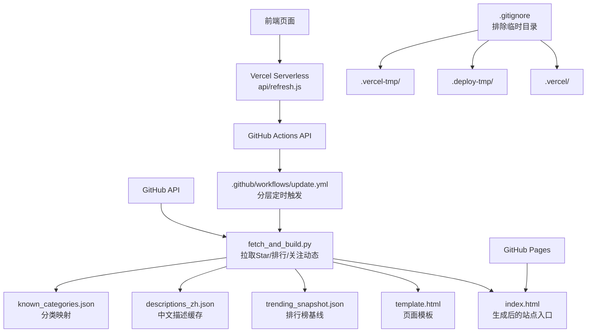
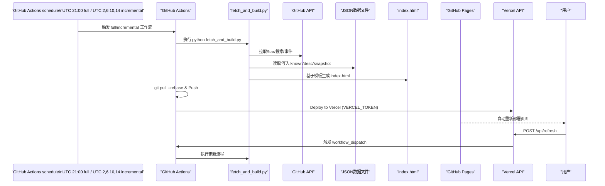
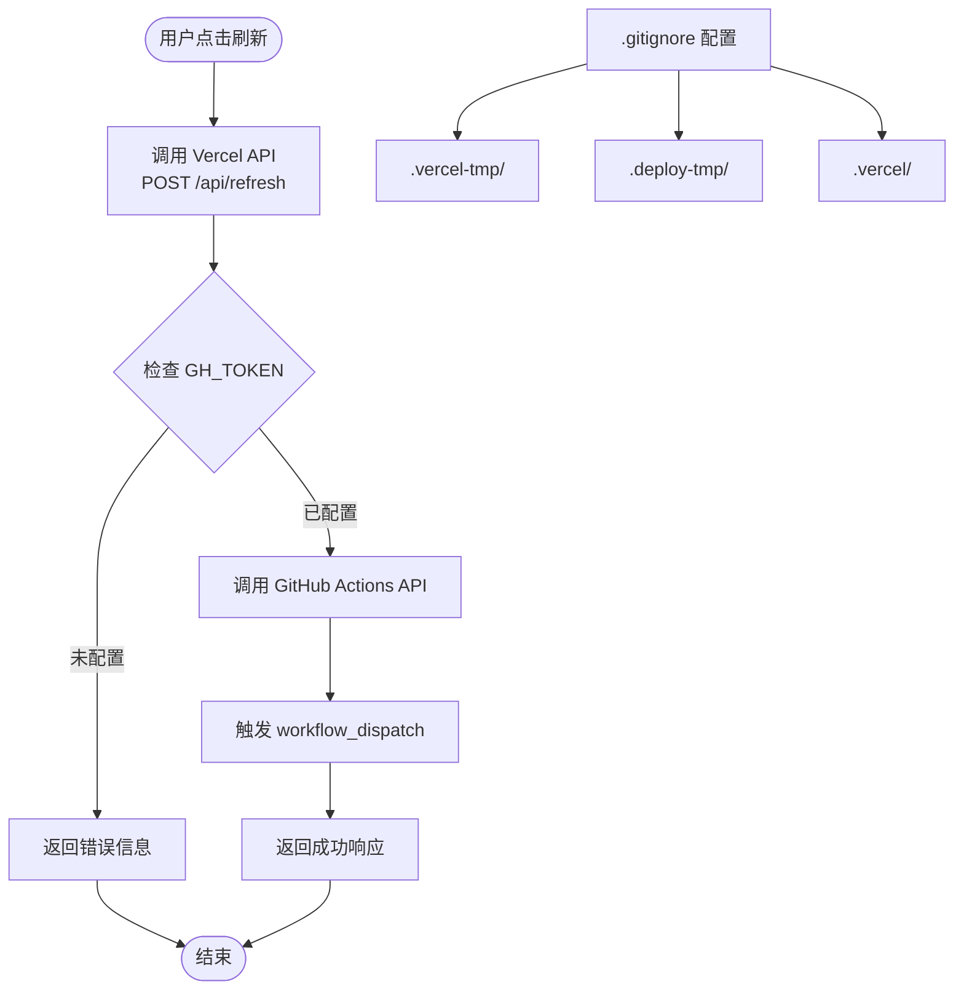
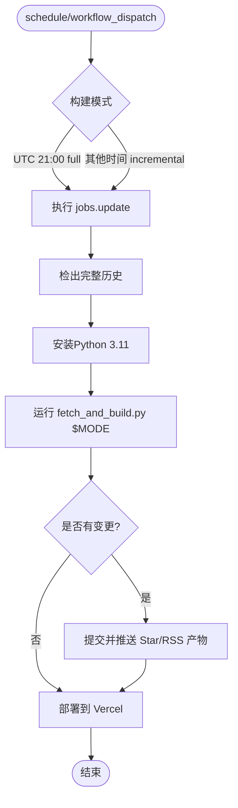
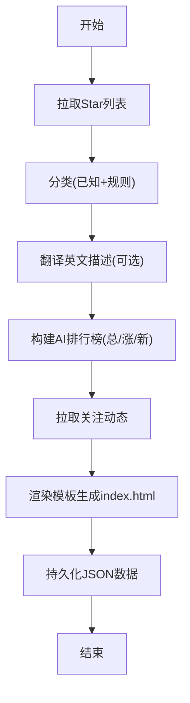
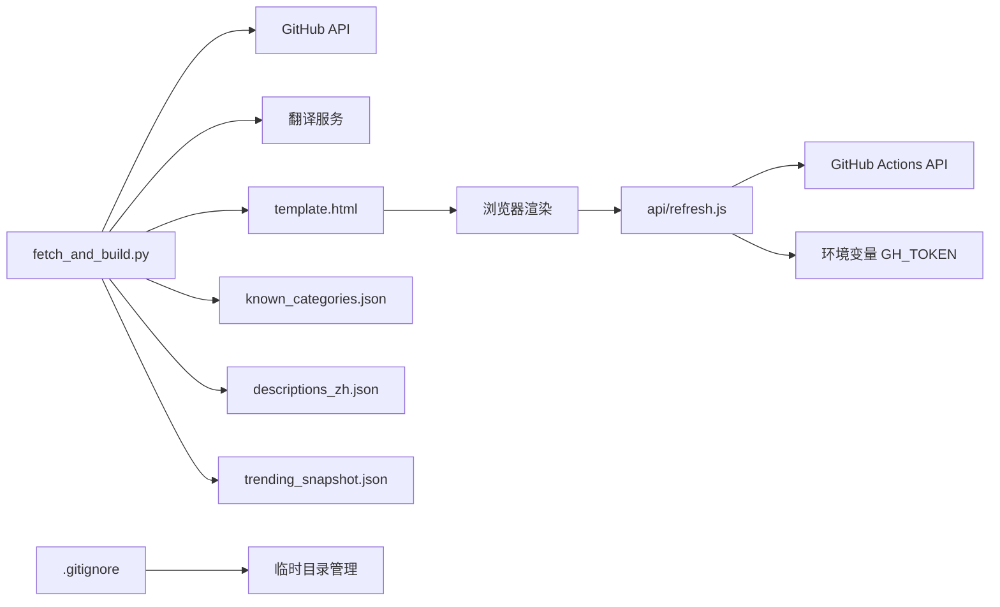

# 部署指南

<cite>
**本文引用的文件**
- [README.md](file://README.md)
- [.github/workflows/update.yml](file://.github/workflows/update.yml)
- [fetch_and_build.py](file://fetch_and_build.py)
- [template.html](file://template.html)
- [index.html](file://index.html)
- [known_categories.json](file://known_categories.json)
- [descriptions_zh.json](file://descriptions_zh.json)
- [trending_snapshot.json](file://trending_snapshot.json)
- [.gitignore](file://.gitignore)
- [vercel.json](file://vercel.json)
- [api/refresh.js](file://api/refresh.js)
- [api/rss.js](file://api/rss.js)
- [api/article.js](file://api/article.js)
- [api/agihunt.js](file://api/agihunt.js)
- [build_rss_aggregator.py](file://build_rss_aggregator.py)
- [rss_sources.json](file://rss_sources.json)
- [rss_history.json](file://rss_history.json)
- [rss_api_snapshot.json](file://rss_api_snapshot.json)
- [HANDOFF.md](file://HANDOFF.md)
</cite>

## 更新摘要
**当前部署状态（2026-09-06）**
- GitHub Pages 是用户实际访问入口；Vercel 承载 Serverless API、静态产物和 production deployment。
- `update.yml` 仅由 schedule 与 `workflow_dispatch` 触发；UTC 21:00 为 full，其余 UTC 2/6/10/14 为 incremental。
- `concurrency.cancel-in-progress: true` 保证同一时段只保留最新构建；构建提交可能触发第二个 dynamic run。
- Vercel 当前声明 7 个函数：refresh、search、events、news、rss、article、agihunt。
- 生产验证不以单次 CI 绿色为终点，必须完成双 run、线上静态验证和 Playwright 双视口 E2E。

## 目录
1. [简介](#简介)
2. [项目结构](#项目结构)
3. [核心组件](#核心组件)
4. [架构总览](#架构总览)
5. [详细组件分析](#详细组件分析)
6. [依赖关系分析](#依赖关系分析)
7. [性能与生产最佳实践](#性能与生产最佳实践)
8. [故障排查与恢复](#故障排查与恢复)
9. [结论](#结论)
10. [附录：本地开发与测试](#附录本地开发与测试)

## 简介
本项目包含 GitHub Star 收藏主线和 RSS 聚合主线。前者由 `fetch_and_build.py` 生成 `index.html`，后者由 `build_rss_aggregator.py` 生成 RSS 页面、数据分块和快照；两者共享 GitHub Actions 构建与 Vercel 部署链，GitHub Pages 提供实际访问入口。

在线地址见仓库说明。

## 当前部署闭环（2026-09-06）

### 构建与发布

1. `update.yml` 由 schedule 或 `workflow_dispatch` 启动；普通代码 push 不会自动启动。
2. checkout 完整历史，设置 Python 3.11，按 UTC 时间选择 `full` 或 `incremental`，执行 `python fetch_and_build.py $MODE`。
3. 构建同时维护 Star 主站产物和 RSS 产物：`index.html`、`ai-daily.html`、`rss-aggregator.html`、`rss-data-0.js`、`rss-data-1.js` 以及 JSON 缓存/快照。
4. 有变更时 Actions 提交并 push；随后执行 `npx vercel --prod`，部署 Vercel API 和静态产物。
5. 由于构建提交可能再次触发工作流，完整发布必须确认源码 workflow run 与 dynamic 连锁 run 均成功。

### RSS 构建分层

- `full`（UTC 21:00，北京 05:00）：抓取全部 711 源。
- `incremental`（UTC 2/6/10/14，北京 10/14/18/22）：跳过 T1，跳过 4 小时内已成功抓取的源，仅更新 T2/T3。
- `api/rss.js?refresh=1`：运行时只抓取 23 个 T1 源，T2/T3 从快照读取。

### 线上验证闭环

- 静态断言：`node .deploy-tmp/verify_online_sidebar.cjs`，检查 DOM 顺序、断点 CSS、全文字段、去重和无图回退。
- 浏览器 E2E：`node .deploy-tmp/verify_ai_sidebar_e2e.cjs`，使用 `1440×900` 与 `390×844` 两个视口，检查 AI 侧栏/抽屉、reader2、src-panel 和 JS 错误。
- Star 主线回归：本地生成 `index.html`，检查主站搜索、筛选、收藏、排行榜和关注动态，不因 RSS 变更而被覆盖。
- API 回归：从 GitHub Pages origin 验证 `/api/article` 的 CORS 头和 OPTIONS 204，不使用相对 `/api/...` URL。

**章节来源**
- [README.md:1-22](file://README.md#L1-L22)

## 项目结构
- index.html：最终生成的页面入口（由脚本根据模板和数据生成）
- template.html：页面模板（含样式与前端逻辑，数据以占位符注入）
- fetch_and_build.py：Star 主线自动化脚本，负责拉取数据、分类、翻译、生成 index.html 并持久化中间结果
- build_rss_aggregator.py：RSS 主线生成器，负责 711 源三层分级、72 小时历史、快照、chunk、AI 动态面板和 reader2
- rss_sources.json / rss_history.json / rss_api_snapshot.json：RSS 信源、历史与 API 快照
- known_categories.json：已知项目的稳定分类映射（随运行增长）
- descriptions_zh.json：已翻译的中文描述缓存（避免重复翻译）
- trending_snapshot.json：AI 排行榜基线快照（用于计算涨星变化）
- .github/workflows/update.yml：GitHub Actions 分层调度、手动触发、提交和 Vercel 部署步骤
- vercel.json：Vercel 部署配置文件，定义 Serverless Function 和超时设置
- api/refresh.js：Vercel Serverless Function，提供鉴权入口触发 GitHub Actions
- api/rss.js：RSS 快照优先与 T1 实时刷新 API
- api/article.js：全文快照/特殊源/Readability 兜底 API，支持 CORS GET/OPTIONS
- api/agihunt.js：AI 动态侧栏频道代理
- .gitignore：忽略 Python 编译产物和 Vercel 临时目录

**图表来源**
- [fetch_and_build.py:126-459](file://fetch_and_build.py#L126-L459)
- [.github/workflows/update.yml:1-51](file://.github/workflows/update.yml#L1-L51)
- [vercel.json:1-13](file://vercel.json#L1-L13)
- [api/refresh.js:1-62](file://api/refresh.js#L1-L62)
- [.gitignore:1-7](file://.gitignore#L1-L7)

**章节来源**
- [README.md:7-22](file://README.md#L7-L22)
- [fetch_and_build.py:1-659](file://fetch_and_build.py#L1-L659)
- [.github/workflows/update.yml:1-51](file://.github/workflows/update.yml#L1-L51)
- [vercel.json:1-13](file://vercel.json#L1-L13)
- [api/refresh.js:1-62](file://api/refresh.js#L1-L62)
- [.gitignore:1-7](file://.gitignore#L1-L7)

## 核心组件
- 自动化脚本 `fetch_and_build.py`：实现 Star 列表抓取、智能分类、中文翻译、AI 排行榜构建、关注动态聚合、HTML 渲染与数据持久化。
- RSS 生成器 `build_rss_aggregator.py`：实现 711 源三层分级、72 小时历史、快照、数据 chunk、AI 动态面板和 reader2。
- 工作流 `update.yml`：定义分层调度与 `workflow_dispatch`，执行双主线构建、提交变更并部署 Vercel。
- Vercel Serverless Function：提供 RESTful API 接口，安全地触发 GitHub Actions 工作流。
- 页面模板 template.html：提供 UI、交互与数据渲染逻辑，通过替换占位符注入运行时数据。
- 数据文件：known_categories.json、descriptions_zh.json、trending_snapshot.json 作为持久化状态与缓存。
- Vercel 部署配置：vercel.json 配置文件和 .gitignore 临时目录管理。

**章节来源**
- [fetch_and_build.py:1-659](file://fetch_and_build.py#L1-L659)
- [.github/workflows/update.yml:1-51](file://.github/workflows/update.yml#L1-L51)
- [vercel.json:1-13](file://vercel.json#L1-L13)
- [api/refresh.js:1-62](file://api/refresh.js#L1-L62)
- [template.html:1-883](file://template.html#L1-L883)
- [.gitignore:1-7](file://.gitignore#L1-L7)

## 架构总览
系统由"后端数据处理 + 前端静态展示 + CI/CD 自动化 + Serverless API"四部分组成：
- 后端数据处理：Python 脚本调用 GitHub API 获取数据，进行清洗、分类、翻译、排序与快照管理。
- 前端静态展示：Star 主站和 RSS 聚合页均为原生 HTML/CSS/JS，适合 GitHub Pages 或 Vercel 托管。
- CI/CD 自动化：GitHub Actions 按分层 schedule 或手动触发，执行双主线构建并部署到 Vercel；GitHub Pages 提供静态入口。
- Serverless API：Vercel 函数提供安全的 API 接口，通过环境变量保护 GitHub Token，触发远程工作流。

**图表来源**
- [.github/workflows/update.yml:1-51](file://.github/workflows/update.yml#L1-L51)
- [fetch_and_build.py:126-459](file://fetch_and_build.py#L126-L459)
- [api/refresh.js:17-31](file://api/refresh.js#L17-L31)

## 详细组件分析

### GitHub Pages 部署流程
- 仓库设置：确保默认分支为 main（或你配置的分支），并在 Settings → Pages 中启用 Pages 服务，选择源分支与目录（通常为根目录）。
- Pages 启用：保存后，访问 https://<用户名>.github.io/<仓库名>/ 验证部署成功。
- 自定义域名配置：在 Pages 设置中填写自定义域名，并在 DNS 提供商处添加 CNAME 记录指向 <用户名>.github.io；随后在 Pages 的 Custom domain 中填入你的域名完成绑定。

提示：仓库 README 中提供了自定义域名的简要指引。

**章节来源**
- [README.md:19-22](file://README.md#L19-L22)

### Vercel 部署基础设施配置
**新增** Vercel 部署基础设施配置，包含完整的临时目录管理和部署优化。

- **配置文件 vercel.json**：定义项目名称、Serverless Function 路径和超时设置（maxDuration: 10秒）
- **临时目录管理**：.gitignore 中新增 .vercel-tmp/ 和 .deploy-tmp/ 临时目录排除规则
- **部署优化**：排除 .vercel/ 目录和 .vercel 文件，减少仓库体积和部署时间
- **API 端点**：`/api/refresh` - POST 请求触发 GitHub Actions 工作流
- **环境变量**：需要配置 `GH_TOKEN` 环境变量（fine-grained PAT，仅 starhub 仓库 + Actions:write 权限）
- **安全机制**：通过环境变量保护 GitHub Token，防止硬编码泄露
- **前端集成**：页面通过 `https://starhub-refresh.vercel.app/api/refresh` 调用 API

**图表来源**
- [vercel.json:1-13](file://vercel.json#L1-L13)
- [api/refresh.js:11-31](file://api/refresh.js#L11-L31)
- [.gitignore:1-7](file://.gitignore#L1-L7)

**章节来源**
- [vercel.json:1-13](file://vercel.json#L1-L13)
- [api/refresh.js:1-62](file://api/refresh.js#L1-L62)
- [.gitignore:1-7](file://.gitignore#L1-L7)

### GitHub Actions 自动化部署
- 工作流文件：位于 `.github/workflows/update.yml`，定义 schedule、`workflow_dispatch`、权限、并发控制与作业步骤。
- 调度模式：UTC 21:00 选择 `full`；UTC 2/6/10/14 选择 `incremental`；普通 push 不会自动触发。
- 执行步骤：checkout 完整历史 → Setup Python 3.11 → `python fetch_and_build.py $MODE` → 有变更时提交并 push → `npx vercel --prod`。
- 提交范围覆盖 Star 主站与 RSS 产物，包括 `index.html`、`ai-daily.html`、`rss-aggregator.html`、数据 chunk 和 JSON 快照。
- 并发安全：`concurrency.group: starhub-update` 且 `cancel-in-progress: true`；push 后可能产生构建提交触发的 dynamic 连锁 run。

**图表来源**
- [.github/workflows/update.yml:1-51](file://.github/workflows/update.yml#L1-L51)

**章节来源**
- [.github/workflows/update.yml:1-51](file://.github/workflows/update.yml#L1-L51)

### 本地开发环境搭建
- Python 环境：需要 Python 3.11（与 Actions 一致），推荐使用系统自带或 pyenv 管理。
- 依赖安装：脚本仅依赖 Python 标准库，无需额外 pip install。
- 本地测试方法：
  - 准备环境变量：如需启用 AI 排行榜与关注动态，需设置 GITHUB_TOKEN 或 GH_TOKEN（可选，用于提高 API 配额与访问受限接口）。
  - 运行脚本：python fetch_and_build.py，将生成/更新 index.html 及 JSON 数据文件。
  - 预览页面：直接浏览器打开 index.html 或使用任意静态服务器（如 python -m http.server）。
  - 修改模板：编辑 template.html 调整样式与交互，再次运行脚本生成新页面。

注意：首次运行会建立排行榜基线（trending_snapshot.json），后续才能显示"涨星榜"。

**章节来源**
- [fetch_and_build.py:157-283](file://fetch_and_build.py#L157-L283)
- [fetch_and_build.py:382-459](file://fetch_and_build.py#L382-L459)
- [README.md:15-18](file://README.md#L15-L18)

### 数据与模板处理逻辑
- 数据拉取：
  - Star 列表：分页拉取用户 Star 仓库，合并去重。
  - AI 排行榜：多 topic 搜索合并成池，按总星标、涨星变化、近 7 天新建分别排序。
  - 关注动态：拉取关注账号今日公开事件（创建仓库、star、关注、PR），按时间倒序。
- 分类与翻译：
  - 已知项目走 known_categories.json 保持稳定；新项目通过关键词规则分类。
  - 英文描述尝试翻译为中文，失败保留原文；翻译结果缓存至 descriptions_zh.json。
- 页面生成：
  - 将 DATA、CATS、LANG_COLORS、FAVS、TRENDING、FEED、UPDATED 等数据注入 template.html 占位符，输出 index.html。
  - 同时更新 known_categories.json、descriptions_zh.json、trending_snapshot.json。

**图表来源**
- [fetch_and_build.py:126-459](file://fetch_and_build.py#L126-L459)

**章节来源**
- [fetch_and_build.py:89-124](file://fetch_and_build.py#L89-L124)
- [fetch_and_build.py:185-283](file://fetch_and_build.py#L185-L283)
- [fetch_and_build.py:313-379](file://fetch_and_build.py#L313-L379)
- [fetch_and_build.py:382-459](file://fetch_and_build.py#L382-L459)

## 依赖关系分析
- 外部依赖：
  - GitHub API：用于拉取 Star、搜索仓库、获取关注动态。
  - 翻译服务：Google Translate 非官方接口与 MyMemory 免费接口（失败回退）。
  - Vercel 平台：Serverless Function 托管和 API 路由。
- 内部依赖：
  - template.html：被 fetch_and_build.py 读取并注入数据。
  - known_categories.json、descriptions_zh.json、trending_snapshot.json：读写状态与缓存。
  - vercel.json：Vercel 部署配置。
  - api/refresh.js：Serverless Function 实现。
  - .gitignore：临时目录管理配置。
- 耦合与内聚：
  - 脚本高内聚：所有数据处理逻辑集中在单一文件中，便于维护。
  - 低耦合：页面与数据分离，模板只负责渲染，不关心数据来源。
  - 模块化设计：Vercel Function 独立于主应用，通过 API 解耦。

**图表来源**
- [fetch_and_build.py:54-86](file://fetch_and_build.py#L54-L86)
- [fetch_and_build.py:126-459](file://fetch_and_build.py#L126-L459)
- [api/refresh.js:11-31](file://api/refresh.js#L11-L31)
- [.gitignore:1-7](file://.gitignore#L1-L7)

**章节来源**
- [fetch_and_build.py:54-86](file://fetch_and_build.py#L54-L86)
- [fetch_and_build.py:126-459](file://fetch_and_build.py#L126-L459)
- [api/refresh.js:1-62](file://api/refresh.js#L1-L62)
- [.gitignore:1-7](file://.gitignore#L1-L7)

## 性能与生产最佳实践
- 性能优化
  - 使用 GitHub Pages 静态托管，减少服务端开销。
  - 合理设置 API 请求间隔（脚本中已有 sleep），避免触发速率限制。
  - 利用缓存文件（descriptions_zh.json、known_categories.json）减少重复翻译与分类成本。
  - 排行榜基线（trending_snapshot.json）降低每日计算量。
  - Vercel Serverless Function 提供快速响应的 API 接口，超时设置为 10 秒。
  - 通过 .gitignore 排除临时目录，减少仓库体积和部署时间。
  - **当前调度**：使用 UTC 21:00 全量构建与 UTC 2/6/10/14 增量构建；普通 push 不会触发工作流。
  - **增强** 自动部署优化：通过 VERCEL_TOKEN 实现一键生产部署，减少人工干预。
  - **新增** 并发控制：通过 concurrency 组和 git pull --rebase 防止并发冲突。
- 错误监控
  - 关注 Actions 日志中的失败信息（如拉取失败、翻译失败）。
  - 对关键步骤增加重试或降级策略（例如翻译失败保留原文）。
  - 监控 Vercel Function 的执行日志和错误响应。
  - **新增** 监控并发提交冲突：定期检查 Actions 日志中的 git pull --rebase 执行情况。
  - **新增** 监控 Vercel 部署状态：关注 VERCEL_TOKEN 认证和部署成功状态。
  - **新增** 监控分层任务执行：确认 full/incremental 两种 schedule 和 workflow_dispatch 均能正常触发。
- 备份策略
  - 定期导出 index.html 与 JSON 数据文件，保存在本地或私有仓库。
  - 使用 Actions 的 artifacts 功能归档每次构建产物（可选增强）。
  - 版本化管理：每次更新都提交 commit，便于回溯与恢复。
  - 环境变量备份：妥善管理 GH_TOKEN 和 VERCEL_TOKEN 等敏感配置。
  - 清理临时文件：定期清理 .vercel-tmp/ 和 .deploy-tmp/ 目录。

## 故障排查与恢复
- 常见问题
  - API 限流或失败：检查网络与令牌（GITHUB_TOKEN/GH_TOKEN），查看 Actions 日志中的错误信息。
  - 翻译失败：脚本会自动回退到原文，不影响页面生成。
  - 排行榜为空：首次运行会建立基线，次日再查看"涨星榜"。
  - 页面未更新：确认 Actions 是否成功提交并推送变更，检查 Pages 部署状态。
  - Vercel API 错误：检查 GH_TOKEN 环境变量是否正确配置，查看 Vercel 控制台日志。
  - 跨域问题：确保 Vercel Function 正确设置 CORS 头（Access-Control-Allow-Origin）。
  - 临时目录问题：检查 .gitignore 是否正确配置，避免临时文件被提交到仓库。
  - **新增** 并发提交冲突：如果看到 "refusing to merge unrelated histories" 或类似错误，检查 git pull --rebase 是否成功执行。
  - **新增** Vercel 部署失败：检查 VERCEL_TOKEN 环境变量是否正确配置，查看 Vercel 控制台日志。
  - **分层任务问题**：确认 `update.yml` 的 UTC 21:00 full、UTC 2/6/10/14 incremental 配置正确，并检查 concurrency 是否取消旧 run。
- 恢复方案
  - 手动触发：在 Actions 页面点击 Run workflow 重新执行。
  - 本地修复：在本地运行脚本并验证 index.html 正确性后提交。
  - 回滚版本：通过 Git 回退到上一个稳定版本并推送。
  - Vercel 调试：检查 Vercel 控制台日志和环境变量配置。
  - 清理临时文件：删除 .vercel-tmp/ 和 .deploy-tmp/ 目录后重新部署。
  - **新增** 解决并发冲突：如果遇到推送失败，手动执行 `git pull --rebase` 后再推送。
  - **新增** 重置 Vercel 部署：在 Vercel 控制台重新连接仓库并重新部署。
  - **新增** 重新配置分层任务：检查 full/incremental schedule 和北京时间换算是否正确。

**章节来源**
- [fetch_and_build.py:126-146](file://fetch_and_build.py#L126-L146)
- [fetch_and_build.py:185-283](file://fetch_and_build.py#L185-L283)
- [fetch_and_build.py:313-379](file://fetch_and_build.py#L313-L379)
- [.github/workflows/update.yml:31-51](file://.github/workflows/update.yml#L31-L51)
- [api/refresh.js:11-15](file://api/refresh.js#L11-L15)
- [.gitignore:1-7](file://.gitignore#L1-L7)

## 结论
本方案通过 Python 双主线构建、GitHub Actions、GitHub Pages 和 Vercel 实现自动化 Star 收藏台与 RSS 聚合器。Star 主线负责收藏、分类、翻译、趋势和关注动态；RSS 主线负责 711 源、72 小时历史、AI 侧栏和全文阅读。发布时必须同时关注源码 run、dynamic 连锁 run、Vercel 部署和页面回归，不能只确认单次 CI 绿色。

## 附录：本地开发与测试
- 环境准备
  - 安装 Python 3.11（与 Actions 一致）。
  - 可选：设置 GITHUB_TOKEN 或 GH_TOKEN 以提高 API 配额与访问能力。
  - Vercel 环境：如需本地测试 Vercel Function，需要安装 Vercel CLI 并配置 GH_TOKEN 环境变量。
  - **新增** Vercel 部署配置：设置 VERCEL_TOKEN 环境变量以启用自动部署功能。
- 运行与验证
  - 执行 python fetch_and_build.py，生成/更新 index.html 与 JSON 数据。
  - 浏览器打开 index.html 或使用静态服务器预览。
  - 修改 template.html 后重新运行脚本验证效果。
  - 使用 Vercel CLI 测试 Serverless Function：`vercel dev`。
  - **新增** 测试自动部署：在本地修改代码后推送到远端，验证 Vercel 自动部署流程。
  - **新增** 验证分层任务：检查 GitHub Actions 的 full/incremental run 和 dynamic 连锁 run 是否正常。
- 调试技巧
  - 查看控制台输出与日志，定位 API 或翻译问题。
  - 临时注释部分逻辑，逐步缩小问题范围。
  - 使用 Git 提交历史对比变更，快速定位引入的问题。
  - 本地测试 Vercel Function：使用 `vercel dev` 启动本地开发服务器。
  - 检查临时目录：确保 .vercel-tmp/ 和 .deploy-tmp/ 未被意外提交。
  - **新增** 监控并发问题：在本地测试时模拟并发提交场景，验证 `git pull --rebase` 的有效性。
  - **新增** 调试 Vercel 部署：检查 VERCEL_TOKEN 配置和部署日志，确保生产环境正确部署。
  - **新增** 验证 schedule：核对 UTC 21:00 与 UTC 2/6/10/14 的构建模式选择。

**章节来源**
- [fetch_and_build.py:382-459](file://fetch_and_build.py#L382-L459)
- [README.md:15-18](file://README.md#L15-L18)
- [api/refresh.js:1-62](file://api/refresh.js#L1-L62)
- [.gitignore:1-7](file://.gitignore#L1-L7)
- [.github/workflows/update.yml:45-51](file://.github/workflows/update.yml#L45-L51)