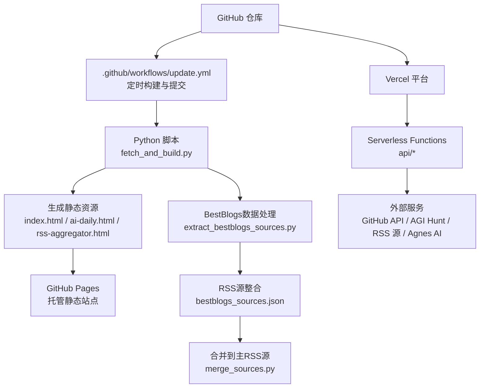
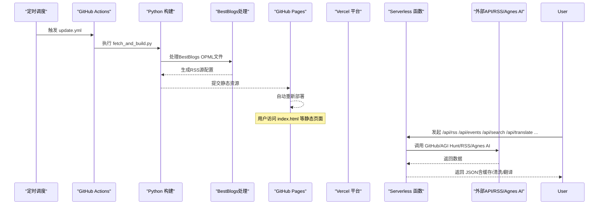
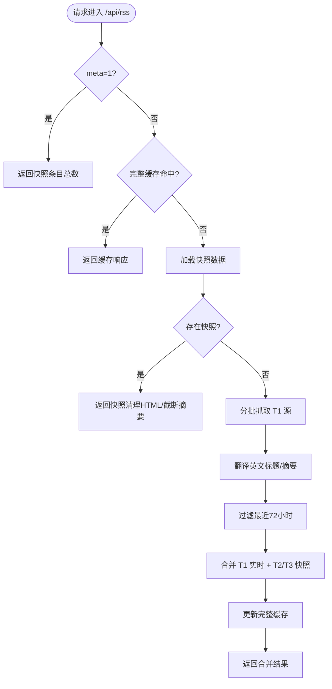
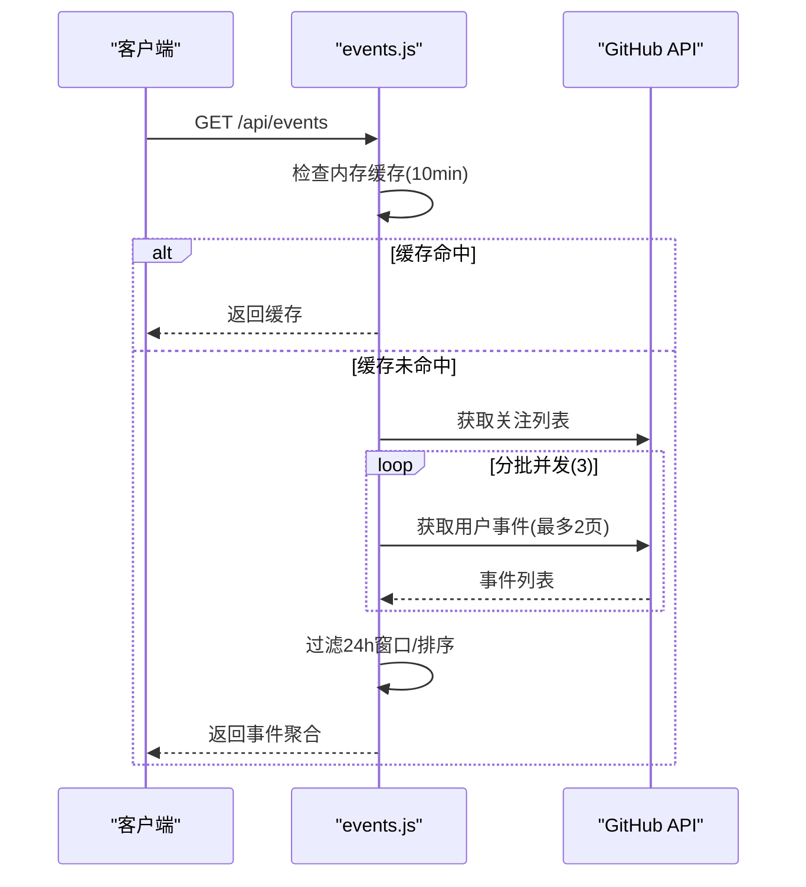
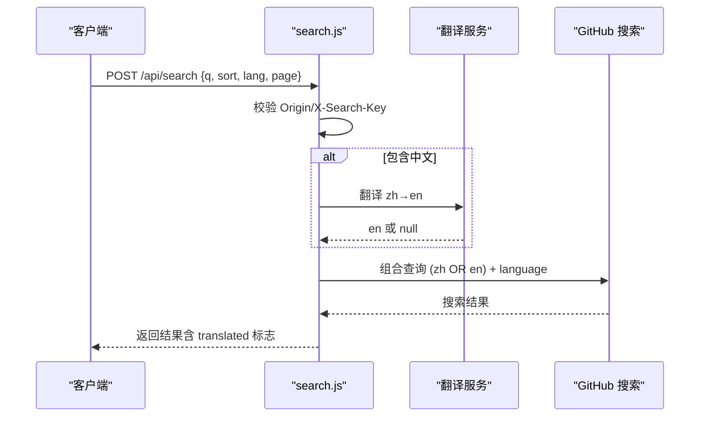
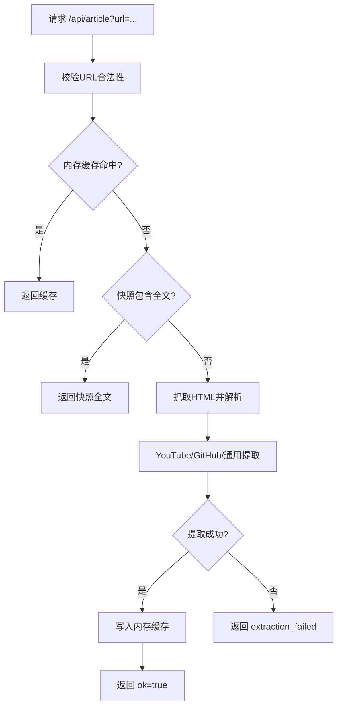
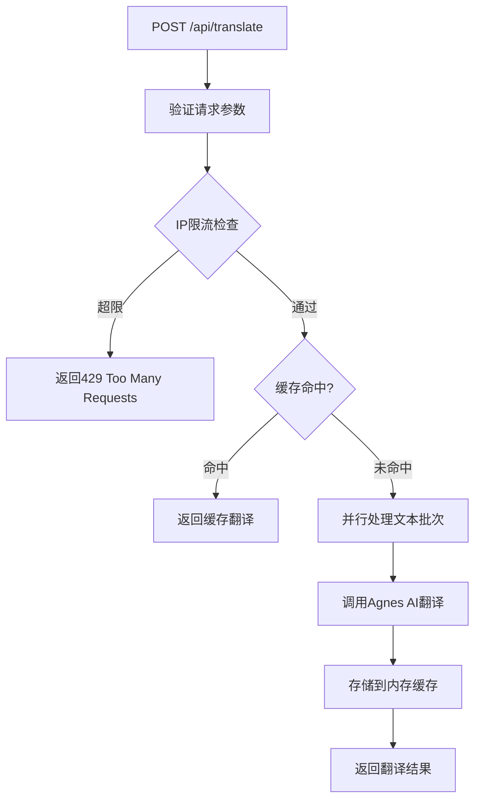
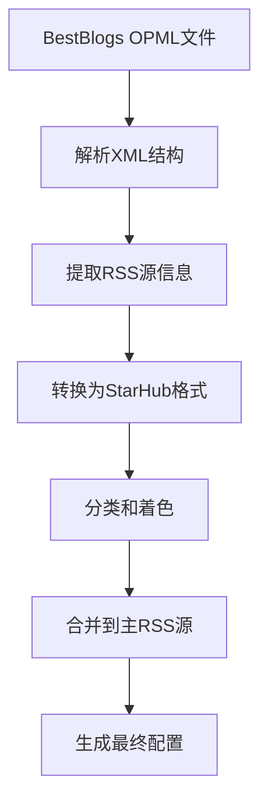
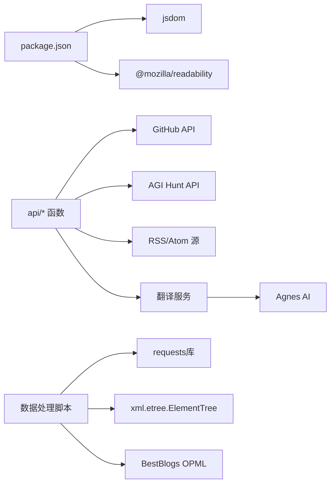

# 部署运维

<cite>
**本文引用的文件**
- [vercel.json](file://vercel.json)
- [package.json](file://package.json)
- [.github/workflows/update.yml](file://.github/workflows/update.yml)
- [README.md](file://README.md)
- [api/agihunt.js](file://api/agihunt.js)
- [api/article.js](file://api/article.js)
- [api/events.js](file://api/events.js)
- [api/news.js](file://api/news.js)
- [api/refresh.js](file://api/refresh.js)
- [api/rss.js](file://api/rss.js)
- [api/search.js](file://api/search.js)
- [api/translate.js](file://api/translate.js)
- [extract_bestblogs_sources.py](file://extract_bestblogs_sources.py)
- [bestblogs_sources.json](file://bestblogs_sources.json)
- [merge_sources.py](file://merge_sources.py)
</cite>

## 更新摘要
**变更内容**
- **移除BestBlogs独立API函数**：从vercel.json配置中移除了bestblogs.js的部署设置
- **BestBlogs功能重构**：将BestBlogs OpenAPI服务重构为RSS源集成，通过Python脚本提取并合并到现有RSS聚合系统中
- **简化部署配置**：减少了Vercel函数配置项，优化了部署架构
- **数据源整合**：BestBlogs的559个RSS源已整合到现有的RSS聚合系统中，不再需要独立的API代理

## 目录
1. [简介](#简介)
2. [项目结构](#项目结构)
3. [核心组件](#核心组件)
4. [架构总览](#架构总览)
5. [详细组件分析](#详细组件分析)
6. [依赖关系分析](#依赖关系分析)
7. [性能与容量规划](#性能与容量规划)
8. [监控与告警](#监控与告警)
9. [故障排查指南](#故障排查指南)
10. [备份与恢复策略](#备份与恢复策略)
11. [安全最佳实践](#安全最佳实践)
12. [运维手册](#运维手册)
13. [结论](#结论)

## 简介
本运维文档面向部署与运维人员，覆盖 Vercel 平台部署配置、GitHub Pages 发布流程、自定义域名设置、监控与告警、故障排查、备份恢复、扩展性与容量规划、安全最佳实践以及日常运维任务。项目通过 GitHub Actions 定时构建并推送静态页面至 GitHub Pages，同时通过 Vercel Serverless Functions 提供 RSS 聚合、事件聚合、搜索代理、文章全文提取、AI翻译等后端能力。**最新架构调整将BestBlogs功能从独立API重构为RSS源集成，简化了部署配置并提升了系统稳定性**。

## 项目结构
- 前端静态站点：index.html、ai-daily.html、rss-aggregator.html 由 Python 脚本生成或维护，作为 GitHub Pages 的入口资源。
- 服务端函数：api/* 下的 Node.js Serverless 函数，运行在 Vercel 上，提供跨域访问、缓存、鉴权、上游 API 代理等功能。
- 自动化流水线：.github/workflows/update.yml 负责定时抓取数据、生成静态资源并提交到仓库，随后触发 Vercel 部署。
- 构建依赖：package.json 声明了运行时依赖（如 jsdom、readability），用于服务端函数解析网页内容。
- **数据源管理**：新增BestBlogs数据处理脚本，将BestBlogs的OPML文件转换为标准RSS源格式并整合到系统中。

**图表来源**
- [.github/workflows/update.yml:1-161](file://.github/workflows/update.yml#L1-L161)
- [extract_bestblogs_sources.py:1-97](file://extract_bestblogs_sources.py#L1-L97)
- [merge_sources.py:1-35](file://merge_sources.py#L1-L35)
- [vercel.json:1-15](file://vercel.json#L1-L15)

**章节来源**
- [README.md:1-22](file://README.md#L1-L22)
- [package.json:1-9](file://package.json#L1-L9)
- [vercel.json:1-15](file://vercel.json#L1-L15)
- [.github/workflows/update.yml:1-161](file://.github/workflows/update.yml#L1-L161)

## 核心组件
- Vercel 函数路由与超时配置：vercel.json 定义了各函数的最大执行时长，确保不同负载场景下稳定运行。
- GitHub Actions 流水线：update.yml 定义定时任务、并发控制、增量/全量构建模式、提交与 Vercel 部署重试逻辑。
- 数据抓取与构建：fetch_and_build.py 负责拉取 Star 列表、分类、生成页面与快照数据。
- 服务端函数：
  - api/rss.js：RSS 聚合与翻译、HTML 清洗、滚动缓存与快照回退。
  - api/events.js：关注账号近 24 小时动态聚合，内存缓存与限流。
  - api/search.js：中文关键词翻译后组合查询 GitHub 仓库搜索，带结果缓存与限流保护。
  - api/article.js：文章全文提取与缓存，支持 YouTube/GitHub/通用页面。
  - api/agihunt.js：AGI Hunt 资讯代理，CORS 白名单与密钥管理。
  - api/refresh.js：触发 GitHub Actions workflow_dispatch，具备 CORS 与请求头鉴权。
  - api/translate.js：Agnes AI 翻译代理，提供高质量的中英文翻译服务。
  - api/news.js：AI资讯流代理，聚合36氪和Redis官方博客内容。
- **数据源管理**：
  - extract_bestblogs_sources.py：从BestBlogs OPML文件提取RSS源并转换为StarHub格式。
  - bestblogs_sources.json：存储BestBlogs的559个RSS源配置。
  - merge_sources.py：将BestBlogs源合并到主RSS源列表中。

**章节来源**
- [vercel.json:1-15](file://vercel.json#L1-L15)
- [.github/workflows/update.yml:1-161](file://.github/workflows/update.yml#L1-L161)
- [api/rss.js:1-468](file://api/rss.js#L1-L468)
- [api/events.js:1-161](file://api/events.js#L1-L161)
- [api/search.js:1-177](file://api/search.js#L1-L177)
- [api/article.js:1-203](file://api/article.js#L1-L203)
- [api/agihunt.js:1-113](file://api/agihunt.js#L1-113)
- [api/refresh.js:1-65](file://api/refresh.js#L1-65)
- [api/translate.js:1-117](file://api/translate.js#L1-117)
- [api/news.js:1-113](file://api/news.js#L1-113)
- [extract_bestblogs_sources.py:1-97](file://extract_bestblogs_sources.py#L1-97)
- [merge_sources.py:1-35](file://merge_sources.py#L1-35)

## 架构总览
系统由"构建流水线 + 静态站点 + 服务端函数"组成。Actions 定时抓取并生成静态资源，推送到仓库后由 Vercel 自动部署；前端通过浏览器直接访问 GitHub Pages，并通过 Vercel 函数调用外部服务获取实时数据。**最新架构调整将BestBlogs功能从独立API重构为RSS源集成，通过Python脚本处理OPML文件并整合到现有RSS聚合系统中**。

**图表来源**
- [.github/workflows/update.yml:1-161](file://.github/workflows/update.yml#L1-L161)
- [extract_bestblogs_sources.py:1-97](file://extract_bestblogs_sources.py#L1-97)
- [api/rss.js:1-468](file://api/rss.js#L1-L468)
- [api/events.js:1-161](file://api/events.js#L1-L161)
- [api/search.js:1-177](file://api/search.js#L1-L177)
- [api/translate.js:1-117](file://api/translate.js#L1-117)

## 详细组件分析

### Vercel 部署配置与路由规则
- 函数超时：为不同 API 设置 maxDuration，避免长时间阻塞导致冷启动失败或实例回收。
- **环境变量**：
  - GH_TOKEN：用于 GitHub API 调用（搜索、触发 workflow_dispatch、事件聚合）。
  - REFRESH_KEY：用于 refresh.js 与 search.js 的请求头鉴权。
  - AGIHUNT_API_KEY：用于 agihunt.js 代理上游 API。
  - AGNES_API_KEY：Agnes AI 翻译服务 API Key。
- 构建命令：本项目为静态站点+Serverless 函数，无需额外构建命令；Vercel 自动识别 api/* 为函数目录。
- 路由规则：所有 /api/* 路径映射到对应函数；静态资源按文件名直接访问。

**更新** 移除了bestblogs.js的15秒超时配置，因为BestBlogs功能已重构为RSS源集成，不再需要独立的API函数。当前配置包含8个活跃的Serverless函数，每个都有针对性的超时设置。

**章节来源**
- [vercel.json:1-15](file://vercel.json#L1-L15)
- [api/refresh.js:1-65](file://api/refresh.js#L1-65)
- [api/search.js:1-177](file://api/search.js#L1-177)
- [api/agihunt.js:1-113](file://api/agihunt.js#L1-113)
- [api/translate.js:1-117](file://api/translate.js#L1-117)

### GitHub Pages 部署流程与自定义域名
- 自动更新：Actions 定时运行，生成并推送静态资源，GitHub Pages 自动重新部署。
- 手动触发：可在 Actions 页面手动运行 update.yml。
- 自定义域名：在仓库 Settings → Pages 中设置自定义域名，并在 DNS 添加 CNAME 指向 Kwei168.github.io，再将域名填入 Pages 的 Custom domain。

**章节来源**
- [.github/workflows/update.yml:1-161](file://.github/workflows/update.yml#L1-L161)
- [README.md:1-22](file://README.md#L1-L22)

### RSS 聚合函数（api/rss.js）
- 功能：聚合多个 RSS/Atom 源，支持英文标题与摘要的在线翻译，HTML 深度清洗，滚动缓存与快照回退。
- 缓存策略：
  - 完整响应缓存：TTL 5 分钟，减少重复抓取。
  - 滚动缓存：每个源保留上次成功抓取的数据，失败时返回旧数据并标记 _stale。
  - 快照优先：优先返回构建时生成的 rss_api_snapshot.json 数据，降低上游压力。
- 并发与超时：单源超时 5s，批量并发 20，提升整体吞吐。
- 安全：输出 HTML 经严格白名单标签过滤，移除危险元素与属性。
- **增强数据源**：现已整合BestBlogs的559个RSS源，包括微信公众号、播客和YouTube内容。

**图表来源**
- [api/rss.js:1-468](file://api/rss.js#L1-L468)

**章节来源**
- [api/rss.js:1-468](file://api/rss.js#L1-L468)

### 事件聚合函数（api/events.js）
- 功能：聚合关注账号近 24 小时公开事件，映射为 7 类事件（创建仓库、Star、关注、PR、Release、公开、Push）。
- 缓存与限流：内存缓存 TTL 10 分钟；每批并发 3 个用户，失败静默跳过。
- 时间处理：统一转换为北京时间进行窗口过滤与展示。

**图表来源**
- [api/events.js:1-161](file://api/events.js#L1-L161)

**章节来源**
- [api/events.js:1-161](file://api/events.js#L1-L161)

### 搜索代理函数（api/search.js）
- 功能：中文关键词翻译为英文后组合查询（中文 OR 英文），调用 GitHub 搜索 API，返回仓库信息。
- 缓存：搜索结果缓存 10 分钟，翻译结果缓存 1 小时。
- 防护：CORS 白名单；X-Search-Key 头校验；分页上限 34（1000/30）。
- 降级：Google 翻译失败则尝试 MyMemory，均失败使用原词直搜。

**图表来源**
- [api/search.js:1-177](file://api/search.js#L1-L177)

**章节来源**
- [api/search.js:1-177](file://api/search.js#L1-L177)

### 文章全文提取函数（api/article.js）
- 功能：根据 URL 抓取 HTML，针对 YouTube/GitHub/通用页面提取标题与正文，支持快照回退与内存缓存。
- 安全：URL 白名单校验，禁止内网与本地地址；HTML 仅允许安全标签。
- 缓存：TTL 4 小时，最多 500 条；快照 map 每 10 分钟重载。

**图表来源**
- [api/article.js:1-203](file://api/article.js#L1-203)

**章节来源**
- [api/article.js:1-203](file://api/article.js#L1-203)

### AGI Hunt 代理函数（api/agihunt.js）
- 功能：代理 AGI Hunt Agent API，携带 Authorization 头与 Skill Version，返回频道资讯。
- 防护：CORS 白名单；channel 白名单校验；day 格式校验。
- 缓存：按 channel|day|sort 键值缓存，TTL 10 分钟，最多 20 项。

**章节来源**
- [api/agihunt.js:1-113](file://api/agihunt.js#L1-113)

### 刷新触发函数（api/refresh.js）
- 功能：POST 触发 GitHub Actions workflow_dispatch，实现手动刷新 star 列表。
- 防护：CORS 白名单；X-Refresh-Key 头校验；仅允许 POST。
- 错误处理：不向上游回显 GitHub 错误细节，避免信息泄露。

**章节来源**
- [api/refresh.js:1-65](file://api/refresh.js#L1-65)

### 翻译代理函数（api/translate.js）
- 功能：Agnes AI 翻译代理，提供高质量的简体中文翻译服务。
- API端点：POST /api/translate，接收文本数组并返回对应的中文翻译。
- 技术特性：
  - 使用 Agnes AI（agnes-2.5-flash模型）进行翻译，质量优于免费端点
  - 支持批量翻译（最多20条文本）
  - 内置内存缓存（24小时TTL）和轻量级限流（每分钟30次）
  - 上游超时设置为12秒，配合Vercel的30秒maxDuration
- 安全防护：
  - CORS白名单限制（starhub-refresh.vercel.app、kwei168.github.io）
  - 需要AGNES_API_KEY环境变量配置
  - IP级别的请求频率限制
- 降级策略：当Agnes AI服务不可用时，前端可自动降级到Google GTX免费翻译端点

**图表来源**
- [api/translate.js:1-117](file://api/translate.js#L1-117)

**章节来源**
- [api/translate.js:1-117](file://api/translate.js#L1-117)

### AI资讯流代理函数（api/news.js）
- 功能：聚合36氪AI资讯流和Redis官方博客内容，解决CORS和反爬问题。
- 缓存策略：10分钟TTL内存缓存，减少上游请求压力。
- 镜像链：支持多个RSSHub镜像源，提高可用性。
- 数据标准化：统一36氪和Redis博客的内容格式。

**章节来源**
- [api/news.js:1-113](file://api/news.js#L1-113)

### BestBlogs数据处理组件
- **功能**：从BestBlogs OPML文件提取RSS源并转换为StarHub格式，整合到现有RSS聚合系统中。
- **数据处理流程**：
  - extract_bestblogs_sources.py：解析BestBlogs的OPML文件，提取559个RSS源
  - bestblogs_sources.json：存储转换后的RSS源配置，包含分类、颜色、URL等信息
  - merge_sources.py：将BestBlogs源合并到主RSS源列表中，按活跃度分级
- **数据源类型**：
  - 微信公众号：wechat2rss.bestblogs.dev，归为cn_tech分类
  - 播客：rsshub.bestblogs.dev，归为tech分类  
  - YouTube：归为tech分类
- **分类映射**：自动识别不同类型的内容源并分配相应的颜色和分类标签

**图表来源**
- [extract_bestblogs_sources.py:1-97](file://extract_bestblogs_sources.py#L1-97)
- [merge_sources.py:1-35](file://merge_sources.py#L1-35)

**章节来源**
- [extract_bestblogs_sources.py:1-97](file://extract_bestblogs_sources.py#L1-97)
- [merge_sources.py:1-35](file://merge_sources.py#L1-35)

## 依赖关系分析
- 运行时依赖：jsdom 与 @mozilla/readability 用于服务端解析 HTML 与提取可读内容。
- 外部依赖：GitHub API、AGI Hunt API、RSS/Atom 源、翻译服务（Google/MyMemory/Agnes AI）。
- 构建依赖：Python 标准库，无第三方包要求。
- **新增依赖**：requests库用于下载BestBlogs OPML文件，xml.etree.ElementTree用于解析XML结构。

**图表来源**
- [package.json:1-9](file://package.json#L1-9)
- [api/rss.js:1-468](file://api/rss.js#L1-468)
- [api/search.js:1-177](file://api/search.js#L1-177)
- [api/agihunt.js:1-113](file://api/agihunt.js#L1-113)
- [api/translate.js:1-117](file://api/translate.js#L1-117)
- [extract_bestblogs_sources.py:1-97](file://extract_bestblogs_sources.py#L1-97)

**章节来源**
- [package.json:1-9](file://package.json#L1-9)

## 性能与容量规划
- 并发与超时：
  - RSS 抓取：单源 5s 超时，批次并发 20，避免长尾拖慢整体响应。
  - 事件聚合：每批并发 3，失败静默跳过，保证稳定性。
  - 搜索代理：分页上限 34，翻译与搜索各自超时保护。
  - 翻译服务：批量翻译支持最多20条文本，上游超时12秒，Vercel函数超时30秒。
- 缓存策略：
  - 内存缓存：事件 10 分钟、搜索 10 分钟、翻译 1 小时、文章 4 小时。
  - 翻译缓存：Agnes AI翻译结果缓存24小时，减少重复请求。
  - 快照回退：RSS 优先返回构建时快照，降低上游压力。
- 容量规划建议：
  - 若 RSS 源数量增长，可调整 CONCURRENCY 与 FETCH_TIMEOUT。
  - 若搜索频率增加，可增加搜索缓存 TTL 或引入分布式缓存。
  - 若事件聚合用户数增长，可提高并发批次或延长窗口。
  - 若翻译请求量增长，可调整RATE_LIMIT和CACHE_TTL参数。
  - **BestBlogs源整合后，RSS聚合系统的源数量大幅增加，需关注抓取性能和缓存效率**。

## 监控与告警
- 日志收集：
  - Vercel 函数日志：查看 console.log/console.error 输出，定位上游错误与异常。
  - GitHub Actions 日志：查看构建与部署步骤输出，诊断网络与权限问题。
- 性能监控：
  - 通过 X-RSS-Cache、X-RSS-Source、X-RSS-Refresh 等响应头判断缓存命中与数据来源。
  - 观察函数执行时间与冷启动情况，必要时调整 maxDuration。
  - 监控翻译服务的缓存命中率与API调用成功率。
- 用户行为分析：
  - 可通过前端埋点（如 GA/Plausible）统计页面访问与交互，但需自行集成。
- 告警建议：
  - 对关键函数（rss/events/search/translate）设置健康检查端点，结合外部监控服务（如 UptimeRobot）发送告警。
  - 对 GitHub API 限流（429/403）与上游不可用（502）进行告警。
  - 对 Agnes AI翻译服务限流（429）和API Key配置错误进行告警。
  - **监控BestBlogs数据处理脚本的执行状态和RSS源整合效果**。

**章节来源**
- [api/rss.js:1-468](file://api/rss.js#L1-468)
- [api/events.js:1-161](file://api/events.js#L1-161)
- [api/search.js:1-177](file://api/search.js#L1-177)
- [api/translate.js:1-117](file://api/translate.js#L1-117)

## 故障排查指南
- 常见问题：
  - 环境变量缺失：GH_TOKEN、REFRESH_KEY、AGIHUNT_API_KEY、AGNES_API_KEY 未配置会导致 500/403。
  - 上游限流：GitHub API 429/403 时返回 503，稍后重试。
  - 网络超时：RSS/文章抓取超时返回 fetch_failed，检查 FETCH_TIMEOUT 与网络连通性。
  - 构建失败：Actions 中 Python 脚本执行失败，查看日志并修复数据格式。
  - 翻译服务故障：Agnes AI API Key配置错误或上游服务不可用。
  - **BestBlogs数据处理故障：OPML文件下载失败、XML解析错误或源合并异常**。
- 诊断步骤：
  - 检查 Vercel 函数日志与 GitHub Actions 日志。
  - 验证 CORS 白名单与请求头（X-Refresh-Key/X-Search-Key）。
  - 确认 RSS 源可达性与 XML 格式正确。
  - 检查快照文件（rss_api_snapshot.json）是否最新。
  - 验证AGNES_API_KEY环境变量是否正确配置。
  - **检查BestBlogs OPML文件的可访问性和数据处理脚本的执行状态**。

**章节来源**
- [api/refresh.js:1-65](file://api/refresh.js#L1-65)
- [api/search.js:1-177](file://api/search.js#L1-177)
- [api/rss.js:1-468](file://api/rss.js#L1-468)
- [api/article.js:1-203](file://api/article.js#L1-203)
- [api/translate.js:1-117](file://api/translate.js#L1-117)

## 备份与恢复策略
- 数据备份：
  - 定期备份 rss_api_snapshot.json、translations.json、known_categories.json、trending_snapshot.json 等关键数据文件。
  - 备份 GitHub 仓库历史与 Actions 工作流配置。
  - **备份BestBlogs相关数据文件：bestblogs_sources.json、bestblogs_analysis.json**。
- 恢复策略：
  - 从 Git 历史恢复静态资源与配置文件。
  - 重建 Vercel 项目并注入环境变量，重新部署函数。
  - 若快照损坏，重新运行 Actions 生成新快照。
  - 若翻译服务故障，确保有备用翻译方案（Google GTX）的配置。
  - **若BestBlogs数据损坏，重新运行extract_bestblogs_sources.py脚本恢复RSS源配置**。

**章节来源**
- [.github/workflows/update.yml:1-161](file://.github/workflows/update.yml#L1-L161)
- [api/rss.js:1-468](file://api/rss.js#L1-468)

## 安全最佳实践
- API 密钥管理：
  - 所有敏感密钥（GH_TOKEN、REFRESH_KEY、AGIHUNT_API_KEY、AGNES_API_KEY）必须存储在 Vercel 环境变量中，严禁硬编码。
  - 使用最小权限原则，GH_TOKEN 仅授予必要仓库与 Actions:write 权限。
- 输入验证与输出编码：
  - URL 白名单校验，禁止内网与本地地址。
  - HTML 输出经严格标签白名单过滤，移除 script/style/form/iframe 等危险元素。
  - 参数校验：channel/day/sort/lang/page 等字段进行格式与范围检查。
  - 翻译请求参数验证：texts数组长度限制、文本长度限制、IP频率限制。
- CORS 限制：
  - 仅允许可信域名（starhub-refresh.vercel.app、kwei168.github.io）跨域访问。
- 防信息泄露：
  - 不向上游回显 GitHub 错误详情，仅返回通用错误消息。
  - 翻译服务错误处理：隐藏上游API的具体错误信息。

**章节来源**
- [api/agihunt.js:1-113](file://api/agihunt.js#L1-113)
- [api/article.js:1-203](file://api/article.js#L1-203)
- [api/rss.js:1-468](file://api/rss.js#L1-468)
- [api/search.js:1-177](file://api/search.js#L1-177)
- [api/refresh.js:1-65](file://api/refresh.js#L1-65)
- [api/translate.js:1-117](file://api/translate.js#L1-117)

## 运维手册
- 日常维护任务：
  - 检查 Actions 运行状态与日志，确保定时任务正常。
  - 监控 Vercel 函数日志，关注 5xx 错误与超时。
  - 定期更新 RSS 源列表与分类映射（rss_sources.json、known_categories.json）。
  - 监控翻译服务的API Key有效性和调用成功率。
  - **监控BestBlogs数据处理脚本的执行状态和RSS源整合效果**。
- 性能调优：
  - 调整 RSS 抓取并发与超时，平衡速度与稳定性。
  - 优化翻译端点选择与缓存 TTL，减少延迟。
  - 对热点页面启用 CDN 缓存（Vercel 默认已启用）。
  - 调整翻译服务的RATE_LIMIT和CACHE_TTL参数以适应流量变化。
  - **优化RSS聚合系统的性能以应对BestBlogs源整合后的负载增长**。
- 故障应急处理流程：
  - 上游不可用：切换备用翻译端点或回退快照数据。
  - 限流告警：降低请求频率或等待配额恢复。
  - 构建失败：回滚到上一个稳定版本，修复脚本后重新构建。
  - 翻译服务故障：检查AGNES_API_KEY配置，启用降级到Google GTX翻译。
  - **BestBlogs数据处理故障：检查OPML文件可访问性，重新运行数据处理脚本**。

**章节来源**
- [.github/workflows/update.yml:1-161](file://.github/workflows/update.yml#L1-L161)
- [api/rss.js:1-468](file://api/rss.js#L1-468)
- [api/search.js:1-177](file://api/search.js#L1-177)
- [api/translate.js:1-117](file://api/translate.js#L1-117)

## 结论
本系统通过 GitHub Actions 与 Vercel Serverless Functions 实现了静态站点与后端能力的解耦部署，具备高可用与可扩展性。通过合理的缓存策略、安全防护与监控告警，能够稳定支撑 RSS 聚合、事件聚合、搜索代理、文章提取、AI翻译等核心功能。**最新的架构调整将BestBlogs功能从独立API重构为RSS源集成，通过Python脚本处理OPML文件并整合到现有RSS聚合系统中，简化了部署配置并提升了系统稳定性**。这种重构消除了对外部API的依赖，降低了运维复杂度，同时通过RSS标准协议获得了更好的兼容性和可靠性。建议持续优化并发与缓存策略，完善监控与告警体系，确保长期稳定运行。