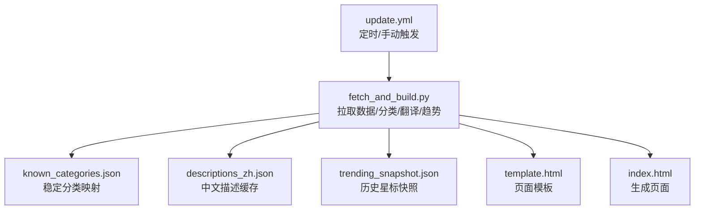
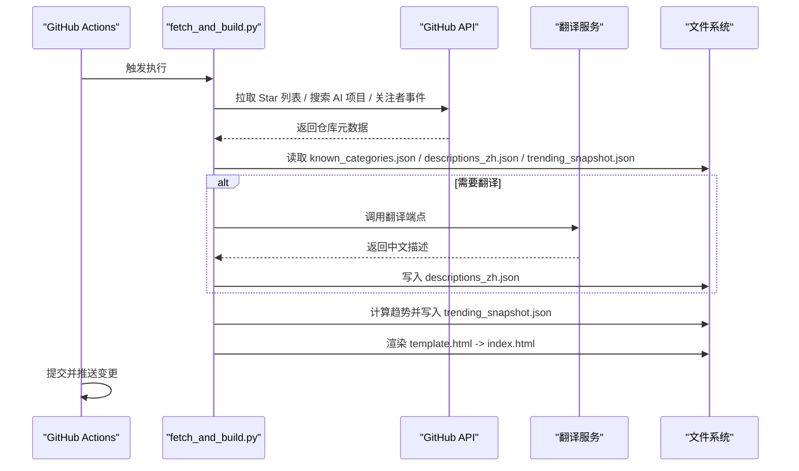
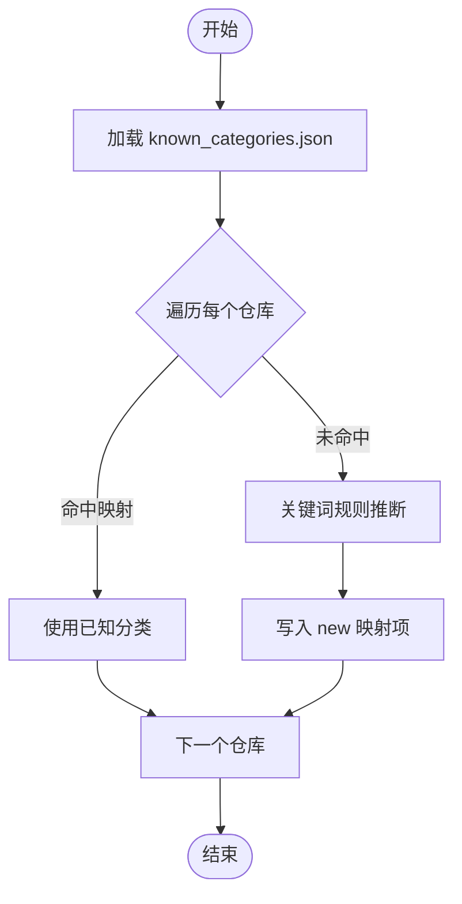
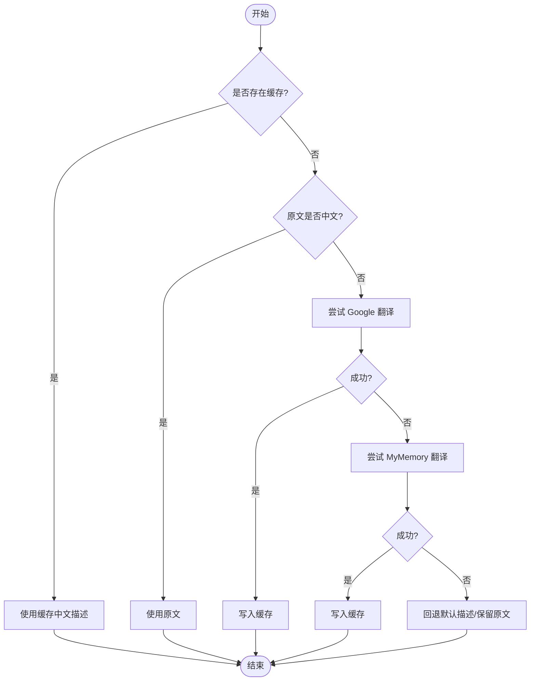
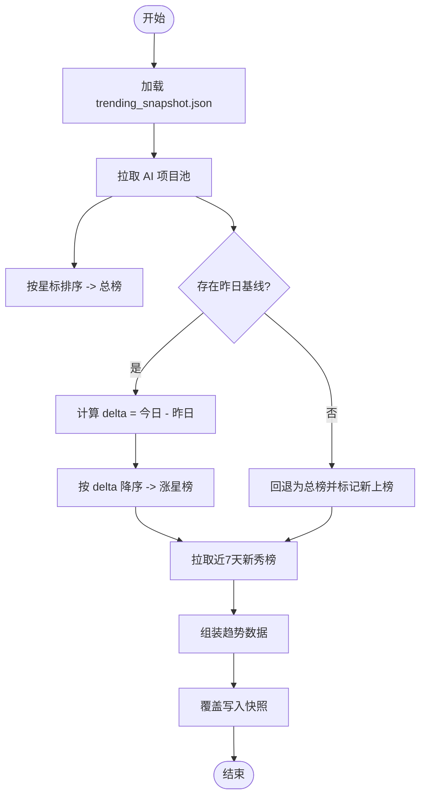
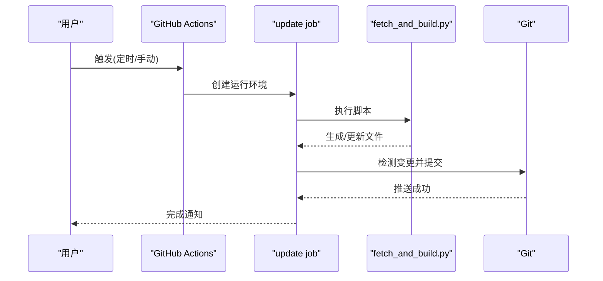
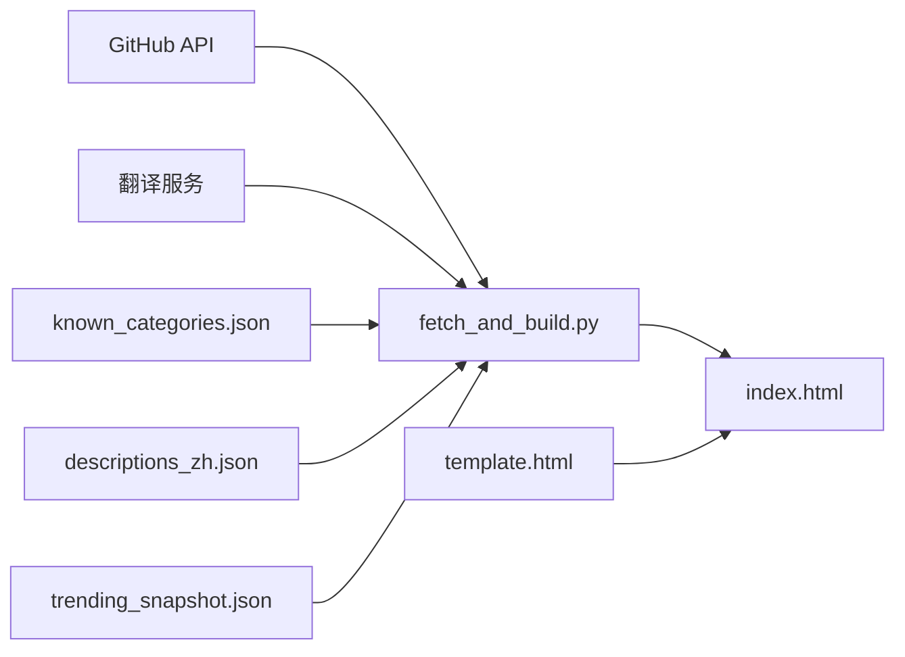

# 配置管理

<cite>
**本文引用的文件**
- [known_categories.json](file://known_categories.json)
- [descriptions_zh.json](file://descriptions_zh.json)
- [trending_snapshot.json](file://trending_snapshot.json)
- [.github/workflows/update.yml](file://.github/workflows/update.yml)
- [fetch_and_build.py](file://fetch_and_build.py)
- [README.md](file://README.md)
- [template.html](file://template.html)
- [index.html](file://index.html)
</cite>

## 更新摘要
**所做更改**
- 更新了 known_categories.json 中的项目分类映射，新增了 Supabase 和 Google Gemini CLI 项目
- 扩展了工具类项目的分类覆盖范围，为开发者探索 AI 驱动开发工作流提供更多样化的选项
- 保持了整体文档结构和一致性

## 目录
1. [简介](#简介)
2. [项目结构](#项目结构)
3. [核心组件](#核心组件)
4. [架构总览](#架构总览)
5. [详细组件分析](#详细组件分析)
6. [依赖关系分析](#依赖关系分析)
7. [性能与扩展性](#性能与扩展性)
8. [故障排除指南](#故障排除指南)
9. [结论](#结论)
10. [附录：配置最佳实践](#附录：配置最佳实践)

## 简介
本仓库实现了一个"GitHub Star 收藏台"的自动化站点：每天定时从 GitHub API 拉取指定用户的 Star 列表，进行智能分类、翻译与趋势统计，最终生成静态页面并部署到 GitHub Pages。本文聚焦于配置管理，详细说明三类关键配置文件的作用与格式，解释 GitHub Actions 工作流的触发与变量配置，并提供自定义分类规则、翻译服务选项与部署参数的调整方法，以及最佳实践与排障建议。

## 项目结构
- index.html：由脚本生成的前端页面（Pages 入口）
- template.html：页面模板，数据通过占位符注入
- fetch_and_build.py：自动更新脚本，负责数据拉取、分类、翻译、趋势计算与页面构建
- known_categories.json：已知项目的稳定分类映射
- descriptions_zh.json：中文描述缓存，避免重复调用翻译接口
- trending_snapshot.json：历史星标快照，用于计算涨星增量
- .github/workflows/update.yml：GitHub Actions 工作流，定义定时任务与执行步骤
- README.md：项目说明与在线地址

**图表来源**
- [.github/workflows/update.yml:1-50](file://.github/workflows/update.yml#L1-L50)
- [fetch_and_build.py:1-659](file://fetch_and_build.py#L1-L659)
- [template.html:1-200](file://template.html#L1-L200)

**章节来源**
- [README.md:1-22](file://README.md#L1-L22)

## 核心组件
- 已知分类映射（known_categories.json）
  - 作用：维护已识别项目的稳定分类键值对，确保分类一致性，不受关键词规则波动影响。
  - 格式：JSON 对象，键为仓库全名（如 "owner/repo"），值为分类键（如 "agent"、"video"、"learning" 等）。
  - 行为：脚本优先读取该映射；若未知项目则按关键词规则推断并回写至该文件，逐步扩大覆盖范围。
  - **最新更新**：新增了 Supabase（Postgres 开发平台）和 Google Gemini CLI（开源 AI 代理）等项目分类，进一步丰富了工具类项目的覆盖范围。
- 中文描述缓存（descriptions_zh.json）
  - 作用：缓存英文描述的中文翻译结果，避免重复调用翻译接口，降低网络开销与限流风险。
  - 格式：JSON 对象，键为仓库全名，值为中文描述字符串。
  - 行为：若已有缓存直接使用；若无且原文非中文，尝试调用翻译端点并写入缓存；失败时保留原文或回退默认描述。
  - **新增内容**：包含了 Supabase 和 Google Gemini CLI 的中文描述缓存。
- 趋势快照（trending_snapshot.json）
  - 作用：保存各项目的历史星标数，作为次日基线以计算涨星增量，支撑"涨星榜"。
  - 格式：JSON 对象，键为仓库全名，值为整数型星标数。
  - 行为：每次运行后覆盖写入最新快照；首次无基线时"涨星榜"回退为"总榜"，并在页面标注"新上榜"。
  - **包含项目**：涵盖了新增的 Supabase 和 Google Gemini CLI 项目的星标数据。

**章节来源**
- [fetch_and_build.py:570-655](file://fetch_and_build.py#L570-L655)
- [fetch_and_build.py:373-436](file://fetch_and_build.py#L373-L436)
- [fetch_and_build.py:188-212](file://fetch_and_build.py#L188-L212)
- [fetch_and_build.py:54-86](file://fetch_and_build.py#L54-L86)
- [known_categories.json:1-154](file://known_categories.json#L1-L154)
- [descriptions_zh.json:1-222](file://descriptions_zh.json#L1-L222)
- [trending_snapshot.json:1-432](file://trending_snapshot.json#L1-L432)

## 架构总览
整体流程如下：
- GitHub Actions 在每小时 UTC :10（北京时间 :10）或手动触发时运行。
- 脚本拉取用户 Star 列表，结合 known_categories.json 与关键词规则进行分类。
- 对英文描述进行翻译并缓存到 descriptions_zh.json。
- 基于 trending_snapshot.json 计算涨星增量，生成"总榜/涨星榜/新秀榜"。
- 将数据注入 template.html，输出 index.html，并提交变更。

**图表来源**
- [.github/workflows/update.yml:1-50](file://.github/workflows/update.yml#L1-L50)
- [fetch_and_build.py:130-149](file://fetch_and_build.py#L130-L149)
- [fetch_and_build.py:373-436](file://fetch_and_build.py#L373-L436)
- [fetch_and_build.py:570-655](file://fetch_and_build.py#L570-L655)

## 详细组件分析

### 已知分类映射（known_categories.json）
- 设计要点
  - 使用稳定的键值映射保证分类一致性，避免关键词规则误判。
  - 随运行自动增长：对新项目采用关键词规则推断并追加到映射中。
- 分类键集合
  - agent、distill、video、coding、content、learning、assistant、tools、finance、business、frontend。
- 扩展方法
  - 新增分类键需在脚本的分类常量中声明标签与颜色，随后可在映射中使用。
  - 如需调整关键词规则，修改 classify_new 函数中的匹配条件。
- **最新更新**
  - 新增了 Supabase 项目分类为 "tools"，提供 Postgres 开发平台支持
  - 新增了 Google Gemini CLI 项目分类为 "agent"，提供终端 AI 代理功能
  - 这些新增项目扩展了工具类和 AI Agent 类的覆盖范围

**图表来源**
- [fetch_and_build.py:570-655](file://fetch_and_build.py#L570-L655)
- [fetch_and_build.py:89-127](file://fetch_and_build.py#L89-L127)

**章节来源**
- [known_categories.json:1-154](file://known_categories.json#L1-L154)
- [fetch_and_build.py:89-127](file://fetch_and_build.py#L89-L127)

### 中文描述缓存（descriptions_zh.json）
- 设计要点
  - 缓存翻译结果，减少对外部翻译服务的调用次数。
  - 若原文已是中文则直接复用；否则尝试翻译并持久化。
- 翻译策略
  - 优先尝试 Google 翻译非官方端点，失败则回退 MyMemory 免费接口。
  - 若均失败，保留原文或回退到内置默认描述。
- 使用场景
  - 排行榜与详情页展示中文描述，提升可读性。
- **新增内容**
  - 包含了 Supabase 的描述："Postgres 开发平台。 Supabase 为您提供专用的 Postgres 数据库来构建您的 Web、移动和 AI 应用程序。"
  - 包含了 Google Gemini CLI 的描述："一款开源 AI 代理，可将 Gemini 的强大功能直接带入您的终端。"

**图表来源**
- [fetch_and_build.py:54-86](file://fetch_and_build.py#L54-L86)
- [fetch_and_build.py:278-291](file://fetch_and_build.py#L278-L291)
- [fetch_and_build.py:611-617](file://fetch_and_build.py#L611-L617)

**章节来源**
- [descriptions_zh.json:1-222](file://descriptions_zh.json#L1-L222)
- [fetch_and_build.py:54-86](file://fetch_and_build.py#L54-L86)
- [fetch_and_build.py:278-291](file://fetch_and_build.py#L278-L291)

### 趋势快照（trending_snapshot.json）
- 设计要点
  - 记录各项目星标数的历史快照，用于计算"涨星榜"的增量。
  - 首次运行无基线时，"涨星榜"回退为"总榜"，并在页面显示"新上榜"。
- 计算逻辑
  - 总榜：按累计星标排序。
  - 涨星榜：仅考虑有昨日基线且不超过阈值的项目，按 delta 排序。
  - 新秀榜：最近 7 天新建且满足最小星标的项目。
- 阈值与数量
  - AI 项目池最小星标、新秀榜最小星标、每榜展示数量、巨头项目排除阈值等。
- **新增项目**
  - 包含了 Supabase 的星标数：108,140
  - 包含了 Google Gemini CLI 的星标数：106,564

**图表来源**
- [fetch_and_build.py:373-436](file://fetch_and_build.py#L373-L436)
- [fetch_and_build.py:188-212](file://fetch_and_build.py#L188-L212)

**章节来源**
- [trending_snapshot.json:1-432](file://trending_snapshot.json#L1-L432)
- [fetch_and_build.py:373-436](file://fetch_and_build.py#L373-L436)

### GitHub Actions 工作流（update.yml）
- 触发机制
  - 定时：cron 表达式设置为每小时 UTC :10（北京时间 :10），提供兜底更新频率。
  - 手动：workflow_dispatch 支持在 Actions 页面手动触发。
- 权限与并发
  - contents: write 允许提交与推送变更。
  - concurrency 组名 starhub-update，禁止取消进行中任务，避免并发冲突。
- 执行步骤
  - Checkout 代码。
  - Setup Python 3.11。
  - 运行 fetch_and_build.py。
  - 检测变更并提交推送（仅当 index.html 及相关 JSON 发生变化时）。
  - 部署到 Vercel（可选）。

**图表来源**
- [.github/workflows/update.yml:1-50](file://.github/workflows/update.yml#L1-L50)

**章节来源**
- [.github/workflows/update.yml:1-50](file://.github/workflows/update.yml#L1-L50)

## 依赖关系分析
- 外部依赖
  - GitHub API：Star 列表、仓库搜索、关注者事件。
  - 翻译服务：Google 翻译非官方端点、MyMemory 免费接口。
- 内部依赖
  - known_categories.json：分类稳定性保障，包含新增的 Supabase 和 Google Gemini CLI 项目。
  - descriptions_zh.json：翻译缓存，降低 API 调用频率，包含新增项目的中文描述。
  - trending_snapshot.json：趋势计算基线，包含新增项目的星标数据。
  - template.html/index.html：页面渲染与展示。
- 耦合与内聚
  - 脚本集中处理数据获取、分类、翻译、趋势与渲染，内聚度高。
  - 配置文件职责清晰，便于独立维护与扩展。

**图表来源**
- [fetch_and_build.py:130-149](file://fetch_and_build.py#L130-L149)
- [fetch_and_build.py:373-436](file://fetch_and_build.py#L373-L436)
- [fetch_and_build.py:570-655](file://fetch_and_build.py#L570-L655)

## 性能与扩展性
- 性能优化
  - 翻译缓存显著减少外部 API 调用，提高运行效率。
  - 分页拉取与间隔控制避免触发速率限制。
  - 趋势计算仅对有基线的项目计算增量，降低无效计算。
- 可扩展性
  - 新增分类：在分类常量中添加键、标签与颜色，并在映射文件中添加对应条目。
  - 新增关键词规则：在 classify_new 中增加匹配条件，保持规则可维护。
  - 新增翻译端点：在 translate_to_zh 中追加备选端点，增强鲁棒性。
  - 调整阈值：修改 AI 项目池最小星标、新秀榜最小星标、巨头排除阈值等参数。
- **新增项目的影响**
  - Supabase 和 Google Gemini CLI 的加入进一步丰富了工具类和 AI Agent 类的生态。
  - 这些项目为开发者提供了更多 AI 驱动开发工作流的选择。

## 故障排除指南
- 拉取失败
  - 现象：脚本打印"拉取失败"，保持现有 index.html 不变。
  - 排查：检查网络连接、GitHub API 可达性与限流情况。
- 翻译失败
  - 现象：日志提示"翻译失败-保留原文"。
  - 排查：确认翻译端点可用性；必要时增加重试或切换备选端点。
- 趋势计算异常
  - 现象：首次运行"涨星榜"显示"新上榜"。
  - 说明：属于预期行为，待有基线后恢复正常增量计算。
- 工作流未提交变更
  - 现象：Actions 日志显示"No changes, skip commit."
  - 原因：本次运行未产生差异（如网络错误导致数据未更新）。
  - 处理：检查上游数据源与脚本执行日志。

**章节来源**
- [fetch_and_build.py:130-149](file://fetch_and_build.py#L130-L149)
- [fetch_and_build.py:611-617](file://fetch_and_build.py#L611-L617)
- [fetch_and_build.py:373-436](file://fetch_and_build.py#L373-L436)
- [.github/workflows/update.yml:32-44](file://.github/workflows/update.yml#L32-L44)

## 结论
本配置管理体系通过"已知分类映射 + 翻译缓存 + 趋势快照"的组合，实现了高可用、低开销的自动化更新与展示。GitHub Actions 提供了可靠的定时与手动触发能力，配合清晰的职责划分与良好的容错机制，确保了系统的稳定运行与持续演进。新增的 Supabase 和 Google Gemini CLI 项目进一步丰富了工具类和 AI Agent 类的覆盖范围，为开发者探索 AI 驱动开发工作流提供了更多选择。

## 附录：配置最佳实践
- 已知分类映射
  - 定期审查 known_categories.json，修正误分类或不必要的条目。
  - 新增分类前先在脚本中声明键与样式，再在映射中应用。
  - **当前状态**：已包含 154 个项目，涵盖 AI Agent、视频创作、编程工具等多个领域。
- 翻译缓存
  - 避免频繁删除 descriptions_zh.json，以免引发大量翻译请求。
  - 如遇翻译服务不可用，可增加重试与降级策略。
  - **当前状态**：已缓存 222 个项目的中文描述。
- 趋势快照
  - 不要手动篡改 trending_snapshot.json，以免影响增量计算的准确性。
  - 首次运行后应尽快形成稳定基线，以便涨星榜生效。
  - **当前状态**：包含 432 个项目的星标历史数据。
- 工作流与环境变量
  - 环境变量：GITHUB_TOKEN 或 GH_TOKEN（可选，用于访问受限 API）。
  - 定时时间：根据需求调整 cron 表达式，注意时区换算。
  - 并发控制：保持 concurrency 设置以避免并发写入冲突。
- 部署参数
  - 自定义域名：在仓库 Settings → Pages 中配置，并在 DNS 添加 CNAME。
  - 页面模板：如需调整展示样式，编辑 template.html 并重新生成 index.html。

**章节来源**
- [.github/workflows/update.yml:1-50](file://.github/workflows/update.yml#L1-L50)
- [fetch_and_build.py:570-655](file://fetch_and_build.py#L570-L655)
- [README.md:15-22](file://README.md#L15-L22)