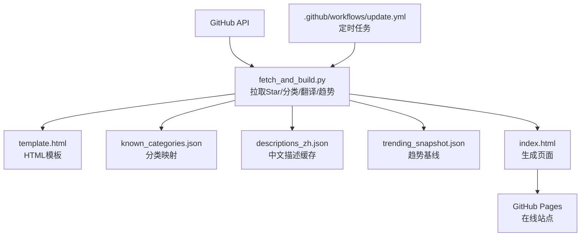
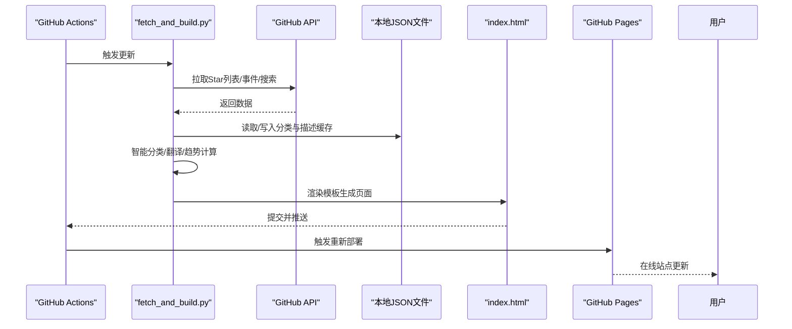
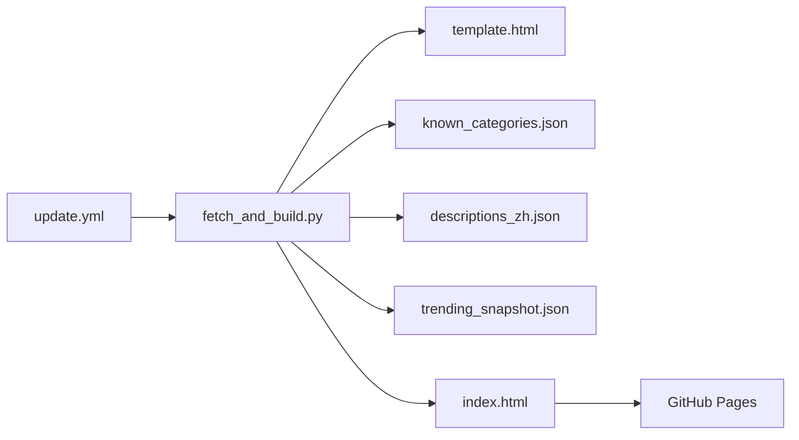

# 项目概述

<cite>
**本文引用的文件**
- [README.md](file://README.md)
- [fetch_and_build.py](file://fetch_and_build.py)
- [index.html](file://index.html)
- [template.html](file://template.html)
- [update.yml](file://.github/workflows/update.yml)
- [known_categories.json](file://known_categories.json)
- [descriptions_zh.json](file://descriptions_zh.json)
- [trending_snapshot.json](file://trending_snapshot.json)
</cite>

## 目录
1. [简介](#简介)
2. [项目结构](#项目结构)
3. [核心组件](#核心组件)
4. [架构总览](#架构总览)
5. [详细组件分析](#详细组件分析)
6. [依赖关系分析](#依赖关系分析)
7. [性能与可扩展性](#性能与可扩展性)
8. [故障排查指南](#故障排查指南)
9. [结论](#结论)
10. [附录：在线地址与使用场景](#附录在线地址与使用场景)

## 简介
本项目是一个“GitHub Star 收藏台”，目标是自动拉取指定用户的 Star 列表，进行智能分类展示，并提供模糊搜索、语言/星标筛选、收藏置顶等能力。页面为静态 HTML，托管在 GitHub Pages；通过 GitHub Actions 定时任务每日自动更新数据并重新生成页面，确保内容始终最新。

主要特性包括：
- 智能分类系统：基于关键词规则与持久化映射，将新项目自动归入预设类别，保持分类稳定且可演进。
- 多语言翻译服务：对英文描述尝试翻译为中文，失败时保留原文，提升可读性。
- 趋势分析引擎：聚合 AI 相关热门仓库，计算涨星榜、总星标榜与新秀榜，形成可视化排行榜。
- 静态页面生成：Python 脚本拉取数据后渲染模板，输出 index.html 供 GitHub Pages 直接托管。

在线地址：https://Kwei168.github.io/starhub/

**章节来源**
- [README.md:1-22](file://README.md#L1-L22)

## 项目结构
仓库采用“脚本 + 模板 + 数据”的清晰分层：
- fetch_and_build.py：自动化主流程（拉取 Star、分类、翻译、趋势计算、渲染）。
- template.html：页面模板，包含样式与前端交互逻辑，数据以占位符注入。
- index.html：由脚本生成的最终页面，供 GitHub Pages 托管。
- known_categories.json：已知项目的分类映射，保证分类稳定性。
- descriptions_zh.json：已翻译或补充的中文描述缓存，避免重复翻译。
- trending_snapshot.json：AI 趋势快照，用于计算涨星变化。
- .github/workflows/update.yml：GitHub Actions 定时任务，每天北京时间 09:00 触发更新。

**图表来源**
- [fetch_and_build.py:126-146](file://fetch_and_build.py#L126-L146)
- [fetch_and_build.py:185-283](file://fetch_and_build.py#L185-L283)
- [fetch_and_build.py:382-455](file://fetch_and_build.py#L382-L455)
- [update.yml:1-42](file://.github/workflows/update.yml#L1-L42)

**章节来源**
- [README.md:7-17](file://README.md#L7-L17)
- [update.yml:1-42](file://.github/workflows/update.yml#L1-L42)

## 核心组件
- 自动化脚本（Python）：负责从 GitHub API 拉取 Star 列表、关注动态、AI 趋势数据；执行智能分类与翻译；渲染模板生成 index.html；持久化分类与描述缓存。
- 页面模板（HTML/CSS/JS）：提供响应式 UI、主题切换、视图切换、模糊搜索、分类标签、星标筛选、排序、收藏置顶、导出导入等功能。
- 工作流（GitHub Actions）：定时触发更新，运行 Python 脚本，提交变更并推送，触发 Pages 重新部署。
- 数据文件：分类映射、中文描述缓存、趋势快照，保障分类稳定与趋势计算准确性。

**章节来源**
- [fetch_and_build.py:1-460](file://fetch_and_build.py#L1-L460)
- [template.html:1-883](file://template.html#L1-L883)
- [update.yml:1-42](file://.github/workflows/update.yml#L1-L42)

## 架构总览
整体架构围绕“数据获取 → 数据处理 → 模板渲染 → 静态发布”的流水线展开：
- 数据层：GitHub API（Star 列表、事件、搜索）、本地 JSON 缓存（分类、描述、趋势）。
- 处理层：Python 脚本实现分类规则、翻译、趋势计算、时间格式化、数据组装。
- 表现层：HTML 模板注入数据，前端 JS 实现交互与过滤。
- 发布层：GitHub Actions 定时运行脚本，提交变更，Pages 自动部署。

**图表来源**
- [update.yml:16-41](file://.github/workflows/update.yml#L16-L41)
- [fetch_and_build.py:126-146](file://fetch_and_build.py#L126-L146)
- [fetch_and_build.py:185-283](file://fetch_and_build.py#L185-L283)
- [fetch_and_build.py:382-455](file://fetch_and_build.py#L382-L455)

## 详细组件分析

### 自动化脚本（fetch_and_build.py）
职责：
- 拉取 Star 列表：分页请求 GitHub API，合并结果。
- 智能分类：优先使用 known_categories.json 中的映射；未知项目通过关键词规则归类到预设类别。
- 翻译服务：尝试调用 Google 翻译与 MyMemory 接口，成功则缓存中文描述。
- 趋势分析：聚合 AI 主题仓库，计算总榜、涨星榜、新秀榜，维护 trending_snapshot.json 作为基线。
- 关注动态：拉取关注账号的公开事件，按类型（新建仓库、Star、关注、PR）聚合并按时间排序。
- 模板渲染：读取 template.html，替换占位符（__DATA__、__CATS__、__LANGS__、__FAVS__、__TRENDING__、__FEED__、__UPDATED__），输出 index.html。
- 持久化：更新 known_categories.json 与 descriptions_zh.json，保证分类与描述缓存持续演进。

关键流程示意：

**图表来源**
- [fetch_and_build.py:89-123](file://fetch_and_build.py#L89-L123)
- [fetch_and_build.py:54-86](file://fetch_and_build.py#L54-L86)
- [fetch_and_build.py:185-283](file://fetch_and_build.py#L185-L283)
- [fetch_and_build.py:382-455](file://fetch_and_build.py#L382-L455)

**章节来源**
- [fetch_and_build.py:126-146](file://fetch_and_build.py#L126-L146)
- [fetch_and_build.py:185-283](file://fetch_and_build.py#L185-L283)
- [fetch_and_build.py:313-379](file://fetch_and_build.py#L313-L379)
- [fetch_and_build.py:382-455](file://fetch_and_build.py#L382-L455)

### 页面模板（template.html）
职责：
- 提供响应式布局与主题切换（明/暗）。
- 展示统计信息、语言分布、分类标签、收藏置顶区、项目网格/列表。
- 支持模糊搜索（跨名称、描述、语言、分类、标签）、语言筛选、星标区间筛选、排序（星标、最近更新、名称）。
- 渲染每日 AI 排行榜（涨星榜、总榜、新秀榜）与今日关注动态。
- 提供收藏置顶、导出/导入备份功能，状态保存在 localStorage。

前端交互要点：
- 搜索即全局搜索，输入时自动清空其他筛选以避免结果被遮挡。
- 分类标签点击可快速定位对应分类。
- 收藏状态持久化，默认包含若干推荐项目。
- 排行榜与动态区域根据后端注入数据动态渲染。

**章节来源**
- [template.html:320-883](file://template.html#L320-L883)

### 工作流（update.yml）
职责：
- 定时触发：每天 UTC 01:00（北京时间 09:00）运行。
- 环境准备：检出代码，设置 Python 3.11。
- 执行更新：运行 fetch_and_build.py。
- 提交变更：仅当有改动时提交并推送，触发 GitHub Pages 重新部署。

**章节来源**
- [update.yml:1-42](file://.github/workflows/update.yml#L1-L42)

### 数据文件
- known_categories.json：维护已知项目的分类映射，保证分类稳定性，随运行自动增长。
- descriptions_zh.json：缓存翻译后的中文描述，避免重复翻译，提升性能。
- trending_snapshot.json：记录 AI 项目池的星标数快照，用于计算涨星变化。

**章节来源**
- [known_categories.json:1-116](file://known_categories.json#L1-L116)
- [descriptions_zh.json:1-102](file://descriptions_zh.json#L1-L102)
- [trending_snapshot.json:1-143](file://trending_snapshot.json#L1-L143)

## 依赖关系分析
- 外部依赖：GitHub API（Star 列表、事件、搜索）、Google 翻译与 MyMemory 翻译接口。
- 内部依赖：脚本依赖模板与 JSON 数据文件；工作流依赖脚本执行环境。
- 耦合度：脚本与模板松耦合（通过占位符注入数据）；数据文件与脚本强耦合（格式约定）。
- 循环依赖：无循环依赖。
- 扩展点：新增分类可通过 CATS 配置与关键词规则扩展；新增翻译源可在 translate_to_zh 中追加。

**图表来源**
- [fetch_and_build.py:382-455](file://fetch_and_build.py#L382-L455)
- [update.yml:16-41](file://.github/workflows/update.yml#L16-L41)

**章节来源**
- [fetch_and_build.py:1-460](file://fetch_and_build.py#L1-L460)
- [update.yml:1-42](file://.github/workflows/update.yml#L1-L42)

## 性能与可扩展性
- 性能优化：
  - 翻译结果缓存至 descriptions_zh.json，避免重复调用翻译接口。
  - 趋势计算使用 trending_snapshot.json 作为基线，减少全量比较开销。
  - 分页拉取与限流控制（sleep 间隔）避免触发 GitHub API 速率限制。
- 可扩展性：
  - 分类规则可扩展：在 classify_new 中添加新关键词组。
  - 翻译服务可扩展：在 translate_to_zh 中追加新的翻译端点。
  - 趋势主题可扩展：在 AI_TOPICS 中增加新主题词。
- 注意事项：
  - GitHub API 存在速率限制，建议合理设置超时与重试策略。
  - 翻译接口可能不稳定，需做好降级处理（保留原文）。

[本节为通用指导，不直接分析具体文件]

## 故障排查指南
常见问题与处理：
- 拉取 Star 失败：检查网络与 GitHub API 可达性；脚本会打印错误并跳过更新。
- 翻译失败：若所有翻译端点失败，将保留原文；可检查网络与接口可用性。
- 趋势数据为空：首次运行无基线时，涨星榜显示“新上榜”；后续运行将建立基线。
- 页面未更新：确认 GitHub Actions 是否成功运行并提交变更；检查 Pages 部署状态。

**章节来源**
- [fetch_and_build.py:126-146](file://fetch_and_build.py#L126-L146)
- [fetch_and_build.py:54-86](file://fetch_and_build.py#L54-L86)
- [fetch_and_build.py:235-283](file://fetch_and_build.py#L235-L283)
- [update.yml:16-41](file://.github/workflows/update.yml#L16-L41)

## 结论
本项目通过 Python 自动化脚本、HTML 模板渲染与 GitHub Actions 定时任务的协作，实现了 GitHub Star 列表的自动拉取、智能分类、多语言翻译、趋势分析与静态页面生成。部署简单（GitHub Pages），更新机制可靠（每日自动更新），适合个人收藏管理与技术趋势追踪。新用户可快速上手，享受智能化、可视化的收藏体验。

[本节为总结性内容，不直接分析具体文件]

## 附录：在线地址与使用场景
- 在线地址：https://Kwei168.github.io/starhub/
- 使用场景：
  - 个人收藏管理：集中查看与管理 Star 的项目，支持分类、搜索与置顶。
  - 技术趋势洞察：通过每日 AI 排行榜了解热门项目与涨星动态。
  - 团队分享：将链接分享给团队成员，快速共享收藏资源。
  - 学习路径规划：结合分类与语言筛选，发现特定领域的优质项目。

**章节来源**
- [README.md:1-22](file://README.md#L1-L22)