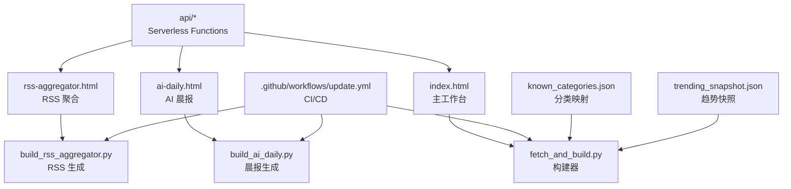
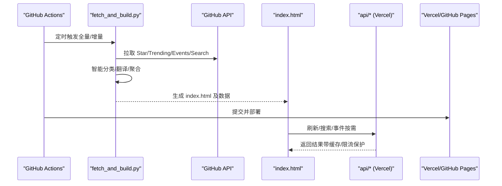
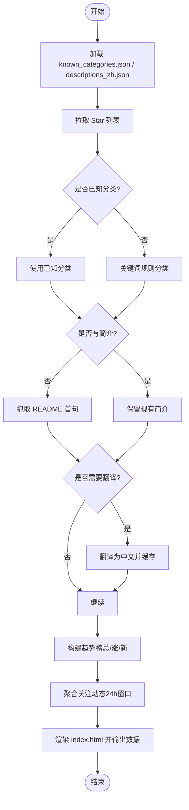
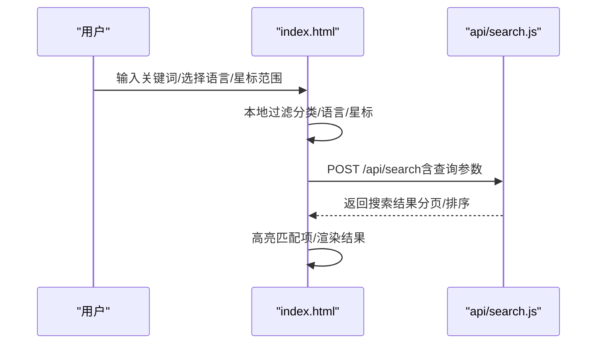
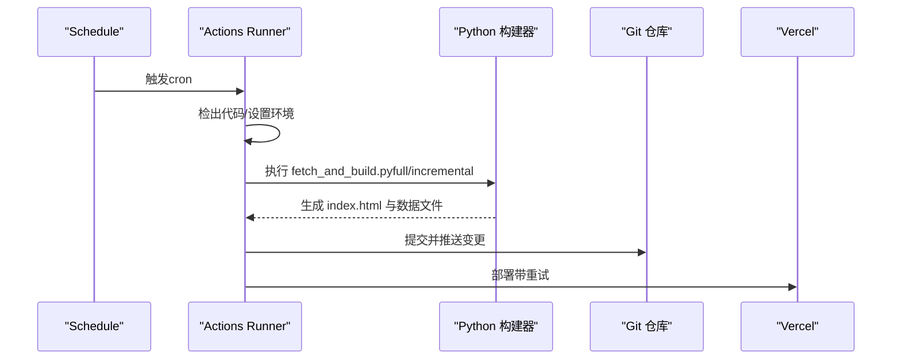
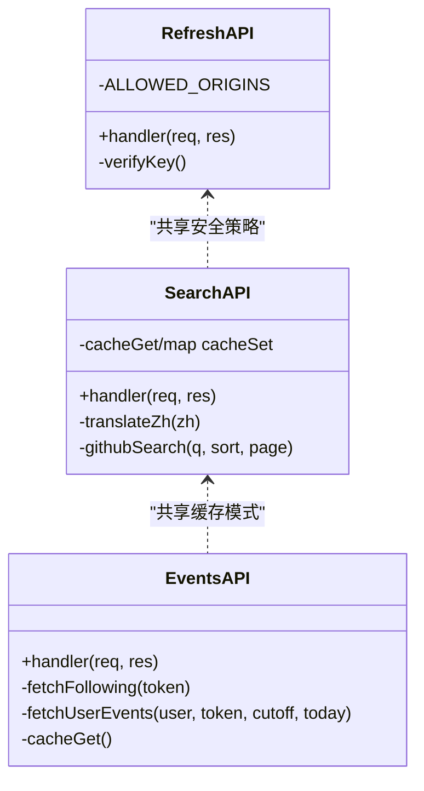
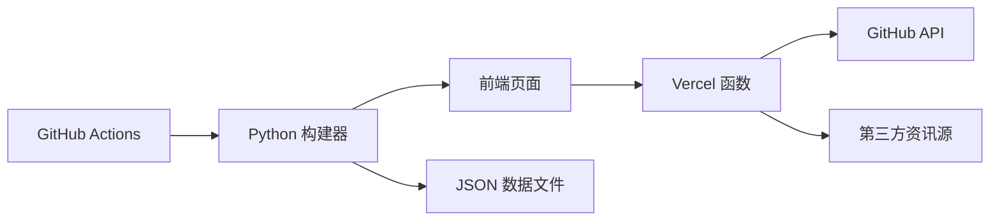

# 项目概述

<cite>
**本文引用的文件**
- [README.md](file://README.md)
- [index.html](file://index.html)
- [package.json](file://package.json)
- [vercel.json](file://vercel.json)
- [.github/workflows/update.yml](file://.github/workflows/update.yml)
- [fetch_and_build.py](file://fetch_and_build.py)
- [known_categories.json](file://known_categories.json)
- [ai-daily.html](file://ai-daily.html)
- [rss-aggregator.html](file://rss-aggregator.html)
- [api/refresh.js](file://api/refresh.js)
- [api/search.js](file://api/search.js)
- [api/events.js](file://api/events.js)
</cite>

## 目录
1. [简介](#简介)
2. [项目结构](#项目结构)
3. [核心组件](#核心组件)
4. [架构总览](#架构总览)
5. [详细组件分析](#详细组件分析)
6. [依赖关系分析](#依赖关系分析)
7. [性能与可扩展性](#性能与可扩展性)
8. [故障排查指南](#故障排查指南)
9. [结论](#结论)
10. [附录：快速开始](#附录快速开始)

## 简介
本项目是一个“GitHub Star 收藏台”，目标是自动拉取指定用户的 Star 列表，进行智能分类展示，并提供模糊搜索、语言/星标筛选、收藏置顶等能力。系统由前端静态页面、后端数据处理脚本、自动化工作流以及可选的在线服务组成，支持多语言（中英）与主题切换，并内置 AI 晨报与 RSS 聚合页。

- 在线地址：见仓库说明中的站点链接
- 更新机制：通过 GitHub Actions 定时任务每天运行，增量或全量构建后提交并部署到 Vercel/GitHub Pages

**章节来源**
- [README.md:1-22](file://README.md#L1-L22)

## 项目结构
仓库采用“前端静态 + 后端脚本 + CI/CD”的分层组织方式：
- 前端页面：index.html（主工作台）、ai-daily.html（AI 晨报）、rss-aggregator.html（RSS 聚合）
- 数据处理脚本：fetch_and_build.py（核心构建器）、build_ai_daily.py（晨报生成）、build_rss_aggregator.py（RSS 生成）
- 配置与数据：known_categories.json（分类映射）、descriptions_zh.json（中文描述缓存）、trending_snapshot.json（趋势快照）
- 自动化：.github/workflows/update.yml（定时构建与部署）
- 服务端函数：api/*（Vercel Serverless Functions，提供刷新、搜索、事件聚合等能力）
- 部署配置：vercel.json（函数超时与路由）

**图表来源**
- [index.html:1-800](file://index.html#L1-L800)
- [fetch_and_build.py:1-674](file://fetch_and_build.py#L1-L674)
- [ai-daily.html:1-200](file://ai-daily.html#L1-L200)
- [rss-aggregator.html:1-200](file://rss-aggregator.html#L1-L200)
- [.github/workflows/update.yml:1-93](file://.github/workflows/update.yml#L1-L93)
- [api/refresh.js:1-65](file://api/refresh.js#L1-L65)
- [api/search.js:1-177](file://api/search.js#L1-L177)
- [api/events.js:1-161](file://api/events.js#L1-L161)

**章节来源**
- [README.md:7-17](file://README.md#L7-L17)
- [vercel.json:1-13](file://vercel.json#L1-L13)

## 核心组件
- 自动构建器（Python）：负责拉取 Star 列表、智能分类、翻译/摘要、趋势排行、关注动态聚合，最终渲染 index.html 并输出辅助数据
- 前端工作台（HTML/CSS/JS）：提供搜索、筛选、视图切换、收藏、导出/导入、主题切换、侧边栏趋势与动态
- 自动化工作流（GitHub Actions）：定时触发全量/增量构建，提交变更并部署到 Vercel
- 服务端函数（Node.js）：提供刷新工作流、全网搜索、实时事件聚合等能力
- 独立页面：AI 晨报（日报式排版）、RSS 聚合（卡片墙与筛选）

**章节来源**
- [fetch_and_build.py:1-674](file://fetch_and_build.py#L1-L674)
- [index.html:1-800](file://index.html#L1-L800)
- [.github/workflows/update.yml:1-93](file://.github/workflows/update.yml#L1-L93)
- [api/refresh.js:1-65](file://api/refresh.js#L1-L65)
- [api/search.js:1-177](file://api/search.js#L1-L177)
- [api/events.js:1-161](file://api/events.js#L1-L161)
- [ai-daily.html:1-200](file://ai-daily.html#L1-L200)
- [rss-aggregator.html:1-200](file://rss-aggregator.html#L1-L200)

## 架构总览
整体架构分为四层：
- 数据源层：GitHub API（Star、Trending、Events、Search）、第三方资讯源（AIHOT、Hacker News、The Verge、TechCrunch、arXiv、36氪、Redis、AtlasNote）
- 处理层：Python 构建器与 Node.js 函数，负责抓取、清洗、分类、翻译、聚合、缓存
- 呈现层：静态 HTML 页面（工作台、晨报、RSS 聚合），前端交互（搜索、筛选、视图切换）
- 自动化与部署：GitHub Actions 定时任务驱动构建与提交，Vercel 部署函数与静态资源

**图表来源**
- [.github/workflows/update.yml:1-93](file://.github/workflows/update.yml#L1-L93)
- [fetch_and_build.py:1-674](file://fetch_and_build.py#L1-L674)
- [api/refresh.js:1-65](file://api/refresh.js#L1-L65)
- [api/search.js:1-177](file://api/search.js#L1-L177)
- [api/events.js:1-161](file://api/events.js#L1-L161)

## 详细组件分析

### 自动构建器（fetch_and_build.py）
职责：
- 拉取用户 Star 列表，按已知分类映射或规则对新项目进行智能分类
- 对无简介的项目抓取 README 首句作为摘要；英文简介尝试翻译为中文并缓存
- 构建 AI 趋势榜（总榜、涨星榜、新秀榜），维护 trending_snapshot.json 作为基线
- 聚合关注账号近 24 小时动态（Create/Watch/Follow/PR/Release/Public/Push）
- 渲染 index.html，并调用 build_ai_daily.py 与 build_rss_aggregator.py 生成独立页面

关键流程（流程图）：

**图表来源**
- [fetch_and_build.py:1-674](file://fetch_and_build.py#L1-L674)

**章节来源**
- [fetch_and_build.py:89-127](file://fetch_and_build.py#L89-L127)
- [fetch_and_build.py:130-149](file://fetch_and_build.py#L130-L149)
- [fetch_and_build.py:188-212](file://fetch_and_build.py#L188-L212)
- [fetch_and_build.py:353-436](file://fetch_and_build.py#L353-L436)
- [fetch_and_build.py:466-560](file://fetch_and_build.py#L466-L560)
- [fetch_and_build.py:570-668](file://fetch_and_build.py#L570-L668)

### 前端工作台（index.html）
功能要点：
- 响应式布局与双主题（明/暗），支持列表/卡片视图切换
- 搜索与筛选：模糊搜索、语言筛选、星标区间筛选、分类标签过滤
- 收藏与置顶：本地收藏状态持久化，置顶显示
- 侧边栏：趋势排行（总榜/涨星榜/新秀榜）与关注动态（24h滚动窗口）
- 工具：导出/导入备份、刷新按钮（触发后端刷新工作流）

交互序列（搜索与筛选）：

**图表来源**
- [index.html:240-320](file://index.html#L240-L320)
- [api/search.js:1-177](file://api/search.js#L1-L177)

**章节来源**
- [index.html:1-800](file://index.html#L1-L800)

### 自动化工作流（update.yml）
职责：
- 定时触发（UTC 21:00 全量，其余时段增量）
- 同步最新远程分支，执行 Python 构建器
- 提交生成的 index.html、ai-daily.html、rss-aggregator.html 及相关数据文件
- 部署到 Vercel（带重试机制）

**图表来源**
- [.github/workflows/update.yml:1-93](file://.github/workflows/update.yml#L1-L93)

**章节来源**
- [.github/workflows/update.yml:1-93](file://.github/workflows/update.yml#L1-L93)

### 服务端函数（api/*）
- refresh.js：POST 触发 GitHub Actions workflow_dispatch，CORS 白名单与密钥校验
- search.js：POST 全网 GitHub 搜索，中文翻译+组合查询，内存缓存（搜索10分钟、翻译1小时）
- events.js：GET 聚合关注账号近24小时动态，并发控制与缓存（10分钟）

**图表来源**
- [api/refresh.js:1-65](file://api/refresh.js#L1-L65)
- [api/search.js:1-177](file://api/search.js#L1-L177)
- [api/events.js:1-161](file://api/events.js#L1-L161)

**章节来源**
- [api/refresh.js:1-65](file://api/refresh.js#L1-L65)
- [api/search.js:1-177](file://api/search.js#L1-L177)
- [api/events.js:1-161](file://api/events.js#L1-L161)

### 独立页面
- AI 晨报（ai-daily.html）：报纸式刊头、今日要闻、分栏新闻流，数据来源 AIHOT 公开 API 与多渠道 RSS
- RSS 聚合（rss-aggregator.html）：卡片墙布局、信源面板、全局搜索、未读标记、分享与收藏

**章节来源**
- [ai-daily.html:1-200](file://ai-daily.html#L1-L200)
- [rss-aggregator.html:1-200](file://rss-aggregator.html#L1-L200)

## 依赖关系分析
- 运行时依赖：
  - Python 标准库（fetch_and_build.py、build_ai_daily.py）
  - Node.js 运行时（Vercel Serverless Functions）
  - 浏览器端（index.html、ai-daily.html、rss-aggregator.html）
- 外部依赖：
  - GitHub API（Star、Trending、Events、Search）
  - 第三方资讯源（AIHOT、Hacker News、The Verge、TechCrunch、arXiv、36氪、Redis、AtlasNote）
- 配置文件：
  - vercel.json（函数超时与路由）
  - package.json（仅声明用于本地开发/测试的依赖）

**图表来源**
- [vercel.json:1-13](file://vercel.json#L1-L13)
- [package.json:1-9](file://package.json#L1-L9)
- [fetch_and_build.py:1-674](file://fetch_and_build.py#L1-L674)
- [api/search.js:1-177](file://api/search.js#L1-L177)
- [api/events.js:1-161](file://api/events.js#L1-L161)

**章节来源**
- [vercel.json:1-13](file://vercel.json#L1-L13)
- [package.json:1-9](file://package.json#L1-L9)

## 性能与可扩展性
- 缓存策略：
  - 搜索缓存（10分钟）、翻译缓存（1小时）、事件缓存（10分钟）
  - 趋势快照（trending_snapshot.json）作为基线，避免重复计算
- 限流与降级：
  - GitHub API 速率限制处理（重试、降级为快照差值）
  - 第三方源失败时回退到 RSS 或本地 JSON
- 并发控制：
  - 事件聚合分批并发（每批3个用户），失败静默跳过
- 前端优化：
  - 内容可见性（content-visibility）、懒加载、响应式布局
  - 本地过滤减少请求次数

[本节为通用指导，不直接分析具体文件]

## 故障排查指南
常见问题与定位：
- 构建失败：检查 GitHub Actions 日志，确认 Python 环境与网络可达
- 搜索受限：search.js 返回 429/403，等待限流解除或降低频率
- 事件为空：events.js 缓存命中或上游不可用，检查 GH_TOKEN 与 CORS 配置
- 部署失败：Vercel 部署重试机制已内置，查看部署日志

**章节来源**
- [api/search.js:145-152](file://api/search.js#L145-L152)
- [api/events.js:126-130](file://api/events.js#L126-L130)
- [.github/workflows/update.yml:75-93](file://.github/workflows/update.yml#L75-L93)

## 结论
本项目以“自动拉取 + 智能分类 + 实时搜索 + 多源资讯”为核心，构建了完整的 GitHub Star 收藏台。通过 Python 构建器与 Node.js 函数的协同，结合 GitHub Actions 自动化，实现了稳定可靠的每日更新与在线访问。前端提供丰富的交互体验，后端具备缓存与降级机制，整体架构清晰、可维护性强。

[本节为总结，不直接分析具体文件]

## 附录：快速开始
- 访问在线版本：参考仓库说明中的站点链接
- 本地部署步骤：
  - 安装 Python 3.11+ 与 Node.js
  - 克隆仓库，安装依赖（如需本地测试）
  - 运行构建脚本：python fetch_and_build.py full/incremental
  - 启动静态服务器或直接打开 index.html
- 基本使用方法：
  - 在工作台页面进行搜索、筛选、分类切换
  - 点击“刷新”触发后端刷新工作流（需配置环境变量）
  - 查看侧边栏趋势与动态，收藏感兴趣项目

**章节来源**
- [README.md:1-22](file://README.md#L1-L22)
- [package.json:1-9](file://package.json#L1-L9)
- [vercel.json:1-13](file://vercel.json#L1-L13)