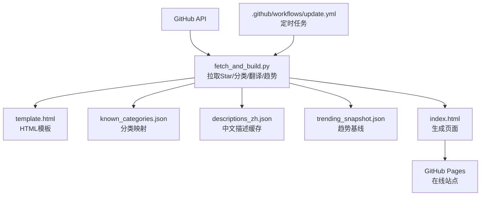
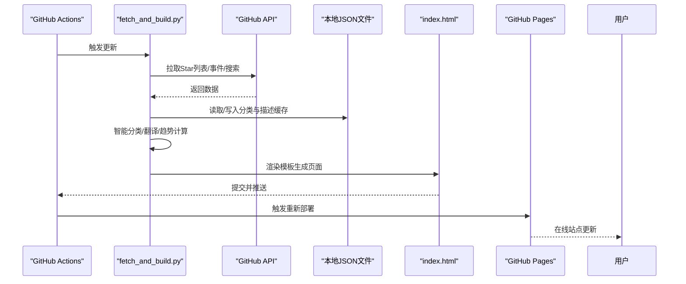
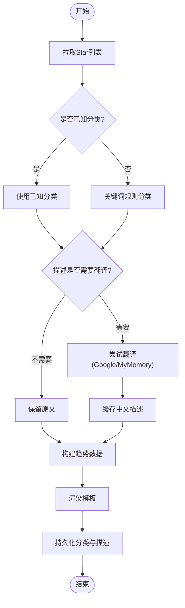
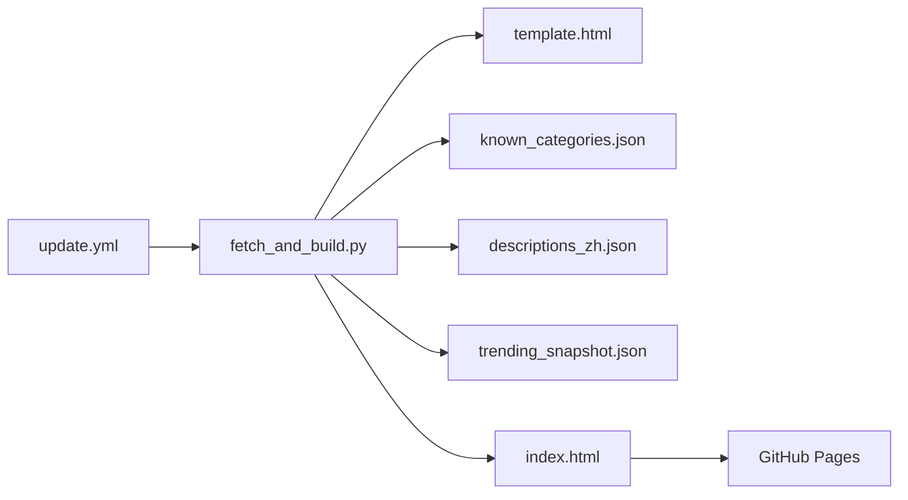

# 项目概述

<cite>
**本文引用的文件**
- [README.md](file://README.md)
- [fetch_and_build.py](file://fetch_and_build.py)
- [index.html](file://index.html)
- [template.html](file://template.html)
- [update.yml](file://.github/workflows/update.yml)
- [known_categories.json](file://known_categories.json)
- [descriptions_zh.json](file://descriptions_zh.json)
- [trending_snapshot.json](file://trending_snapshot.json)
- [build_rss_aggregator.py](file://build_rss_aggregator.py)
- [rss-aggregator.html](file://rss-aggregator.html)
- [rss-data-0.js](file://rss-data-0.js)
- [rss-data-1.js](file://rss-data-1.js)
- [rss_api_snapshot.json](file://rss_api_snapshot.json)
- [rss_history.json](file://rss_history.json)
- [api/rss.js](file://api/rss.js)
- [api/article.js](file://api/article.js)
- [vercel.json](file://vercel.json)
- [HANDOFF.md](file://HANDOFF.md)
</cite>

## 目录
1. [简介](#简介)
2. [项目结构](#项目结构)
3. [核心组件](#核心组件)
4. [架构总览](#架构总览)
5. [详细组件分析](#详细组件分析)
6. [依赖关系分析](#依赖关系分析)
7. [性能与可扩展性](#性能与可扩展性)
8. [故障排查指南](#故障排查指南)
9. [结论](#结论)
10. [附录：在线地址与使用场景](#附录在线地址与使用场景)

## 简介
本项目由两条并行但共享部署链路的产品主线组成：原有的 GitHub Star 收藏台，以及后续加入的 RSS 聚合与 AI 动态系统。GitHub Pages 是用户实际访问入口，Vercel 承载 Serverless API 与部署产物；GitHub Actions 负责构建、提交生成文件并执行 Vercel production deployment。

主要特性包括：
- 智能分类系统：基于关键词规则与持久化映射，将新项目自动归入预设类别，保持分类稳定且可演进。
- 多语言翻译服务：对英文描述尝试翻译为中文，失败时保留原文，提升可读性。
- 趋势分析引擎：聚合 AI 相关热门仓库，计算涨星榜、总星标榜与新秀榜，形成可视化排行榜。
- 静态页面生成：`fetch_and_build.py` 生成 Star 主站 `index.html`、AI 晨报和 RSS 聚合产物；`build_rss_aggregator.py` 另外生成 RSS 页面、数据分块、72 小时快照与历史文件。

在线地址：https://Kwei168.github.io/starhub/

**章节来源**
- [README.md:1-22](file://README.md#L1-L22)

## 项目结构
仓库采用“脚本 + 模板 + 数据”的清晰分层：
- fetch_and_build.py：自动化主流程（拉取 Star、分类、翻译、趋势计算、渲染）。
- template.html：页面模板，包含样式与前端交互逻辑，数据以占位符注入。
- index.html：由脚本生成的最终页面，供 GitHub Pages 托管。
- known_categories.json：已知项目的分类映射，保证分类稳定性。
- descriptions_zh.json：已翻译或补充的中文描述缓存，避免重复翻译。
- trending_snapshot.json：AI 趋势快照，用于计算涨星变化。
- `.github/workflows/update.yml`：支持 schedule 与 `workflow_dispatch`；UTC 21:00 执行 RSS full 构建，其余 UTC 2/6/10/14 执行增量构建，普通 push 不会自动触发。

**图表来源**
- [fetch_and_build.py:126-146](file://fetch_and_build.py#L126-L146)
- [fetch_and_build.py:185-283](file://fetch_and_build.py#L185-L283)
- [fetch_and_build.py:382-455](file://fetch_and_build.py#L382-L455)
- [update.yml:1-42](file://.github/workflows/update.yml#L1-L42)

**章节来源**
- [README.md:7-17](file://README.md#L7-L17)
- [update.yml:1-42](file://.github/workflows/update.yml#L1-L42)

## 核心组件
- 自动化脚本（Python）：负责从 GitHub API 拉取 Star 列表、关注动态、AI 趋势数据；执行智能分类与翻译；渲染模板生成 index.html；持久化分类与描述缓存。
- 页面模板（HTML/CSS/JS）：提供响应式 UI、主题切换、视图切换、模糊搜索、分类标签、星标筛选、排序、收藏置顶、导出导入等功能。
- 工作流（GitHub Actions）：定时触发更新，运行 Python 脚本，提交变更并推送，触发 Pages 重新部署。
- 数据文件：分类映射、中文描述缓存、趋势快照，保障分类稳定与趋势计算准确性。

**章节来源**
- [fetch_and_build.py:1-460](file://fetch_and_build.py#L1-L460)
- [template.html:1-883](file://template.html#L1-L883)
- [update.yml:1-42](file://.github/workflows/update.yml#L1-L42)

## 架构总览
当前架构是“双数据系统 + 统一部署链”：
- **Star 主线**：GitHub REST API 的 starred/search/following/events → `fetch_and_build.py` → 分类、翻译、Trending、关注动态 → `index.html`。
- **RSS 主线**：711 个信源按 T1/T2/T3 分层 → `build_rss_aggregator.py` 生成 72 小时历史、快照和数据分块 → `rss-aggregator.html`；`api/rss.js` 对 T1 提供实时刷新。
- **运行时 API**：`api/events.js`、`api/search.js`、`api/news.js`、`api/article.js`、`api/agihunt.js` 和 `api/refresh.js` 均部署在 Vercel。
- **发布层**：Actions 完成构建提交和 Vercel 部署；GitHub Pages 提供静态用户入口。

**图表来源**
- [update.yml:16-41](file://.github/workflows/update.yml#L16-L41)
- [fetch_and_build.py:126-146](file://fetch_and_build.py#L126-L146)
- [fetch_and_build.py:185-283](file://fetch_and_build.py#L185-L283)
- [fetch_and_build.py:382-455](file://fetch_and_build.py#L382-L455)

## 详细组件分析

### 自动化脚本（fetch_and_build.py）
职责：
- 拉取 Star 列表：分页请求 GitHub API，合并结果。
- 智能分类：优先使用 known_categories.json 中的映射；未知项目通过关键词规则归类到预设类别。
- 翻译服务：尝试调用 Google 翻译与 MyMemory 接口，成功则缓存中文描述。
- 趋势分析：聚合 AI 主题仓库，计算总榜、涨星榜、新秀榜，维护 trending_snapshot.json 作为基线。
- 关注动态：拉取关注账号的公开事件，按类型（新建仓库、Star、关注、PR）聚合并按时间排序。
- 模板渲染：读取 template.html，替换占位符（__DATA__、__CATS__、__LANGS__、__FAVS__、__TRENDING__、__FEED__、__UPDATED__），输出 index.html。
- 持久化：更新 known_categories.json 与 descriptions_zh.json，保证分类与描述缓存持续演进。

关键流程示意：

**图表来源**
- [fetch_and_build.py:89-123](file://fetch_and_build.py#L89-L123)
- [fetch_and_build.py:54-86](file://fetch_and_build.py#L54-L86)
- [fetch_and_build.py:185-283](file://fetch_and_build.py#L185-L283)
- [fetch_and_build.py:382-455](file://fetch_and_build.py#L382-L455)

**章节来源**
- [fetch_and_build.py:126-146](file://fetch_and_build.py#L126-L146)
- [fetch_and_build.py:185-283](file://fetch_and_build.py#L185-L283)
- [fetch_and_build.py:313-379](file://fetch_and_build.py#L313-L379)
- [fetch_and_build.py:382-455](file://fetch_and_build.py#L382-L455)

### 页面模板（template.html）
职责：
- 提供响应式布局与主题切换（明/暗）。
- 展示统计信息、语言分布、分类标签、收藏置顶区、项目网格/列表。
- 支持模糊搜索（跨名称、描述、语言、分类、标签）、语言筛选、星标区间筛选、排序（星标、最近更新、名称）。
- 渲染每日 AI 排行榜（涨星榜、总榜、新秀榜）与今日关注动态。
- 提供收藏置顶、导出/导入备份功能，状态保存在 localStorage。

前端交互要点：
- 搜索即全局搜索，输入时自动清空其他筛选以避免结果被遮挡。
- 分类标签点击可快速定位对应分类。
- 收藏状态持久化，默认包含若干推荐项目。
- 排行榜与动态区域根据后端注入数据动态渲染。

**章节来源**
- [template.html:320-883](file://template.html#L320-L883)

### 工作流（update.yml）
职责：
- 触发方式：schedule + `workflow_dispatch`；代码 push 不会直接触发。
- 构建模式：UTC 21:00 为 RSS full，其余 UTC 2/6/10/14 为 incremental。
- 环境准备：checkout 完整历史，设置 Python 3.11，执行 `python fetch_and_build.py $MODE`。
- 并发与发布：`cancel-in-progress: true`；有变更时提交并推送，随后使用 Vercel CLI 部署 production。
- 验证要求：涉及 RSS/API 的变更需确认源码 run 与 dynamic 连锁 run 均成功，并执行线上静态验证和 Playwright 双视口 E2E。

**章节来源**
- [update.yml:1-42](file://.github/workflows/update.yml#L1-L42)

### 数据文件
- `known_categories.json`：Star 项目分类映射。
- `descriptions_zh.json`：Star 项目中文描述缓存。
- `trending_snapshot.json`：Star 主线 Trending 基线。
- `rss_sources.json`：711 个 RSS 信源及 tier 元数据。
- `rss_history.json`：RSS 72 小时滚动历史。
- `rss_api_snapshot.json`：供 `/api/rss` 和 `/api/article` 使用的快照及 `meta.last_fetch`。
- `rss-data-0.js` / `rss-data-1.js`：RSS 首屏与后台数据块。
- `translations.json`：RSS 构建与 API 共享的翻译缓存。

**章节来源**
- [known_categories.json:1-116](file://known_categories.json#L1-L116)
- [descriptions_zh.json:1-102](file://descriptions_zh.json#L1-L102)
- [trending_snapshot.json:1-143](file://trending_snapshot.json#L1-L143)

## 依赖关系分析
- 外部依赖：GitHub API（Star 列表、事件、搜索）、Google 翻译与 MyMemory 翻译接口。
- 内部依赖：脚本依赖模板与 JSON 数据文件；工作流依赖脚本执行环境。
- 耦合度：脚本与模板松耦合（通过占位符注入数据）；数据文件与脚本强耦合（格式约定）。
- 循环依赖：无循环依赖。
- 扩展点：新增分类可通过 CATS 配置与关键词规则扩展；新增翻译源可在 translate_to_zh 中追加。

**图表来源**
- [fetch_and_build.py:382-455](file://fetch_and_build.py#L382-L455)
- [update.yml:16-41](file://.github/workflows/update.yml#L16-L41)

**章节来源**
- [fetch_and_build.py:1-460](file://fetch_and_build.py#L1-L460)
- [update.yml:1-42](file://.github/workflows/update.yml#L1-L42)

## 性能与可扩展性
- 性能优化：
  - 翻译结果缓存至 descriptions_zh.json，避免重复调用翻译接口。
  - 趋势计算使用 trending_snapshot.json 作为基线，减少全量比较开销。
  - 分页拉取与限流控制（sleep 间隔）避免触发 GitHub API 速率限制。
- 可扩展性：
  - 分类规则可扩展：在 classify_new 中添加新关键词组。
  - 翻译服务可扩展：在 translate_to_zh 中追加新的翻译端点。
  - 趋势主题可扩展：在 AI_TOPICS 中增加新主题词。
- 注意事项：
  - GitHub API 存在速率限制，建议合理设置超时与重试策略。
  - 翻译接口可能不稳定，需做好降级处理（保留原文）。

[本节为通用指导，不直接分析具体文件]

## 故障排查指南
常见问题与处理：
- 拉取 Star 失败：检查网络与 GitHub API 可达性；脚本会打印错误并跳过更新。
- 翻译失败：若所有翻译端点失败，将保留原文；可检查网络与接口可用性。
- 趋势数据为空：首次运行无基线时，涨星榜显示“新上榜”；后续运行将建立基线。
- 页面未更新：确认 GitHub Actions 是否成功运行并提交变更；检查 Pages 部署状态。

**章节来源**
- [fetch_and_build.py:126-146](file://fetch_and_build.py#L126-L146)
- [fetch_and_build.py:54-86](file://fetch_and_build.py#L54-L86)
- [fetch_and_build.py:235-283](file://fetch_and_build.py#L235-L283)
- [update.yml:16-41](file://.github/workflows/update.yml#L16-L41)

## 结论
本项目当前由 GitHub Star 收藏台和 RSS 聚合器两条主线组成：前者负责个人收藏、分类、翻译、趋势与关注动态，后者负责 711 源、72 小时历史、AI 动态侧栏和阅读器全文体验。两条主线共享 `update.yml` 构建与 Vercel 部署链，但页面产物和数据文件边界清晰；维护时应分别验证 Star 主站与 RSS 页面，不能只验证其中一条。

[本节为总结性内容，不直接分析具体文件]

## 附录：在线地址与使用场景
- 在线地址：https://Kwei168.github.io/starhub/
- 使用场景：
  - 个人收藏管理：集中查看与管理 Star 的项目，支持分类、搜索与置顶。
  - 技术趋势洞察：通过每日 AI 排行榜了解热门项目与涨星动态。
  - 团队分享：将链接分享给团队成员，快速共享收藏资源。
  - 学习路径规划：结合分类与语言筛选，发现特定领域的优质项目。

**章节来源**
- [README.md:1-22](file://README.md#L1-L22)