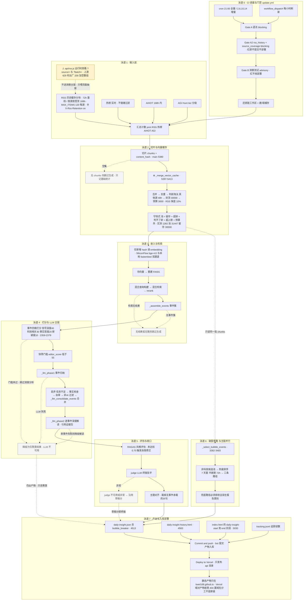

# 每日洞察流水线 · 泳道流程图（Mermaid）

节点与行号取自 `build_daily_insight.py`、`.github/workflows/update.yml`、`api/rss.js`（2026-09-22 状态）。
图例：`⊕` 本轮（run 1282/1288）改动过的节点 · 虚线边 = 降级或兜底路径 · `⚠` 已知缺口。

## 读这张图的两条注意

1. `api/rss.js`（图右上角那条 ⚠ 旁路）**不在洞察主链上**。洞察吃的是构建期落盘的 RSS 历史缓存，运行时出口只服务页面抽屉的实时刷新 —— 本轮 4 处改动（`cleanLink`、超范围码点钳位、剥 fragment、媒体 url）全在旁路，影响抽屉显示，不影响洞察计算。
2. 图里的虚线边（降级/兜底）大多是**静默**的：Gate B advisory、embedding 双通道回退、judge 沿用草稿分、LLM 挂掉仍出聚类产物。所以判断"这场构建到底有没有真跑出洞察"要看 `build_logs` 与产物时间戳，不能只看 Actions 的绿勾。
